# LoCoMo-MC10 Benchmark Pipeline Diagrams

## 1. Current Implementation (WRONG ❌)


### Issues with Current Flow
1. **No choice field parsing** - Ignores the 10 answer options entirely
2. **No retrieval** - Passes full context to LLM (no memory system)
3. **Wrong output format** - Generates free text instead of choosing from 10 options
4. **Wrong evaluation** - Uses LLM judge/F1/BLEU instead of accuracy
5. **Meaningless results** - "50% LLM judge accuracy" is not a valid MC accuracy score

---

## 2. Correct Implementation (BASELINE - No Memory) ✅


### Baseline Flow Characteristics
- **Context:** Full haystack_sessions
- **Selection:** LLM chooses from 10 options
- **Evaluation:** Simple accuracy (choice index matching)
- **Use Case:** Baseline for context-window tests, sanity check

---

## 3. Correct Implementation (MEMORY AUGMENTED) ✅


### Memory-Augmented Flow Characteristics
- **Ingest:** Convert haystack_sessions into ultrathink memories
- **Retrieve:** Get relevant conversation turns for question
- **Context:** Filtered/relevant information only
- **Selection:** LLM chooses from 10 options using retrieved context
- **Evaluation:** Accuracy + retrieval quality metrics
- **Use Case:** Main benchmark test, memory system evaluation

---

## 4. Correct Implementation (RAG PIPELINE) ✅

```mermaid
graph TD
    A["🟢 Dataset Load<br/>1,986 MC questions"] --> B["For Each Question"]
    B --> C["✅ Parse all fields"]
    C --> D1["question_text"]
    C --> D2["choices: list10"]
    C --> D3["correct_choice_index"]
    C --> D4["haystack_sessions"]

    D1 --> E["RAG Pipeline Approach"]
    D2 --> E
    D3 --> F["Ground Truth"]
    D4 --> G["Retrieval Stage"]

    G --> G1["Embed Question"]
    G1 --> G2["Vector search in<br/>conversation turns DB"]
    G2 --> G3["Return top-k passages<br/>Measure Recall@k"]

    G3 --> H["Augmentation Stage"]
    E --> H
    H --> H1["Format prompt:<br/>question<br/>+ top-k passages<br/>+ 10 choices"]
    H1 --> H2["➜ LLM (DeepSeek)<br/>Select from choices<br/>using retrieved context"]

    H2 --> H3["✅ Output:<br/>Choice Index 0-9"]
    H3 --> I["Evaluation Phase"]
    F --> I

    I --> I1["🔵 Retrieval Evaluation<br/>Recall@k vs<br/>relevant passages"]
    I1 --> I2["Result: Recall scores"]

    I --> I3["🟢 QA Evaluation<br/>predicted vs correct"]
    I3 --> I4["Result: Accuracy"]

    I2 --> J["Combined Score:<br/>Recall@k<br/>+ Accuracy<br/>+ Analysis"]
    I4 --> J

    style A fill:#51cf66
    style G fill:#ffd43b
    style H fill:#4dabf7
    style H3 fill:#51cf66
    style I1 fill:#ffd43b
    style I3 fill:#51cf66
```



### RAG Pipeline Flow Characteristics
- **Retrieval:** Vector search / embedding-based
- **Recall@k:** Measures retrieval quality
- **Context:** Retrieved passages only
- **Selection:** LLM chooses from 10 options
- **Evaluation:** Recall metrics + Answer accuracy
- **Use Case:** RAG system benchmarking, pipeline optimization

---

## 5. Evaluation Metrics Comparison

### What We're Currently Using (WRONG ❌)

```mermaid
graph LR
    A["Generated Answer<br/>Free text"] -->|LLM Judge| B["Binary score<br/>0 or 1"]
    A -->|F1 Score| C["Token overlap<br/>0.0-1.0"]
    A -->|BLEU Score| D["N-gram match<br/>0.0-1.0"]

    B --> E["❌ Meaningless for MC<br/>50% 'accuracy'"]
    C --> E
    D --> E

    style A fill:#ff6b6b
    style E fill:#ff6b6b
```



### What We Should Use (CORRECT ✅)


---

## 6. Data Structure Flow

### What We Parse (INCOMPLETE ❌)

```python
question_data = {
    "question": "string",              # ✅ Used
    "answer": "string",                # ⚠️ Used wrong (for free-form comparison)
    "question_type": "string",         # ✅ Parsed but not used effectively

    "choices": ["opt0", ...],          # ❌ IGNORED
    "correct_choice_index": 0-9,       # ❌ IGNORED
    "haystack_sessions": [...],        # ✅ Used, but whole thing directly to LLM
    "haystack_session_summaries": [...] # ⚠️ Optional, used inconsistently
}
```

### What Should Be Parsed (COMPLETE ✅)

```python
question_data = {
    # Question content
    "question": "string",              # ✅ Required for LLM
    "question_type": "string",         # ✅ For per-type evaluation
    "question_id": "string",           # ✅ For tracking results

    # Multiple choice structure
    "choices": ["opt0", ..., "opt9"],  # ✅ CRITICAL - 10 options
    "correct_choice_index": int,       # ✅ CRITICAL - ground truth (0-9)
    "answer": "string",                # ✅ Redundant with choices[correct_choice_index]

    # Context for memory/retrieval
    "haystack_sessions": [...],        # ✅ Full conversation
    "haystack_session_summaries": [...], # ✅ Compressed summaries
    "haystack_session_ids": [...],     # ✅ Session identifiers
    "haystack_session_datetimes": [...], # ✅ Temporal context
    "num_sessions": int                # ✅ Context metadata
}
```

---

## 7. Prompt Evolution

### Current Prompt (WRONG ❌)

```
Conversation History:
[Full haystack_sessions passed directly]

Question: [question_text]

Instructions:
1. Examine all memories that contain information related to the question.
2. Convert relative time references to specific dates...
3. ...

Answer: [LLM generates free text]
```

**Issues:**
- No mention of choice options
- LLM generates any text, not selecting from 10
- No evaluation against choices

### Correct Prompt (BASELINE ✅)

```
Conversation History:
[Full context OR retrieved context]

Question: [question_text]

Available Answer Options:
0. [choice_0]
1. [choice_1]
...
9. [choice_9]

Instructions:
1. Examine the conversation history and question
2. Identify the best matching answer from the options
3. Return ONLY the choice index (0-9)

Answer Index: [LLM outputs: 0, 1, 2, ..., or 9]
```

**Improvements:**
- Explicitly lists all 10 options
- Forces selection from options
- Output is machine-readable index
- Enables accurate evaluation

---

## 8. Complete Evaluation Flow Diagram

```mermaid
graph TD
    Start["🟢 Start Benchmark"] --> Setup["Load LoCoMo-MC10 Dataset<br/>1,986 questions"]
    Setup --> Config["Configure Approach:<br/>Baseline / Memory / RAG"]

    Config --> Loop["For Each Question"]
    Loop --> Parse["Parse:<br/>question, choices[10],<br/>correct_index, context"]

    Parse --> Branch{Approach?}

    Branch -->|Baseline| B1["Use full haystack_sessions"]
    Branch -->|Memory| B2["Ingest → Retrieve → Select"]
    Branch -->|RAG| B3["Vector search + Retrieve"]

    B1 --> Format["Format MC Prompt<br/>+ 10 choices"]
    B2 --> Format
    B3 --> Format

    Format --> LLM["Call LLM<br/>temperature=0<br/>max_tokens=10"]
    LLM --> Parse_Output["Parse Output:<br/>Extract index 0-9"]

    Parse_Output --> Eval["Evaluate:<br/>predicted_index == correct_index"]
    Eval --> Score{Correct?}

    Score -->|Yes| Inc1["accuracy += 1"]
    Score -->|No| Inc2["accuracy += 0"]

    Inc1 --> Store["Store result:<br/>question_id<br/>predicted<br/>correct<br/>type"]
    Inc2 --> Store

    Store --> More{More<br/>Questions?}
    More -->|Yes| Loop
    More -->|No| Aggregate["Aggregate Results:<br/>- Overall accuracy<br/>- Per-type accuracy<br/>- Confusion matrix"]

    Aggregate --> Report["Generate Report:<br/>Single-Hop: X%<br/>Multi-Hop: Y%<br/>Temporal: Z%<br/>Open: A%<br/>Adversarial: B%"]

    Report --> End["📊 Benchmark Complete<br/>Save results.json"]

    style Start fill:#51cf66
    style Setup fill:#51cf66
    style End fill:#51cf66
    style Format fill:#4dabf7
    style Eval fill:#ffd43b
```



---

## 9. Key Takeaways

| Aspect | Current (WRONG ❌) | Correct (✅) |
|--------|-------------------|-------------|
| **Task Type** | Free-form generation | Multiple-choice selection |
| **Choices** | Ignored | Select from 10 options |
| **Context** | Full session passed directly | Full/retrieved depending on approach |
| **Output** | Free text of any length | Choice index (0-9) |
| **Metric** | LLM judge, F1, BLEU | Simple accuracy |
| **Memory** | Bypassed entirely | Integrated for retrieval |
| **Results** | "50% LLM accuracy" | "62.3% overall accuracy" |

