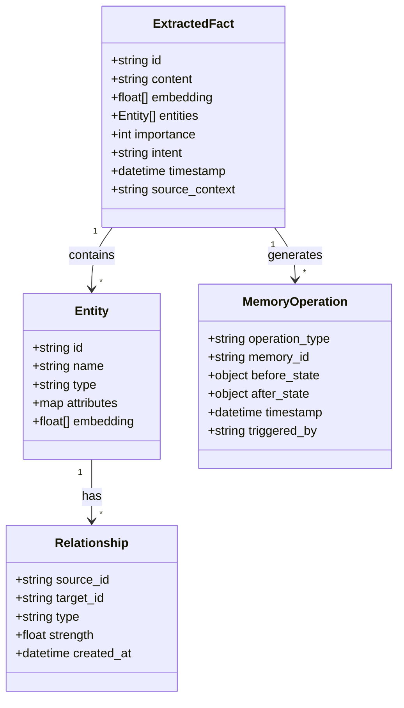

# Mem0 Two-Phase Memory Pipeline

## Overview

Mem0's architecture processes memories through an **Extraction phase** and an **Update phase**, storing across three parallel systems. This approach ensures that every piece of information is properly analyzed, deduplicated, and stored in the most appropriate format for later retrieval.

The key innovation of Mem0 is its intelligent conflict resolution system that determines whether new information should create a new memory, update an existing one, merge with related facts, or be discarded as redundant. This prevents the common problem of memory systems accumulating duplicate or contradictory information over time.

## Core Concepts

### Two-Phase Architecture

**Phase 1: Extraction** - The system analyzes incoming conversations to identify discrete facts worth remembering. This involves:
- Assembling context from multiple sources (current message, conversation history, rolling summary)
- Using an LLM to extract atomic facts with structured prompts
- Scoring each fact for importance (1-10 scale)
- Generating embeddings for semantic search
- Extracting entities and relationships

**Phase 2: Update** - The system determines how each extracted fact relates to existing memories:
- Similarity search against the vector store (cosine threshold typically 0.85)
- Conflict detection and classification
- Resolution decisions: CREATE, UPDATE, DELETE, or MERGE
- Atomic writes across all storage systems

### Memory Scopes

Mem0 organizes memories into three scopes:
- **User memories**: Persistent facts about a specific user (preferences, background, history)
- **Session memories**: Context relevant to the current conversation session
- **Agent memories**: Information the agent has learned that applies across users

## Detailed Flow

```mermaid
flowchart TB
    subgraph Input["INPUT LAYER"]
        MSG[/"New Message Pair<br/>(User + Assistant)"/]
        ROLL[/"Rolling Summary<br/>(Conversation so far)"/]
        RECENT[/"Recent Messages<br/>(Last 10 messages)"/]
    end

    subgraph Extraction["PHASE 1: EXTRACTION"]
        direction TB

        subgraph ContextAssembly["Context Assembly"]
            CA1[Concatenate Latest Exchange]
            CA2[Append Rolling Summary]
            CA3[Include Message Window]
            CA4[Format as Structured Prompt]
        end

        subgraph LLMExtraction["LLM Fact Extraction"]
            EX1[Send to LLM with extraction prompt]
            EX2{Response Valid?}
            EX3[Parse JSON response]
            EX4[Retry with simplified prompt]
            EX5[Extract atomic facts]
            EX6[Identify entities per fact]
            EX7[Score importance 1-10]
            EX8[Classify intent type]
        end

        subgraph FactProcessing["Fact Processing"]
            FP1[Generate embeddings for each fact]
            FP2[Extract entity mentions]
            FP3[Detect relationships between entities]
            FP4[Assign timestamps]
            FP5[Create fact objects with metadata]
        end
    end

    subgraph Update["PHASE 2: UPDATE"]
        direction TB

        subgraph SimilarityCheck["Similarity Check"]
            SC1[Query vector store for similar facts]
            SC2{Similar facts found?<br/>cosine > 0.85}
            SC3[Retrieve top-k matches]
            SC4[Load full fact details]
        end

        subgraph ConflictResolution["Conflict Resolution"]
            CR1[Compare new vs existing facts]
            CR2{Conflict detected?}
            CR3[LLM analyzes conflict type]
            CR4{Resolution type?}
            CR5[Mark existing as superseded]
            CR6[Merge facts into unified version]
            CR7[Keep both with different contexts]
            CR8[Discard new as duplicate/outdated]
        end

        subgraph ActionDecision["Action Decision"]
            AD1{Final action?}
            AD2[CREATE: New memory entry]
            AD3[UPDATE: Modify existing]
            AD4[DELETE: Remove obsolete]
            AD5[MERGE: Combine memories]
        end
    end

    subgraph Storage["PARALLEL STORAGE LAYER"]
        direction LR

        subgraph VectorStore["Vector Database"]
            VS1[(Embedding Vectors)]
            VS2[Index with HNSW]
            VS3[Store metadata]
        end

        subgraph GraphStore["Graph Database"]
            GS1[(Entity Nodes)]
            GS2[(Relationship Edges)]
            GS3[Update graph structure]
            GS4[Compute graph metrics]
        end

        subgraph KVStore["Key-Value Store"]
            KV1[(User Memories)]
            KV2[(Session Memories)]
            KV3[(Agent Memories)]
        end

        subgraph AuditLog["History Log"]
            AL1[Log operation type]
            AL2[Store before/after state]
            AL3[Record timestamp]
            AL4[Track provenance]
        end
    end

    subgraph AsyncProcessing["ASYNC BACKGROUND PROCESSING"]
        AP1[Summary generation queue]
        AP2[Periodic consolidation]
        AP3[Decay score updates]
        AP4[Graph recomputation]
    end

    %% Flow connections
    MSG --> CA1
    ROLL --> CA2
    RECENT --> CA3
    CA1 --> CA4
    CA2 --> CA4
    CA3 --> CA4

    CA4 --> EX1
    EX1 --> EX2
    EX2 -->|Yes| EX3
    EX2 -->|No| EX4
    EX4 --> EX1
    EX3 --> EX5
    EX5 --> EX6
    EX6 --> EX7
    EX7 --> EX8

    EX8 --> FP1
    FP1 --> FP2
    FP2 --> FP3
    FP3 --> FP4
    FP4 --> FP5

    FP5 --> SC1
    SC1 --> SC2
    SC2 -->|Yes| SC3
    SC2 -->|No| AD1
    SC3 --> SC4
    SC4 --> CR1

    CR1 --> CR2
    CR2 -->|Yes| CR3
    CR2 -->|No| AD1
    CR3 --> CR4
    CR4 -->|Supersede| CR5
    CR4 -->|Merge| CR6
    CR4 -->|Coexist| CR7
    CR4 -->|Duplicate| CR8

    CR5 --> AD1
    CR6 --> AD1
    CR7 --> AD1
    CR8 --> AD1

    AD1 -->|Create| AD2
    AD1 -->|Update| AD3
    AD1 -->|Delete| AD4
    AD1 -->|Merge| AD5

    AD2 --> VS1
    AD2 --> GS1
    AD2 --> KV1
    AD2 --> AL1

    AD3 --> VS1
    AD3 --> GS1
    AD3 --> KV1
    AD3 --> AL1

    AD4 --> VS1
    AD4 --> GS1
    AD4 --> KV1
    AD4 --> AL1

    AD5 --> VS1
    AD5 --> GS1
    AD5 --> KV1
    AD5 --> AL1

    VS1 --> VS2
    VS2 --> VS3

    GS1 --> GS2
    GS2 --> GS3
    GS3 --> GS4

    KV1 --> KV2
    KV2 --> KV3

    AL1 --> AL2
    AL2 --> AL3
    AL3 --> AL4

    VS3 -.-> AP1
    GS4 -.-> AP4
    KV3 -.-> AP2
    AL4 -.-> AP3

    classDef input fill:#e1f5fe,stroke:#01579b,color:#01579b
    classDef extraction fill:#f3e5f5,stroke:#4a148c,color:#4a148c
    classDef update fill:#fff3e0,stroke:#e65100,color:#bf360c
    classDef storage fill:#e8f5e9,stroke:#1b5e20,color:#1b5e20
    classDef async fill:#fce4ec,stroke:#880e4f,color:#880e4f

    class MSG,ROLL,RECENT input
    class CA1,CA2,CA3,CA4,EX1,EX2,EX3,EX4,EX5,EX6,EX7,EX8,FP1,FP2,FP3,FP4,FP5 extraction
    class SC1,SC2,SC3,SC4,CR1,CR2,CR3,CR4,CR5,CR6,CR7,CR8,AD1,AD2,AD3,AD4,AD5 update
    class VS1,VS2,VS3,GS1,GS2,GS3,GS4,KV1,KV2,KV3,AL1,AL2,AL3,AL4 storage
    class AP1,AP2,AP3,AP4 async
```



## Phase 1: Extraction - Deep Dive

### Context Assembly

The extraction phase begins by assembling a rich context window that provides the LLM with enough information to extract meaningful facts:

1. **Latest Exchange**: The most recent user message and assistant response pair. This is the primary source of new information.

2. **Rolling Summary**: A compressed representation of the conversation so far. This helps the LLM understand context without requiring the full conversation history.

3. **Message Window**: Typically the last 10 messages, providing immediate conversational context for disambiguation.

4. **Structured Prompt**: The assembled context is formatted with clear instructions for the LLM:

```
You are a memory extraction expert. Given the following conversation context, extract facts that should be remembered for future conversations.

Focus on:
- User preferences and opinions
- Factual information about the user
- Important events or decisions
- Relationships between entities

Return a JSON array of facts, each with:
- content: The fact in a single sentence
- entities: Named entities mentioned
- importance: 1-10 score
- intent: preference|fact|event|relationship

Context:
{assembled_context}
```

### LLM Fact Extraction

The LLM processes the context and returns structured facts. Key considerations:

- **Atomic Facts**: Each fact should be self-contained and represent a single piece of information
- **Decontextualization**: Facts should be understandable without the original conversation
- **Entity Identification**: Named entities (people, places, organizations, concepts) are tagged
- **Importance Scoring**: 1-3 (trivial), 4-6 (useful), 7-8 (important), 9-10 (critical)

### Fact Processing

Once extracted, each fact undergoes processing:

1. **Embedding Generation**: Using a model like `text-embedding-ada-002` or `nomic-embed-text`
2. **Entity Extraction**: Named Entity Recognition to identify key entities
3. **Relationship Detection**: Identifying connections between entities (e.g., "works_at", "prefers")
4. **Timestamping**: Recording when the fact was learned
5. **Metadata Assembly**: Creating the complete fact object

## Phase 2: Update - Deep Dive

### Similarity Check

Before storing a new fact, the system checks for existing similar facts:

1. **Vector Search**: Query the embedding store with cosine similarity
2. **Threshold**: Typically 0.85 - facts above this threshold are candidates for conflict resolution
3. **Top-K Retrieval**: Usually retrieve top 5 similar facts for analysis

### Conflict Resolution

When similar facts exist, the system must determine the relationship:

| Resolution Type | When Applied | Action |
|-----------------|--------------|--------|
| **DUPLICATE** | New fact says the same thing | Discard new, optionally update timestamp |
| **SUPERSEDE** | New fact contradicts/updates old | Mark old as superseded, create new |
| **MERGE** | New fact adds detail to existing | Combine into single enriched fact |
| **COEXIST** | Facts are related but distinct | Keep both, create relationship |

The LLM is used to classify the conflict type with a prompt like:

```
Given these two facts, determine their relationship:
Existing: "{old_fact}"
New: "{new_fact}"

Classify as:
- DUPLICATE: Same information
- SUPERSEDE: New replaces old
- MERGE: New adds to old
- COEXIST: Both are valid

Return: {classification, confidence, reasoning}
```

### Action Execution

Based on the resolution, one of four actions is taken:

- **CREATE**: Insert new memory across all storage systems
- **UPDATE**: Modify existing memory's content or metadata
- **DELETE**: Remove or archive obsolete memory
- **MERGE**: Combine memories and create unified version

## Data Structures



### ExtractedFact

The core memory unit containing:
- **id**: Unique identifier (UUID)
- **content**: Human-readable fact text
- **embedding**: Vector representation for semantic search
- **entities**: List of named entities mentioned
- **importance**: 1-10 priority score
- **intent**: Classification (preference, fact, event, relationship)
- **timestamp**: When the fact was learned
- **source_context**: Reference to original conversation

### Entity

Represents a named entity extracted from facts:
- **id**: Unique identifier
- **name**: Canonical name
- **type**: person, organization, location, concept, event
- **attributes**: Key-value pairs of known properties
- **embedding**: Vector for entity-level search

### Relationship

Connections between entities:
- **source_id/target_id**: Entity references
- **type**: Relationship type (works_at, prefers, located_in, etc.)
- **strength**: Confidence score 0-1
- **created_at**: When relationship was established

## Retrieval Flow

```mermaid
flowchart LR
    subgraph Query["QUERY PROCESSING"]
        Q1[/User Query/]
        Q2[Embed query]
        Q3[Extract query entities]
        Q4[Parse filters]
    end

    subgraph MultiSearch["PARALLEL SEARCH"]
        direction TB
        S1[Vector similarity search]
        S2[Graph traversal search]
        S3[Keyword/FTS search]
    end

    subgraph Fusion["RESULT FUSION"]
        F1[Normalize scores]
        F2[Apply weights]
        F3[Reciprocal rank fusion]
        F4[Deduplicate results]
    end

    subgraph Rerank["RERANKING"]
        R1[Load full memory content]
        R2[Cross-encoder rerank]
        R3[Apply business rules]
        R4[Filter by access scope]
    end

    subgraph Output["OUTPUT"]
        O1[/Top-K Memories/]
        O2[Format response]
        O3[Update access counts]
    end

    Q1 --> Q2 --> Q3 --> Q4
    Q4 --> S1
    Q4 --> S2
    Q4 --> S3
    S1 --> F1
    S2 --> F1
    S3 --> F1
    F1 --> F2 --> F3 --> F4
    F4 --> R1 --> R2 --> R3 --> R4
    R4 --> O1 --> O2 --> O3
```



### Multi-Path Retrieval

Mem0 uses three parallel search paths:

1. **Vector Similarity**: Semantic search using embeddings
2. **Graph Traversal**: Following entity relationships
3. **Keyword/FTS**: Traditional full-text search for exact matches

### Result Fusion

Results from all paths are combined using:
- **Score Normalization**: Bringing all scores to 0-1 range
- **Weighted Combination**: Configurable weights per source
- **Reciprocal Rank Fusion**: RRF algorithm for stable ranking
- **Deduplication**: Removing duplicate memories across sources

### Reranking

Final ranking uses:
- **Cross-encoder**: More expensive but accurate pairwise comparison
- **Business Rules**: Boosting recent, high-importance, or scope-matched memories
- **Access Scope**: Filtering based on user/session/agent permissions

## Parallel Storage Systems

### Vector Store
- Primary storage for semantic search
- Uses HNSW indexing for fast approximate nearest neighbor
- Stores metadata alongside embeddings

### Graph Store
- Entity nodes with attributes
- Relationship edges with types and strengths
- Enables multi-hop reasoning queries

### Key-Value Store
- Fast lookup by memory ID
- Organized by scope (user/session/agent)
- Full memory content storage

### Audit Log
- Complete history of all operations
- Before/after states for debugging
- Provenance tracking for trust

## Background Processing

Async jobs handle:
- **Summary Generation**: Creating rolling summaries
- **Periodic Consolidation**: Merging related memories
- **Decay Updates**: Adjusting importance over time
- **Graph Recomputation**: Updating metrics and communities

---

## How to Incorporate This into MycelicMemory

### Current State Analysis

MycelicMemory already has foundational elements that align with Mem0's architecture:
- SQLite database with `memories` table
- Vector storage via `sqlite-vec`
- Relationship tracking via `memory_relationships` table
- FTS5 full-text search

### Recommended Implementation Steps

#### Step 1: Implement Two-Phase Pipeline Structure

Create a new extraction pipeline in Go:

```go
// internal/extraction/pipeline.go
type ExtractionPipeline struct {
    llm       LLMClient
    embedder  EmbeddingClient
    db        *database.DB
}

type ExtractedFact struct {
    Content    string
    Entities   []Entity
    Importance int
    Intent     string
    Embedding  []float32
}

func (p *ExtractionPipeline) Extract(ctx context.Context, input ExtractionInput) ([]ExtractedFact, error) {
    // Phase 1: Context Assembly
    context := p.assembleContext(input)

    // Phase 1: LLM Extraction
    facts, err := p.llmExtract(ctx, context)
    if err != nil {
        return nil, err
    }

    // Phase 1: Fact Processing
    for i := range facts {
        facts[i].Embedding, _ = p.embedder.Embed(facts[i].Content)
        facts[i].Entities = p.extractEntities(facts[i].Content)
    }

    return facts, nil
}
```

#### Step 2: Add Conflict Resolution

Implement the update phase with conflict detection:

```go
// internal/extraction/update.go
type ConflictType string

const (
    ConflictDuplicate  ConflictType = "DUPLICATE"
    ConflictSupersede  ConflictType = "SUPERSEDE"
    ConflictMerge      ConflictType = "MERGE"
    ConflictCoexist    ConflictType = "COEXIST"
)

func (p *ExtractionPipeline) Update(ctx context.Context, fact ExtractedFact) error {
    // Phase 2: Similarity Check
    similar, err := p.db.SearchSimilar(fact.Embedding, 0.85, 5)
    if err != nil {
        return err
    }

    if len(similar) == 0 {
        // No conflicts - CREATE
        return p.db.CreateMemory(fact)
    }

    // Phase 2: Conflict Resolution
    for _, existing := range similar {
        conflictType := p.classifyConflict(ctx, fact, existing)
        switch conflictType {
        case ConflictDuplicate:
            return nil // Discard
        case ConflictSupersede:
            p.db.MarkSuperseded(existing.ID)
            return p.db.CreateMemory(fact)
        case ConflictMerge:
            merged := p.mergeFacts(ctx, fact, existing)
            return p.db.UpdateMemory(existing.ID, merged)
        case ConflictCoexist:
            p.db.CreateRelationship(existing.ID, fact.ID, "related_to")
            return p.db.CreateMemory(fact)
        }
    }

    return nil
}
```

#### Step 3: Extend Database Schema

Add tables for the audit log and enhanced entities:

```sql
-- Add to schema.go
CREATE TABLE IF NOT EXISTS memory_operations (
    id TEXT PRIMARY KEY,
    operation_type TEXT NOT NULL,  -- CREATE, UPDATE, DELETE, MERGE
    memory_id TEXT NOT NULL,
    before_state TEXT,  -- JSON
    after_state TEXT,   -- JSON
    triggered_by TEXT,  -- conversation_id or 'system'
    created_at DATETIME DEFAULT CURRENT_TIMESTAMP,
    FOREIGN KEY (memory_id) REFERENCES memories(id)
);

CREATE TABLE IF NOT EXISTS entities (
    id TEXT PRIMARY KEY,
    name TEXT NOT NULL,
    canonical_name TEXT NOT NULL,
    entity_type TEXT NOT NULL,  -- person, organization, concept, etc.
    attributes TEXT,  -- JSON
    embedding BLOB,
    created_at DATETIME DEFAULT CURRENT_TIMESTAMP,
    UNIQUE(canonical_name, entity_type)
);

CREATE TABLE IF NOT EXISTS memory_entities (
    memory_id TEXT NOT NULL,
    entity_id TEXT NOT NULL,
    mention_text TEXT,
    PRIMARY KEY (memory_id, entity_id),
    FOREIGN KEY (memory_id) REFERENCES memories(id),
    FOREIGN KEY (entity_id) REFERENCES entities(id)
);
```

#### Step 4: Add MCP Tool for Auto-Extraction

Extend the MCP server with an auto-extraction tool:

```go
// Add to mcp/tools.go
{
    Name: "memory_extract",
    Description: "Automatically extract memories from conversation context",
    InputSchema: map[string]interface{}{
        "type": "object",
        "properties": map[string]interface{}{
            "messages": map[string]interface{}{
                "type": "array",
                "description": "Recent conversation messages",
            },
            "user_id": map[string]interface{}{
                "type": "string",
                "description": "User identifier for scoping",
            },
        },
        "required": []string{"messages"},
    },
}
```

#### Step 5: Implement Hybrid Retrieval

Enhance the search with multi-path retrieval:

```go
// internal/retrieval/hybrid.go
type HybridRetriever struct {
    vectorSearch  *VectorSearcher
    graphSearch   *GraphSearcher
    keywordSearch *KeywordSearcher
}

func (h *HybridRetriever) Search(ctx context.Context, query string, k int) ([]Memory, error) {
    // Parallel search
    var wg sync.WaitGroup
    vectorResults := make(chan []ScoredMemory)
    graphResults := make(chan []ScoredMemory)
    keywordResults := make(chan []ScoredMemory)

    wg.Add(3)
    go func() { defer wg.Done(); vectorResults <- h.vectorSearch.Search(query, k*2) }()
    go func() { defer wg.Done(); graphResults <- h.graphSearch.Search(query, k*2) }()
    go func() { defer wg.Done(); keywordResults <- h.keywordSearch.Search(query, k*2) }()

    wg.Wait()

    // Fusion
    all := append(<-vectorResults, <-graphResults...)
    all = append(all, <-keywordResults...)

    fused := h.reciprocalRankFusion(all)
    deduplicated := h.deduplicate(fused)

    return deduplicated[:min(k, len(deduplicated))], nil
}
```

### Configuration Options

Add configuration for the extraction pipeline:

```yaml
# config.yaml addition
extraction:
  enabled: true
  llm_model: "qwen2.5:3b"  # Ollama model for extraction
  similarity_threshold: 0.85
  importance_threshold: 3  # Minimum importance to store
  batch_size: 10  # Process in batches

retrieval:
  vector_weight: 0.5
  graph_weight: 0.3
  keyword_weight: 0.2
  rerank_enabled: true
```

### Integration with Claude Code Hooks

Create a hook that triggers extraction on conversation context:

```bash
#!/bin/bash
# hooks/post-conversation-extract.sh

# Called after significant conversation exchanges
# Extracts memories automatically

MESSAGES="$1"
USER_ID="${USER:-default}"

mycelicmemory extract \
    --messages "$MESSAGES" \
    --user-id "$USER_ID" \
    --auto-resolve-conflicts
```

### Benefits of This Integration

1. **Automatic Memory Building**: No manual `memory_store` calls needed
2. **Deduplication**: Prevents memory bloat from repeated information
3. **Conflict Resolution**: Intelligently handles contradictions
4. **Multi-Modal Retrieval**: Better search through fusion
5. **Audit Trail**: Complete history for debugging and trust

### Migration Path

For existing MycelicMemory installations:

1. Run schema migration to add new tables
2. Backfill entities from existing memory content
3. Enable extraction pipeline in config
4. Gradually transition from manual to auto-extraction
5. Monitor and tune similarity thresholds
