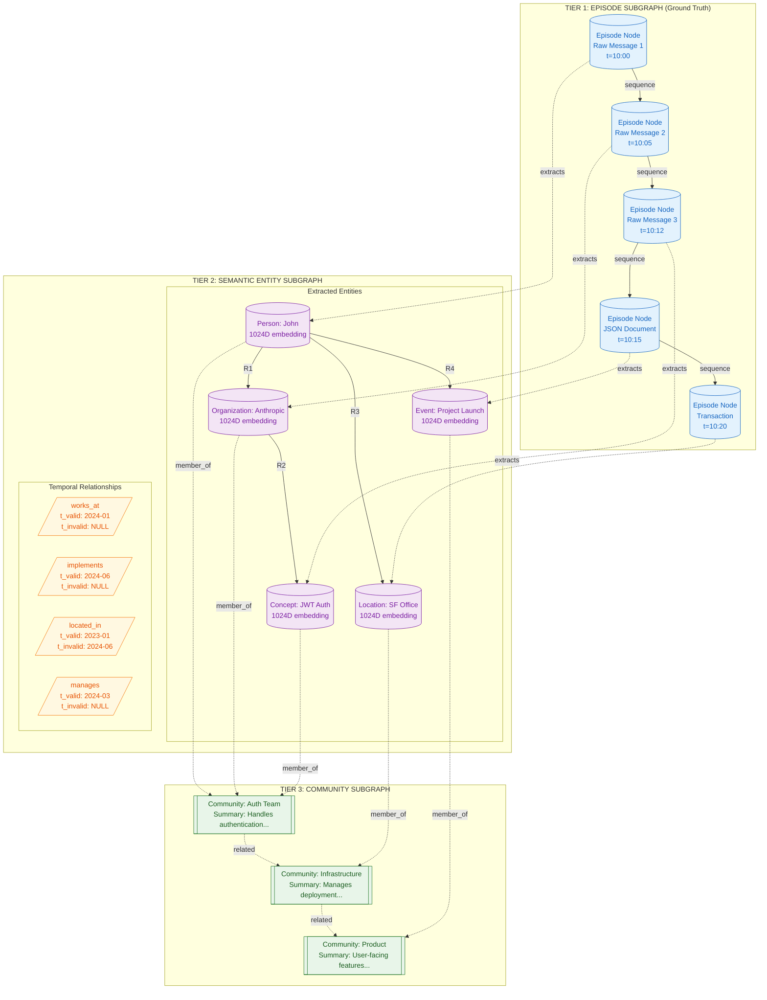

# Zep/Graphiti Temporal Knowledge Graph Architecture

## Overview

Zep implements a **three-tier subgraph structure** with **bi-temporal tracking** for complete historical reasoning. This architecture is particularly powerful for applications that need to understand not just what is currently true, but what was true at any point in time, and when the system learned about changes.

The key innovations of Zep/Graphiti include:
- **Episode-level ground truth**: Raw data is preserved as immutable episodes
- **Semantic entity extraction**: Named entities are extracted and linked across episodes
- **Community detection**: Related entities are grouped for higher-level reasoning
- **Bi-temporal model**: Tracking both real-world validity and system knowledge time

## Core Concepts

### Three-Tier Architecture

**Tier 1: Episode Subgraph (Ground Truth)**
- Stores raw, immutable records of conversations, documents, and transactions
- Episodes are sequentially linked to preserve chronological order
- Acts as the source of truth that can always be re-processed
- Each episode has a timestamp and content type

**Tier 2: Semantic Entity Subgraph**
- Extracted entities (people, organizations, concepts, locations, events)
- Relationships between entities with temporal validity windows
- Each entity and relationship has an embedding for semantic search
- Entities can be deduplicated and merged across episodes

**Tier 3: Community Subgraph**
- Clusters of related entities discovered through graph algorithms
- Each community has a summary describing its theme
- Enables high-level reasoning about topics
- Useful for answering broad questions

### Bi-Temporal Model

The bi-temporal model tracks two independent time dimensions:

**Valid Time (Real World)**
- `t_valid`: When the fact became true in reality
- `t_invalid`: When the fact stopped being true (NULL if still valid)

**System Time (Database)**
- `t_created`: When the system first learned about the fact
- `t_expired`: When the system invalidated this record (NULL if current)

This enables powerful queries like:
- "What was true on date X?" (valid time query)
- "What did we know on date Y?" (system time query)
- "When did we learn that X changed?" (combined query)

## Three-Tier Subgraph Architecture



### Tier 1: Episode Subgraph Details

Episodes are the foundation of the knowledge graph. They represent raw, unprocessed input:

| Episode Type | Content | Use Case |
|--------------|---------|----------|
| **Message** | Conversation turn (user or assistant) | Chat history |
| **Document** | Structured text (markdown, code, etc.) | Documentation |
| **JSON** | Structured data objects | API responses, configs |
| **Transaction** | Business events with metadata | Purchases, actions |

Episodes are linked sequentially within a session, allowing reconstruction of conversation flow. The raw content is preserved so that entity extraction can be re-run with improved prompts.

### Tier 2: Semantic Entity Subgraph Details

Entities are categorized by type:

| Entity Type | Examples | Typical Attributes |
|-------------|----------|-------------------|
| **Person** | John, Dr. Smith | name, role, contact |
| **Organization** | Anthropic, Google | name, type, location |
| **Concept** | JWT Auth, Microservices | name, domain, description |
| **Event** | Project Launch, Meeting | name, date, participants |
| **Location** | SF Office, NYC HQ | name, address, type |

Relationships between entities have:
- **Type**: Predicate describing the connection (works_at, implements, manages)
- **Temporal validity**: When the relationship was/is true
- **Confidence**: How certain the extraction is
- **Source episodes**: Which episodes support this relationship

### Tier 3: Community Subgraph Details

Communities are detected using graph clustering algorithms (e.g., Louvain, Label Propagation). Each community:
- Contains entities that are densely connected
- Has a generated summary describing its theme
- Can be queried at a high level
- Helps answer broad questions like "What topics do we discuss?"

## Bi-Temporal Model Detail

```mermaid
flowchart TB
    subgraph TemporalModel["BI-TEMPORAL TRACKING"]
        direction TB

        subgraph ValidTime["VALID TIME (Real World)"]
            VT1["t_valid: When fact became TRUE<br/>in the real world"]
            VT2["t_invalid: When fact became FALSE<br/>in the real world (NULL if current)"]
        end

        subgraph SystemTime["SYSTEM TIME (Database)"]
            ST1["t_created: When system LEARNED<br/>about this fact"]
            ST2["t_expired: When system INVALIDATED<br/>this record (NULL if current)"]
        end
    end

    subgraph Example["EXAMPLE: Job Change"]
        direction TB

        subgraph OldFact["Old Fact"]
            OF1["John works_at Google"]
            OF2["t_valid: 2020-01-15"]
            OF3["t_invalid: 2024-06-01"]
            OF4["t_created: 2020-01-20"]
            OF5["t_expired: NULL"]
        end

        subgraph NewFact["New Fact"]
            NF1["John works_at Anthropic"]
            NF2["t_valid: 2024-06-01"]
            NF3["t_invalid: NULL"]
            NF4["t_created: 2024-06-15"]
            NF5["t_expired: NULL"]
        end

        OF1 -.->|superseded_by| NF1
    end

    subgraph Queries["TEMPORAL QUERIES"]
        Q1["Query: Where did John work on 2023-05-01?"]
        Q2["Filter: t_valid <= 2023-05-01<br/>AND (t_invalid IS NULL OR t_invalid > 2023-05-01)"]
        Q3["Result: Google"]

        Q4["Query: When did we learn John left Google?"]
        Q5["Filter: Find edge where t_invalid IS NOT NULL"]
        Q6["Result: System learned on 2024-06-15<br/>(t_created of superseding fact)"]
    end

    Q1 --> Q2 --> Q3
    Q4 --> Q5 --> Q6
```



### Temporal Query Patterns

**Point-in-Time Query**: "What was true on date X?"
```sql
SELECT * FROM relationships
WHERE t_valid <= :query_date
  AND (t_invalid IS NULL OR t_invalid > :query_date)
```

**Current State Query**: "What is true now?"
```sql
SELECT * FROM relationships
WHERE t_invalid IS NULL
```

**History Query**: "What changed for entity X?"
```sql
SELECT * FROM relationships
WHERE (source_id = :entity_id OR target_id = :entity_id)
ORDER BY t_valid ASC
```

**Knowledge Timeline**: "When did we learn about changes?"
```sql
SELECT * FROM relationships
WHERE source_id = :entity_id
ORDER BY t_created ASC
```

## Ingestion Pipeline

```mermaid
flowchart TB
    subgraph Input["DATA INGESTION"]
        I1[/"Raw Episode<br/>(Message/Document)"/]
        I2[Parse content type]
        I3{Content type?}
        I4[JSON Parser]
        I5[Text Parser]
        I6[Transaction Parser]
    end

    subgraph Temporal["TEMPORAL EXTRACTION"]
        T1[Detect explicit timestamps]
        T2[Detect relative dates]
        T3{Has temporal reference?}
        T4[Resolve relative to absolute]
        T5[Use ingestion time as t_valid]
        T6[Assign t_created = now]
        T7[Set t_invalid = NULL]
    end

    subgraph EntityExtraction["ENTITY EXTRACTION"]
        EE1[LLM entity extraction prompt]
        EE2[Parse entity JSON response]
        EE3[Classify entity types]
        EE4[Generate 1024D embeddings]
        EE5[Entity deduplication check]
        EE6{Existing entity?}
        EE7[Create new entity node]
        EE8[Link to existing entity]
        EE9[Update entity attributes]
    end

    subgraph RelationExtraction["RELATIONSHIP EXTRACTION"]
        RE1[LLM relationship extraction]
        RE2[Form subject-predicate-object triplets]
        RE3[Score relationship confidence]
        RE4{Confidence > threshold?}
        RE5[Create relationship edge]
        RE6[Discard low-confidence]
        RE7[Add temporal metadata to edge]
    end

    subgraph ConflictDetection["CONFLICT DETECTION"]
        CD1[Query existing relationships]
        CD2{Same entities + predicate?}
        CD3[Compare temporal validity]
        CD4{Conflict type?}
        CD5[Set t_invalid on old edge]
        CD6[Create new edge]
        CD7[Log conflict resolution]
    end

    subgraph GraphUpdate["GRAPH UPDATE"]
        GU1[Begin transaction]
        GU2[Upsert entity nodes]
        GU3[Create/update edges]
        GU4[Update community assignments]
        GU5[Recompute affected summaries]
        GU6[Commit transaction]
        GU7[Update vector indices]
    end

    I1 --> I2 --> I3
    I3 -->|JSON| I4
    I3 -->|Text| I5
    I3 -->|Transaction| I6
    I4 --> T1
    I5 --> T1
    I6 --> T1

    T1 --> T2 --> T3
    T3 -->|Yes| T4
    T3 -->|No| T5
    T4 --> T6
    T5 --> T6
    T6 --> T7

    T7 --> EE1
    EE1 --> EE2 --> EE3 --> EE4 --> EE5 --> EE6
    EE6 -->|No| EE7
    EE6 -->|Yes| EE8
    EE8 --> EE9
    EE7 --> RE1
    EE9 --> RE1

    RE1 --> RE2 --> RE3 --> RE4
    RE4 -->|Yes| RE5
    RE4 -->|No| RE6
    RE5 --> RE7

    RE7 --> CD1 --> CD2
    CD2 -->|No| GU1
    CD2 -->|Yes| CD3 --> CD4
    CD4 -->|Supersede| CD5 --> CD6
    CD4 -->|Coexist| CD6
    CD5 --> CD7
    CD6 --> CD7 --> GU1

    GU1 --> GU2 --> GU3 --> GU4 --> GU5 --> GU6 --> GU7

    classDef input fill:#e1f5fe,stroke:#01579b,color:#01579b
    classDef temporal fill:#fff3e0,stroke:#e65100,color:#bf360c
    classDef entity fill:#f3e5f5,stroke:#7b1fa2,color:#7b1fa2
    classDef relation fill:#e8f5e9,stroke:#2e7d32,color:#1b5e20
    classDef conflict fill:#ffebee,stroke:#c62828,color:#c62828
    classDef graph fill:#e0f2f1,stroke:#00695c,color:#00695c

    class I1,I2,I3,I4,I5,I6 input
    class T1,T2,T3,T4,T5,T6,T7 temporal
    class EE1,EE2,EE3,EE4,EE5,EE6,EE7,EE8,EE9 entity
    class RE1,RE2,RE3,RE4,RE5,RE6,RE7 relation
    class CD1,CD2,CD3,CD4,CD5,CD6,CD7 conflict
    class GU1,GU2,GU3,GU4,GU5,GU6,GU7 graph
```

### Entity Extraction Prompts

The LLM is prompted with structured instructions:

```
You are an entity extraction expert. Given the following text, extract all named entities.

For each entity, provide:
- name: The canonical name
- type: person|organization|concept|event|location
- attributes: Any known attributes (role, description, etc.)

Text: {episode_content}

Return as JSON array.
```

### Relationship Extraction Prompts

```
Given these entities: {entity_list}
And this context: {episode_content}

Extract relationships in the form:
- subject: Entity name
- predicate: Relationship type (works_at, manages, implements, etc.)
- object: Entity name
- confidence: 0.0-1.0
- temporal_hint: Any time references (optional)

Return as JSON array.
```

### Conflict Detection Logic

When a new relationship is extracted:

1. **Check for existing**: Query for same (subject, predicate, object)
2. **Compare values**: If object differs, it's a potential conflict
3. **Resolve temporally**:
   - If new fact has explicit later date → supersede old
   - If no dates → mark old as `t_invalid = now()` and create new
   - If dates overlap → may coexist (different contexts)

## Hybrid Retrieval System

```mermaid
flowchart TB
    subgraph Query["QUERY PROCESSING"]
        Q1[/"User Query"/]
        Q2[Embed query with BGE-M3]
        Q3[Extract query entities]
        Q4[Parse temporal constraints]
        Q5[Identify query intent]
    end

    subgraph SemanticSearch["SEMANTIC SEARCH PATH"]
        SS1[Dense vector search]
        SS2[Search entity embeddings]
        SS3[Search relationship embeddings]
        SS4[Rank by cosine similarity]
        SS5[Apply temporal filters]
    end

    subgraph KeywordSearch["KEYWORD SEARCH PATH"]
        KS1[BM25 keyword matching]
        KS2[Search episode content]
        KS3[Search entity names]
        KS4[Search relationship contexts]
        KS5[Apply temporal filters]
    end

    subgraph GraphSearch["GRAPH TRAVERSAL PATH"]
        GS1[Identify seed entities from query]
        GS2[Execute graph traversal]
        GS3[Follow relationship edges]
        GS4[Respect temporal validity]
        GS5[Compute path scores]
        GS6[Multi-hop expansion]
    end

    subgraph CommunitySearch["COMMUNITY SEARCH"]
        CS1[Match query to community summaries]
        CS2[Identify relevant communities]
        CS3[Expand to community members]
        CS4[Retrieve community context]
    end

    subgraph Fusion["RESULT FUSION"]
        F1[Collect all candidate results]
        F2[Normalize scores per source]
        F3[Apply source weights]
        F4[Reciprocal rank fusion]
        F5[Deduplicate entities/episodes]
        F6[Build unified context]
    end

    subgraph TemporalReasoning["TEMPORAL REASONING"]
        TR1{Temporal query?}
        TR2[Filter by t_valid range]
        TR3[Reconstruct point-in-time state]
        TR4[Order by temporal relevance]
        TR5[Include temporal context]
    end

    subgraph Output["OUTPUT ASSEMBLY"]
        O1[Select top-K results]
        O2[Fetch full episode content]
        O3[Include entity context]
        O4[Add relationship context]
        O5[Format for LLM consumption]
        O6[/"Retrieved Context"/]
    end

    Q1 --> Q2 --> Q3 --> Q4 --> Q5

    Q5 --> SS1
    Q5 --> KS1
    Q5 --> GS1
    Q5 --> CS1

    SS1 --> SS2 --> SS3 --> SS4 --> SS5
    KS1 --> KS2 --> KS3 --> KS4 --> KS5
    GS1 --> GS2 --> GS3 --> GS4 --> GS5 --> GS6
    CS1 --> CS2 --> CS3 --> CS4

    SS5 --> F1
    KS5 --> F1
    GS6 --> F1
    CS4 --> F1

    F1 --> F2 --> F3 --> F4 --> F5 --> F6

    F6 --> TR1
    TR1 -->|Yes| TR2 --> TR3 --> TR4 --> TR5
    TR1 -->|No| O1
    TR5 --> O1

    O1 --> O2 --> O3 --> O4 --> O5 --> O6

    classDef query fill:#e1f5fe,stroke:#01579b,color:#01579b
    classDef semantic fill:#f3e5f5,stroke:#7b1fa2,color:#7b1fa2
    classDef keyword fill:#fff3e0,stroke:#e65100,color:#bf360c
    classDef graph fill:#e8f5e9,stroke:#2e7d32,color:#1b5e20
    classDef community fill:#e0f7fa,stroke:#00838f,color:#00695c
    classDef fusion fill:#fce4ec,stroke:#ad1457,color:#880e4f
    classDef temporal fill:#fffde7,stroke:#f9a825,color:#e65100
    classDef output fill:#f1f8e9,stroke:#558b2f,color:#33691e

    class Q1,Q2,Q3,Q4,Q5 query
    class SS1,SS2,SS3,SS4,SS5 semantic
    class KS1,KS2,KS3,KS4,KS5 keyword
    class GS1,GS2,GS3,GS4,GS5,GS6 graph
    class CS1,CS2,CS3,CS4 community
    class F1,F2,F3,F4,F5,F6 fusion
    class TR1,TR2,TR3,TR4,TR5 temporal
    class O1,O2,O3,O4,O5,O6 output
```

### Retrieval Path Comparison

| Path | Best For | Strengths | Weaknesses |
|------|----------|-----------|------------|
| **Semantic** | Conceptual questions | Finds related concepts | May miss exact names |
| **Keyword** | Specific names/terms | Precise matching | Misses synonyms |
| **Graph** | Relationship questions | Multi-hop reasoning | Needs good seed entities |
| **Community** | Broad topic questions | High-level summaries | Less specific details |

### Fusion Weights (Recommended Defaults)

```yaml
retrieval:
  weights:
    semantic: 0.35
    keyword: 0.25
    graph: 0.25
    community: 0.15
```

---

## How to Incorporate This into MycelicMemory

### Current State Analysis

MycelicMemory has partial support for knowledge graph concepts:
- `memory_relationships` table with relationship types
- Basic entity support (can be extended)
- FTS5 for keyword search
- Vector search via sqlite-vec

Missing components:
- Bi-temporal tracking
- Episode-level storage
- Community detection
- Graph traversal queries

### Recommended Implementation Steps

#### Step 1: Add Bi-Temporal Columns

Extend the database schema:

```sql
-- Modify memories table
ALTER TABLE memories ADD COLUMN t_valid DATETIME;
ALTER TABLE memories ADD COLUMN t_invalid DATETIME;
ALTER TABLE memories ADD COLUMN t_created DATETIME DEFAULT CURRENT_TIMESTAMP;
ALTER TABLE memories ADD COLUMN t_expired DATETIME;

-- Modify relationships table
ALTER TABLE memory_relationships ADD COLUMN t_valid DATETIME;
ALTER TABLE memory_relationships ADD COLUMN t_invalid DATETIME;
ALTER TABLE memory_relationships ADD COLUMN t_created DATETIME DEFAULT CURRENT_TIMESTAMP;
ALTER TABLE memory_relationships ADD COLUMN t_expired DATETIME;
ALTER TABLE memory_relationships ADD COLUMN confidence REAL DEFAULT 1.0;

-- Create episodes table
CREATE TABLE IF NOT EXISTS episodes (
    id TEXT PRIMARY KEY,
    content TEXT NOT NULL,
    content_type TEXT NOT NULL,  -- message, document, json, transaction
    session_id TEXT,
    sequence_num INTEGER,
    created_at DATETIME DEFAULT CURRENT_TIMESTAMP,
    metadata TEXT  -- JSON
);

CREATE INDEX idx_episodes_session ON episodes(session_id, sequence_num);
```

#### Step 2: Implement Episode Storage

Store raw episodes before extraction:

```go
// internal/temporal/episodes.go
type Episode struct {
    ID          string
    Content     string
    ContentType string  // message, document, json, transaction
    SessionID   string
    SequenceNum int
    CreatedAt   time.Time
    Metadata    map[string]interface{}
}

func (db *DB) StoreEpisode(ep Episode) error {
    // Get next sequence number for session
    var seq int
    db.conn.QueryRow(`
        SELECT COALESCE(MAX(sequence_num), 0) + 1
        FROM episodes WHERE session_id = ?
    `, ep.SessionID).Scan(&seq)
    ep.SequenceNum = seq

    _, err := db.conn.Exec(`
        INSERT INTO episodes (id, content, content_type, session_id, sequence_num, metadata)
        VALUES (?, ?, ?, ?, ?, ?)
    `, ep.ID, ep.Content, ep.ContentType, ep.SessionID, ep.SequenceNum, ep.Metadata)
    return err
}
```

#### Step 3: Add Temporal Query Support

Implement point-in-time queries:

```go
// internal/temporal/queries.go
type TemporalQuery struct {
    AsOfDate    *time.Time  // Valid time filter
    KnownAsOf   *time.Time  // System time filter
}

func (db *DB) SearchWithTemporal(query string, temporal TemporalQuery, limit int) ([]Memory, error) {
    baseQuery := `
        SELECT m.* FROM memories m
        WHERE m.embedding MATCH ?
    `

    if temporal.AsOfDate != nil {
        baseQuery += ` AND m.t_valid <= ? AND (m.t_invalid IS NULL OR m.t_invalid > ?)`
    }

    if temporal.KnownAsOf != nil {
        baseQuery += ` AND m.t_created <= ?`
    }

    baseQuery += ` ORDER BY distance LIMIT ?`

    // Execute with appropriate parameters...
}

func (db *DB) GetEntityHistoryAt(entityID string, asOfDate time.Time) ([]Relationship, error) {
    return db.Query(`
        SELECT r.* FROM memory_relationships r
        WHERE (r.source_memory_id = ? OR r.target_memory_id = ?)
          AND r.t_valid <= ?
          AND (r.t_invalid IS NULL OR r.t_invalid > ?)
        ORDER BY r.t_valid ASC
    `, entityID, entityID, asOfDate, asOfDate)
}
```

#### Step 4: Implement Relationship Supersession

Handle temporal conflicts:

```go
// internal/temporal/supersession.go
func (db *DB) CreateOrSupersede(rel Relationship) error {
    // Check for existing relationship with same entities and type
    existing, err := db.FindRelationship(rel.SourceID, rel.TargetID, rel.Type)
    if err != nil {
        return err
    }

    if existing != nil && existing.TInvalid == nil {
        // Supersede the existing relationship
        now := time.Now()
        existing.TInvalid = &now
        if err := db.UpdateRelationship(existing); err != nil {
            return err
        }
    }

    // Create new relationship
    rel.TValid = time.Now()
    rel.TCreated = time.Now()
    return db.CreateRelationship(rel)
}
```

#### Step 5: Add Community Detection

Implement simple community detection:

```go
// internal/graph/communities.go
type Community struct {
    ID       string
    Name     string
    Summary  string
    Members  []string  // Entity IDs
}

func (g *GraphDB) DetectCommunities() ([]Community, error) {
    // Simple connected components or label propagation
    // More sophisticated: Louvain algorithm

    // Get all entities and their relationships
    entities, _ := g.GetAllEntities()
    edges, _ := g.GetAllRelationships()

    // Build adjacency list
    adj := make(map[string][]string)
    for _, e := range edges {
        adj[e.SourceID] = append(adj[e.SourceID], e.TargetID)
        adj[e.TargetID] = append(adj[e.TargetID], e.SourceID)
    }

    // Find connected components (simple algorithm)
    visited := make(map[string]bool)
    var communities []Community

    for _, entity := range entities {
        if visited[entity.ID] {
            continue
        }

        // BFS to find component
        component := g.bfs(entity.ID, adj, visited)
        community := Community{
            ID:      uuid.New().String(),
            Members: component,
        }

        // Generate summary using LLM
        community.Summary = g.generateCommunitySummary(component)
        communities = append(communities, community)
    }

    return communities, nil
}
```

#### Step 6: Add MCP Tools for Temporal Queries

```go
// Add to mcp/tools.go
{
    Name: "memory_search_temporal",
    Description: "Search memories with temporal constraints",
    InputSchema: map[string]interface{}{
        "type": "object",
        "properties": map[string]interface{}{
            "query": map[string]interface{}{
                "type": "string",
                "description": "Search query",
            },
            "as_of_date": map[string]interface{}{
                "type": "string",
                "description": "Return facts valid at this date (ISO format)",
            },
            "limit": map[string]interface{}{
                "type": "integer",
                "default": 10,
            },
        },
        "required": []string{"query"},
    },
},
{
    Name: "memory_entity_history",
    Description: "Get the history of changes for an entity",
    InputSchema: map[string]interface{}{
        "type": "object",
        "properties": map[string]interface{}{
            "entity_name": map[string]interface{}{
                "type": "string",
            },
        },
        "required": []string{"entity_name"},
    },
}
```

### Configuration Options

```yaml
# config.yaml addition
temporal:
  enabled: true
  default_valid_time: "ingestion"  # or "explicit"
  retention_days: 365  # How long to keep expired facts

graph:
  community_detection:
    enabled: true
    algorithm: "connected_components"  # or "louvain"
    min_community_size: 3
    recompute_interval: "24h"

retrieval:
  paths:
    semantic: true
    keyword: true
    graph: true
    community: true
  weights:
    semantic: 0.35
    keyword: 0.25
    graph: 0.25
    community: 0.15
```

### Benefits of This Integration

1. **Historical Reasoning**: Answer "what was true when" questions
2. **Change Tracking**: Know when information changed
3. **Conflict Handling**: Properly manage contradictions over time
4. **Multi-Hop Queries**: Follow relationships to find indirect connections
5. **Topic Clustering**: Understand high-level themes in memory

### Migration Path

For existing MycelicMemory installations:

1. Run schema migration to add temporal columns
2. Set `t_valid = created_at` and `t_created = created_at` for existing memories
3. Leave `t_invalid` and `t_expired` as NULL (current facts)
4. Enable community detection to cluster existing entities
5. New memories will have full temporal tracking
