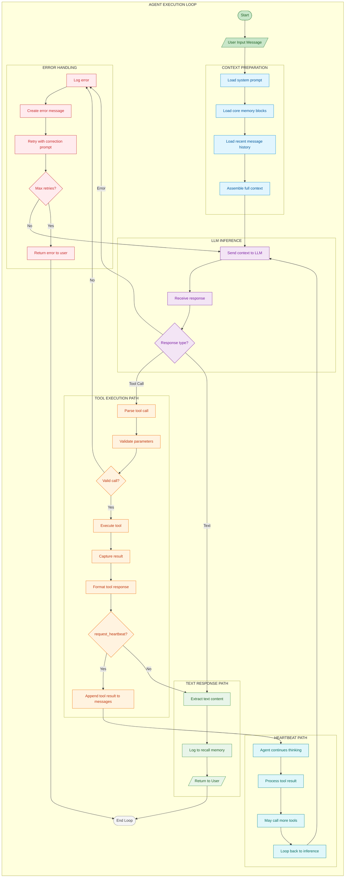
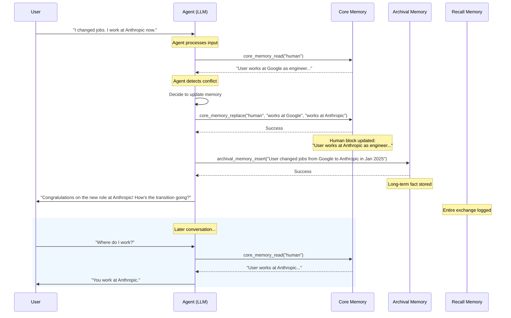
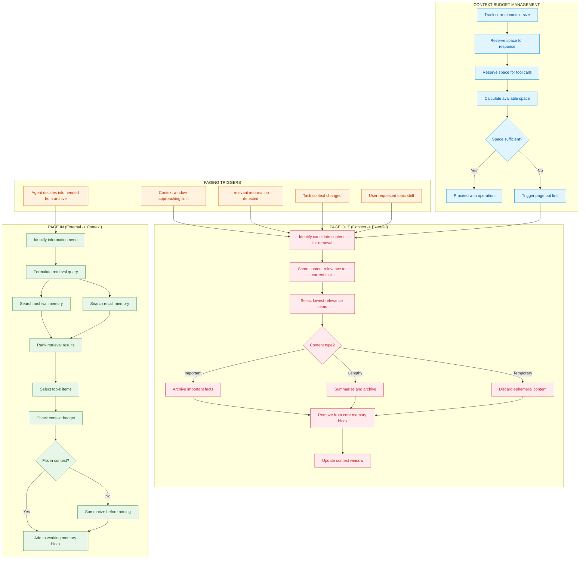
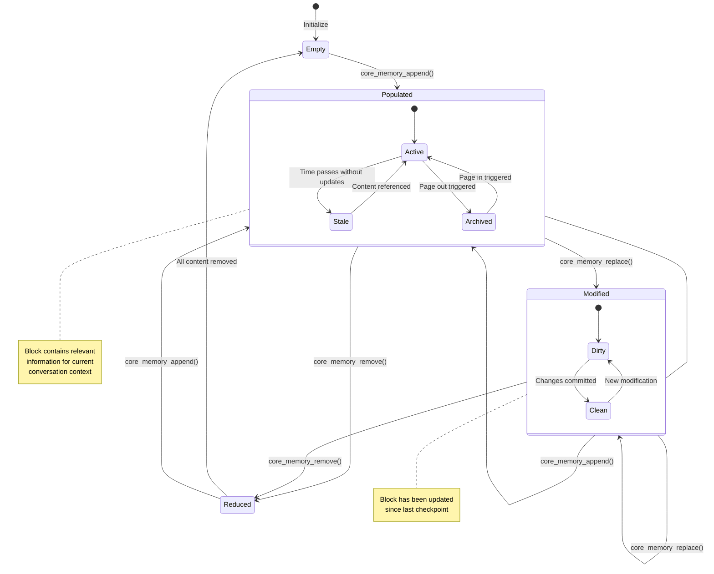

# MemGPT/Letta Self-Editing Memory Architecture

## Overview

MemGPT (now Letta) treats the LLM as an **operating system** that manages its own memory through explicit tool calls, with a two-tier memory hierarchy. This innovative approach allows AI agents to overcome context window limitations by intelligently paging information in and out of active memory, much like how operating systems manage RAM and disk storage.

The key insight of MemGPT is that LLMs can be given tools to manage their own context window, enabling them to:
- Decide what information is relevant to keep in working memory
- Archive important facts for later retrieval
- Edit and update their understanding of users and tasks
- Maintain coherent long-term interactions across unbounded conversations

This architecture is particularly powerful for:
- Long-running agent interactions that exceed context limits
- Personalized assistants that remember user preferences
- Task-oriented agents that need to manage complex state
- Systems requiring explicit memory management with audit trails

## Core Concepts

### Two-Tier Memory Architecture

**In-Context Memory (Fast, Limited)**
- **Persona Block**: The agent's identity, personality, and capabilities. This remains relatively stable but can be modified as the agent learns about itself.
- **Human Block**: Information about the current user - their name, preferences, context, and relationship history. This evolves as the agent learns more about the user.
- **Working Memory**: Temporary scratchpad for the current task, active context, and recent decisions. This is the most volatile part of memory.

**External Memory (Slow, Unlimited)**
- **Archival Memory**: Long-term fact storage using vector similarity search. Ideal for historical context, learned knowledge, and facts that may be relevant later.
- **Recall Memory**: Complete conversation history stored in SQL. Enables searching past conversations by content or time range.

### Heartbeat Mechanism

The heartbeat mechanism enables multi-step reasoning by allowing the agent to continue processing after tool calls. When an agent calls a tool and sets `request_heartbeat=True`, control returns to the agent immediately after the tool result, allowing it to:
- Chain multiple tool calls together
- Think through complex problems step-by-step
- Gather information from multiple sources before responding

### Self-Editing Memory

Unlike traditional RAG systems where memory is read-only, MemGPT agents actively manage their own memory:
- **Append**: Add new information to memory blocks
- **Replace**: Update existing information when it changes
- **Remove**: Clear outdated or irrelevant information
- **Search**: Query archival and recall memory for relevant context

## Two-Tier Memory Architecture

```mermaid
flowchart TB
    subgraph ContextWindow["LLM CONTEXT WINDOW (Limited Resource)"]
        direction TB

        subgraph SystemPrompt["SYSTEM PROMPT (Fixed)"]
            SP1["Base instructions"]
            SP2["Tool definitions"]
            SP3["Behavior guidelines"]
        end

        subgraph InContextMemory["IN-CONTEXT MEMORY (Editable)"]
            direction LR

            subgraph PersonaBlock["PERSONA BLOCK"]
                PB1["Agent identity"]
                PB2["Personality traits"]
                PB3["Capabilities"]
                PB4["Current goals"]
            end

            subgraph HumanBlock["HUMAN BLOCK"]
                HB1["User name"]
                HB2["User preferences"]
                HB3["User context"]
                HB4["Relationship history"]
            end

            subgraph WorkingMemory["WORKING MEMORY"]
                WM1["Current task"]
                WM2["Active context"]
                WM3["Recent decisions"]
                WM4["Temporary notes"]
            end
        end

        subgraph MessageHistory["RECENT MESSAGES"]
            MH1["User message N-2"]
            MH2["Assistant response N-2"]
            MH3["User message N-1"]
            MH4["Assistant response N-1"]
            MH5["Current user message"]
        end
    end

    subgraph ExternalMemory["EXTERNAL MEMORY (Unlimited)"]
        direction TB

        subgraph ArchivalMemory["ARCHIVAL MEMORY (Vector DB)"]
            AM1[("Long-term facts")]
            AM2[("Historical context")]
            AM3[("Knowledge base")]
            AM4[("Past learnings")]
        end

        subgraph RecallMemory["RECALL MEMORY (SQL DB)"]
            RM1[("Complete conversation history")]
            RM2[("All past messages")]
            RM3[("Session metadata")]
            RM4[("Interaction logs")]
        end
    end

    subgraph MemoryTools["MEMORY MANAGEMENT TOOLS"]
        direction LR

        subgraph CoreMemoryTools["CORE MEMORY TOOLS"]
            CMT1["core_memory_append(block, content)"]
            CMT2["core_memory_replace(block, old, new)"]
            CMT3["core_memory_remove(block, content)"]
        end

        subgraph ArchivalTools["ARCHIVAL TOOLS"]
            AT1["archival_memory_insert(content)"]
            AT2["archival_memory_search(query, k)"]
        end

        subgraph RecallTools["RECALL TOOLS"]
            RT1["conversation_search(query, k)"]
            RT2["conversation_search_date(start, end)"]
        end
    end

    %% Tool connections
    CMT1 -.->|modifies| PersonaBlock
    CMT1 -.->|modifies| HumanBlock
    CMT1 -.->|modifies| WorkingMemory
    CMT2 -.->|modifies| PersonaBlock
    CMT2 -.->|modifies| HumanBlock
    CMT2 -.->|modifies| WorkingMemory
    CMT3 -.->|modifies| PersonaBlock
    CMT3 -.->|modifies| HumanBlock
    CMT3 -.->|modifies| WorkingMemory

    AT1 -.->|writes to| ArchivalMemory
    AT2 -.->|reads from| ArchivalMemory
    RT1 -.->|reads from| RecallMemory
    RT2 -.->|reads from| RecallMemory

    classDef system fill:#e8eaf6,stroke:#3f51b5,color:#283593
    classDef persona fill:#e1f5fe,stroke:#0288d1,color:#01579b
    classDef human fill:#f3e5f5,stroke:#7b1fa2,color:#7b1fa2
    classDef working fill:#fff3e0,stroke:#ef6c00,color:#bf360c
    classDef message fill:#e0f2f1,stroke:#00897b,color:#00695c
    classDef archival fill:#e8f5e9,stroke:#388e3c,color:#1b5e20
    classDef recall fill:#fce4ec,stroke:#c2185b,color:#880e4f
    classDef tool fill:#fffde7,stroke:#fbc02d,color:#e65100

    class SP1,SP2,SP3 system
    class PB1,PB2,PB3,PB4 persona
    class HB1,HB2,HB3,HB4 human
    class WM1,WM2,WM3,WM4 working
    class MH1,MH2,MH3,MH4,MH5 message
    class AM1,AM2,AM3,AM4 archival
    class RM1,RM2,RM3,RM4 recall
    class CMT1,CMT2,CMT3,AT1,AT2,RT1,RT2 tool
```



### Memory Block Details

| Block Type | Purpose | Persistence | Update Frequency |
|------------|---------|-------------|------------------|
| **Persona** | Agent's self-model and capabilities | Persistent | Rare (identity changes) |
| **Human** | User information and preferences | Per-user | Moderate (as learned) |
| **Working** | Current task and temporary context | Session | Frequent (every turn) |
| **Archival** | Long-term knowledge base | Permanent | On significant events |
| **Recall** | Complete conversation history | Permanent | Every message |

### Memory Tool Comparison

| Tool | Operation | Target | Use Case |
|------|-----------|--------|----------|
| `core_memory_append` | Add content | In-context blocks | Learning new facts about user |
| `core_memory_replace` | Edit content | In-context blocks | Correcting/updating information |
| `core_memory_remove` | Delete content | In-context blocks | Clearing irrelevant details |
| `archival_memory_insert` | Store fact | Vector DB | Important long-term knowledge |
| `archival_memory_search` | Semantic search | Vector DB | Retrieving relevant history |
| `conversation_search` | Text search | SQL DB | Finding past discussions |
| `conversation_search_date` | Time-range search | SQL DB | Reviewing specific periods |

## Heartbeat Mechanism (Multi-Step Reasoning)



### Heartbeat Flow Explanation

1. **Context Preparation**: Before each LLM call, the system assembles the full context including system prompt, current memory blocks, and recent messages.

2. **Inference**: The LLM processes the context and generates a response, which can be either a tool call or a text response.

3. **Tool Execution**: If the LLM requests a tool call, the system validates and executes it, capturing the result.

4. **Heartbeat Decision**: The critical decision point - if `request_heartbeat=True`, control returns to the LLM to continue processing. This enables:
   - Multi-step information gathering
   - Chain-of-thought reasoning with external lookups
   - Complex task decomposition

5. **Response Delivery**: When the agent decides to respond with text (no heartbeat), the message is logged and returned to the user.

## Self-Editing Memory Example Flow



### Key Observations

1. **Conflict Detection**: The agent recognizes that new information contradicts existing memory.
2. **Intelligent Update**: Rather than just appending, the agent replaces outdated information.
3. **Historical Preservation**: Important changes are archived for future reference.
4. **Immediate Application**: The updated knowledge is used in the same conversation.

## Memory Paging Strategy



### Page Out Strategies

| Content Type | Strategy | When to Use |
|--------------|----------|-------------|
| **Important Facts** | Archive to vector DB | User preferences, learned knowledge |
| **Lengthy Details** | Summarize then archive | Long explanations, verbose context |
| **Ephemeral Notes** | Discard | Temporary calculations, transient state |
| **Old Messages** | Move to recall | Messages beyond window limit |

### Context Budget Allocation

A typical 8K context window might be allocated as:
- System prompt: 1K tokens (fixed)
- Persona block: 500 tokens
- Human block: 500 tokens
- Working memory: 1K tokens
- Message history: 3K tokens
- Reserved for response: 2K tokens

## Memory Block State Machine



---

## How to Incorporate This into MycelicMemory

### Current State Analysis

MycelicMemory has foundational elements that can support MemGPT-style architecture:
- SQLite database with `memories` table for persistent storage
- Vector storage via `sqlite-vec` (similar to archival memory)
- FTS5 for keyword search (similar to recall memory search)
- Session tracking via `agent_sessions` table
- Relationship tracking for connecting related memories

Missing components:
- Structured memory blocks (persona, human, working)
- Self-editing memory tools exposed via MCP
- Heartbeat mechanism for multi-step reasoning
- Context budget management
- Page in/out orchestration

### Recommended Implementation Steps

#### Step 1: Add Memory Blocks Schema

Extend the database to support structured memory blocks:

```sql
-- Add to schema.go or create new migration
CREATE TABLE IF NOT EXISTS memory_blocks (
    id TEXT PRIMARY KEY,
    block_type TEXT NOT NULL CHECK (
        block_type IN ('persona', 'human', 'working', 'system')
    ),
    user_id TEXT,  -- NULL for persona/system, set for human blocks
    session_id TEXT,  -- NULL for persistent, set for session-scoped
    content TEXT NOT NULL,
    max_tokens INTEGER DEFAULT 500,
    current_tokens INTEGER DEFAULT 0,
    version INTEGER DEFAULT 1,
    created_at DATETIME DEFAULT CURRENT_TIMESTAMP,
    updated_at DATETIME DEFAULT CURRENT_TIMESTAMP,
    FOREIGN KEY (session_id) REFERENCES agent_sessions(session_id)
);

CREATE INDEX IF NOT EXISTS idx_memory_blocks_type ON memory_blocks(block_type);
CREATE INDEX IF NOT EXISTS idx_memory_blocks_user ON memory_blocks(user_id);
CREATE INDEX IF NOT EXISTS idx_memory_blocks_session ON memory_blocks(session_id);

-- Block edit history for auditing
CREATE TABLE IF NOT EXISTS memory_block_history (
    id TEXT PRIMARY KEY,
    block_id TEXT NOT NULL,
    operation TEXT NOT NULL CHECK (operation IN ('append', 'replace', 'remove')),
    old_content TEXT,
    new_content TEXT,
    changed_at DATETIME DEFAULT CURRENT_TIMESTAMP,
    triggered_by TEXT,  -- 'agent', 'user', 'system'
    FOREIGN KEY (block_id) REFERENCES memory_blocks(id)
);
```

#### Step 2: Implement Memory Block Service

Create a service to manage memory blocks:

```go
// internal/memoryblocks/service.go
package memoryblocks

import (
    "context"
    "fmt"
    "time"

    "github.com/google/uuid"
)

type BlockType string

const (
    BlockTypePersona BlockType = "persona"
    BlockTypeHuman   BlockType = "human"
    BlockTypeWorking BlockType = "working"
    BlockTypeSystem  BlockType = "system"
)

type MemoryBlock struct {
    ID            string
    BlockType     BlockType
    UserID        *string
    SessionID     *string
    Content       string
    MaxTokens     int
    CurrentTokens int
    Version       int
    CreatedAt     time.Time
    UpdatedAt     time.Time
}

type BlockService struct {
    db        *database.DB
    tokenizer Tokenizer
}

func NewBlockService(db *database.DB, tokenizer Tokenizer) *BlockService {
    return &BlockService{db: db, tokenizer: tokenizer}
}

// Append adds content to a memory block
func (s *BlockService) Append(ctx context.Context, blockID, content string) error {
    block, err := s.GetBlock(ctx, blockID)
    if err != nil {
        return err
    }

    newTokens := s.tokenizer.Count(content)
    if block.CurrentTokens+newTokens > block.MaxTokens {
        return fmt.Errorf("append would exceed max tokens (%d + %d > %d)",
            block.CurrentTokens, newTokens, block.MaxTokens)
    }

    newContent := block.Content + "\n" + content
    return s.updateBlock(ctx, block, newContent, "append")
}

// Replace substitutes old content with new content
func (s *BlockService) Replace(ctx context.Context, blockID, oldText, newText string) error {
    block, err := s.GetBlock(ctx, blockID)
    if err != nil {
        return err
    }

    if !strings.Contains(block.Content, oldText) {
        return fmt.Errorf("old text not found in block")
    }

    newContent := strings.Replace(block.Content, oldText, newText, 1)
    newTokens := s.tokenizer.Count(newContent)

    if newTokens > block.MaxTokens {
        return fmt.Errorf("replacement would exceed max tokens")
    }

    return s.updateBlock(ctx, block, newContent, "replace")
}

// Remove deletes content from a memory block
func (s *BlockService) Remove(ctx context.Context, blockID, content string) error {
    block, err := s.GetBlock(ctx, blockID)
    if err != nil {
        return err
    }

    newContent := strings.Replace(block.Content, content, "", 1)
    return s.updateBlock(ctx, block, newContent, "remove")
}

func (s *BlockService) updateBlock(ctx context.Context, block *MemoryBlock, newContent, operation string) error {
    // Start transaction
    tx, err := s.db.BeginTx(ctx)
    if err != nil {
        return err
    }
    defer tx.Rollback()

    // Log history
    _, err = tx.Exec(`
        INSERT INTO memory_block_history (id, block_id, operation, old_content, new_content, triggered_by)
        VALUES (?, ?, ?, ?, ?, 'agent')
    `, uuid.New().String(), block.ID, operation, block.Content, newContent)
    if err != nil {
        return err
    }

    // Update block
    newTokens := s.tokenizer.Count(newContent)
    _, err = tx.Exec(`
        UPDATE memory_blocks
        SET content = ?, current_tokens = ?, version = version + 1, updated_at = ?
        WHERE id = ?
    `, newContent, newTokens, time.Now(), block.ID)
    if err != nil {
        return err
    }

    return tx.Commit()
}
```

#### Step 3: Add MCP Tools for Self-Editing

Extend the MCP server with memory block tools:

```go
// Add to mcp/tools.go
var MemoryBlockTools = []Tool{
    {
        Name:        "core_memory_append",
        Description: "Append content to a core memory block (persona, human, or working)",
        InputSchema: map[string]interface{}{
            "type": "object",
            "properties": map[string]interface{}{
                "block": map[string]interface{}{
                    "type":        "string",
                    "enum":        []string{"persona", "human", "working"},
                    "description": "Which memory block to append to",
                },
                "content": map[string]interface{}{
                    "type":        "string",
                    "description": "Content to append",
                },
            },
            "required": []string{"block", "content"},
        },
    },
    {
        Name:        "core_memory_replace",
        Description: "Replace content in a core memory block",
        InputSchema: map[string]interface{}{
            "type": "object",
            "properties": map[string]interface{}{
                "block": map[string]interface{}{
                    "type": "string",
                    "enum": []string{"persona", "human", "working"},
                },
                "old_content": map[string]interface{}{
                    "type":        "string",
                    "description": "Text to find and replace",
                },
                "new_content": map[string]interface{}{
                    "type":        "string",
                    "description": "Replacement text",
                },
            },
            "required": []string{"block", "old_content", "new_content"},
        },
    },
    {
        Name:        "core_memory_remove",
        Description: "Remove content from a core memory block",
        InputSchema: map[string]interface{}{
            "type": "object",
            "properties": map[string]interface{}{
                "block": map[string]interface{}{
                    "type": "string",
                    "enum": []string{"persona", "human", "working"},
                },
                "content": map[string]interface{}{
                    "type":        "string",
                    "description": "Content to remove",
                },
            },
            "required": []string{"block", "content"},
        },
    },
    {
        Name:        "archival_memory_insert",
        Description: "Insert a memory into long-term archival storage",
        InputSchema: map[string]interface{}{
            "type": "object",
            "properties": map[string]interface{}{
                "content": map[string]interface{}{
                    "type":        "string",
                    "description": "Memory content to archive",
                },
                "importance": map[string]interface{}{
                    "type":        "integer",
                    "minimum":     1,
                    "maximum":     10,
                    "description": "Importance score (1-10)",
                },
            },
            "required": []string{"content"},
        },
    },
    {
        Name:        "archival_memory_search",
        Description: "Search archival memory for relevant information",
        InputSchema: map[string]interface{}{
            "type": "object",
            "properties": map[string]interface{}{
                "query": map[string]interface{}{
                    "type":        "string",
                    "description": "Search query",
                },
                "limit": map[string]interface{}{
                    "type":    "integer",
                    "default": 5,
                },
            },
            "required": []string{"query"},
        },
    },
}
```

#### Step 4: Implement Context Assembly

Create a context assembler that builds the full prompt:

```go
// internal/context/assembler.go
package context

type ContextAssembler struct {
    blockService   *memoryblocks.BlockService
    memoryService  *memory.Service
    maxTokens      int
}

type AssembledContext struct {
    SystemPrompt    string
    PersonaBlock    string
    HumanBlock      string
    WorkingMemory   string
    MessageHistory  []Message
    TotalTokens     int
    AvailableTokens int
}

func (a *ContextAssembler) Assemble(ctx context.Context, sessionID, userID string) (*AssembledContext, error) {
    result := &AssembledContext{}

    // Load system prompt (fixed)
    result.SystemPrompt = a.getSystemPrompt()

    // Load memory blocks
    persona, _ := a.blockService.GetBlockByType(ctx, memoryblocks.BlockTypePersona, nil, nil)
    if persona != nil {
        result.PersonaBlock = persona.Content
    }

    human, _ := a.blockService.GetBlockByType(ctx, memoryblocks.BlockTypeHuman, &userID, nil)
    if human != nil {
        result.HumanBlock = human.Content
    }

    working, _ := a.blockService.GetBlockByType(ctx, memoryblocks.BlockTypeWorking, nil, &sessionID)
    if working != nil {
        result.WorkingMemory = working.Content
    }

    // Calculate used tokens
    usedTokens := a.countTokens(result.SystemPrompt) +
        a.countTokens(result.PersonaBlock) +
        a.countTokens(result.HumanBlock) +
        a.countTokens(result.WorkingMemory)

    // Load as many messages as will fit
    reserveForResponse := 2000
    availableForMessages := a.maxTokens - usedTokens - reserveForResponse

    messages, _ := a.loadRecentMessages(ctx, sessionID, availableForMessages)
    result.MessageHistory = messages

    result.TotalTokens = usedTokens + a.countMessagesTokens(messages)
    result.AvailableTokens = a.maxTokens - result.TotalTokens

    return result, nil
}
```

### Configuration Options

```yaml
# config.yaml addition
memgpt:
  enabled: true

  # Memory block settings
  blocks:
    persona:
      max_tokens: 500
      default_content: "I am a helpful AI assistant with access to a persistent memory system."
    human:
      max_tokens: 500
    working:
      max_tokens: 1000
      clear_on_session_end: true

  # Context window management
  context:
    max_tokens: 8192
    reserve_for_response: 2000
    message_history_limit: 20

  # Paging thresholds
  paging:
    page_out_threshold: 0.9  # Start paging when 90% full
    min_relevance_to_keep: 0.3
    summarize_threshold: 500  # Summarize content longer than this

  # Archival settings
  archival:
    auto_archive_importance: 7  # Auto-archive memories with importance >= 7
    search_top_k: 5
```

### Benefits of This Integration

1. **Self-Managing Memory**: Claude can explicitly manage what it remembers about users and tasks, leading to more personalized interactions.

2. **Context Optimization**: Intelligent paging prevents context overflow while keeping relevant information available.

3. **Audit Trail**: Complete history of memory modifications enables debugging and trust verification.

4. **User-Specific Personalization**: Human blocks allow per-user memory without session limitations.

5. **Long-Running Tasks**: Heartbeat-style continuation enables complex multi-step workflows.

### Migration Path

For existing MycelicMemory installations:

1. Run schema migration to add `memory_blocks` and `memory_block_history` tables
2. Create default persona block from configuration
3. Initialize human blocks for existing users based on extracted preferences
4. Add new MCP tools to the tool registry
5. Update Claude's system prompt to describe memory management capabilities
6. Enable context assembly in the request pipeline
7. Monitor block usage and tune token limits based on actual patterns
