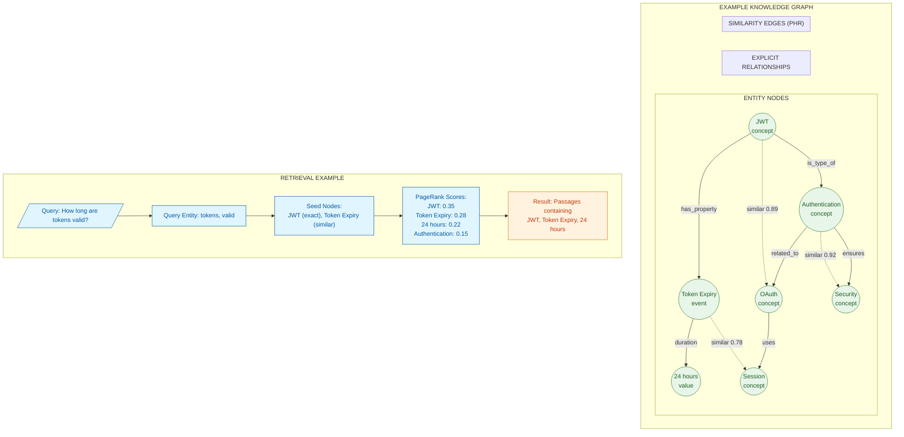
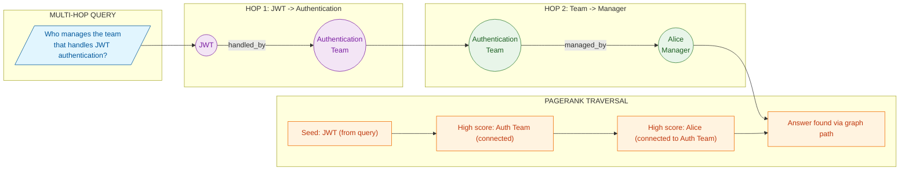

# HippoRAG: Neurobiologically Inspired Memory Architecture

## Overview

HippoRAG mimics the **human hippocampal memory system** with pattern separation (encoding) and pattern completion (retrieval) using knowledge graphs and Personalized PageRank. This approach is inspired by how the human brain's hippocampus indexes memories and enables associative recall.

The key innovations of HippoRAG include:
- **Brain-inspired indexing**: Using knowledge graph nodes as hippocampal memory indices
- **Pattern separation**: Encoding unique information for each memory via entity extraction
- **Pattern completion**: Retrieving related memories through graph traversal
- **Personalized PageRank**: Enabling multi-hop associative reasoning from seed entities

This architecture is particularly effective for:
- Multi-hop reasoning questions that require connecting disparate facts
- Knowledge-intensive tasks where relationships matter
- Long-tail entity recognition and retrieval
- Questions requiring implicit inference across multiple documents

## Core Concepts

### Brain-to-System Mapping

HippoRAG draws direct analogies between the human memory system and RAG components:

| Brain Component | Function | HippoRAG Component |
|----------------|----------|-------------------|
| **Neocortex** | Processes sensory input, high-level understanding | LLM for entity extraction |
| **Parahippocampal Regions (PHR)** | Routes information, provides similarity bridges | Dense retrieval encoder, similarity edges |
| **Hippocampus** | Indexes salient signals, associates concepts | Knowledge graph with entities |
| **Pattern Separation** | Creates distinct representations for similar inputs | OpenIE entity extraction |
| **Pattern Completion** | Retrieves full memory from partial cues | Personalized PageRank traversal |

### Two-Phase Operation

**Encoding (Pattern Separation)**
1. Extract named entities from passages using Open Information Extraction (OpenIE)
2. Create knowledge graph nodes for each entity
3. Add explicit relationship edges between co-occurring entities
4. Add similarity edges between semantically similar entities (PHR function)
5. Store passage references with entity nodes

**Retrieval (Pattern Completion)**
1. Extract entities from the query
2. Find matching/similar entities as seed nodes
3. Run Personalized PageRank from seed nodes
4. Rank entities by PageRank score
5. Retrieve passages associated with top-ranked entities

## Brain-Inspired Architecture Mapping

```mermaid
flowchart TB
    subgraph HumanBrain["HUMAN BRAIN MEMORY SYSTEM"]
        direction TB

        subgraph Neocortex["NEOCORTEX"]
            NC1["Process sensory input"]
            NC2["High-level feature extraction"]
            NC3["Conceptual understanding"]
        end

        subgraph PHR["PARAHIPPOCAMPAL REGIONS"]
            PHR1["Route information"]
            PHR2["Connect cortex to hippocampus"]
            PHR3["Provide similarity bridges"]
        end

        subgraph Hippocampus["HIPPOCAMPUS"]
            HC1["Index salient signals"]
            HC2["Associate related concepts"]
            HC3["Pattern separation"]
            HC4["Pattern completion"]
        end
    end

    subgraph HippoRAG["HIPPORAG SYSTEM MAPPING"]
        direction TB

        subgraph LLM["LLM (Neocortex)"]
            LLM1["Process text input"]
            LLM2["Extract entities via OpenIE"]
            LLM3["Understand semantic meaning"]
        end

        subgraph RetrieverEncoder["RETRIEVAL ENCODER (PHR)"]
            RE1["Dense embeddings"]
            RE2["Connect similar entities"]
            RE3["Bridge non-identical concepts"]
        end

        subgraph KnowledgeGraph["KNOWLEDGE GRAPH (Hippocampus)"]
            KG1["Store entity nodes"]
            KG2["Relationship edges"]
            KG3["Schemaless OpenIE structure"]
            KG4["Personalized PageRank"]
        end
    end

    NC1 -.->|maps to| LLM1
    NC2 -.->|maps to| LLM2
    NC3 -.->|maps to| LLM3

    PHR1 -.->|maps to| RE1
    PHR2 -.->|maps to| RE2
    PHR3 -.->|maps to| RE3

    HC1 -.->|maps to| KG1
    HC2 -.->|maps to| KG2
    HC3 -.->|maps to| KG3
    HC4 -.->|maps to| KG4

    classDef brain fill:#fff3e0,stroke:#e65100,color:#bf360c
    classDef system fill:#e3f2fd,stroke:#1565c0,color:#1565c0

    class NC1,NC2,NC3,PHR1,PHR2,PHR3,HC1,HC2,HC3,HC4 brain
    class LLM1,LLM2,LLM3,RE1,RE2,RE3,KG1,KG2,KG3,KG4 system
```



### Why This Mapping Works

The human hippocampus doesn't store memories directly - it stores **indices** that point to memory content distributed across the neocortex. Similarly, HippoRAG's knowledge graph stores entity indices that point to passage content. This enables:

1. **Sparse Encoding**: Not every detail is indexed, only salient entities
2. **Associative Recall**: Related memories can be retrieved through shared entities
3. **Multi-hop Reasoning**: PageRank propagation simulates spreading activation
4. **Disambiguation**: Similarity edges enable fuzzy matching to the right entity

## Pattern Separation (Memory Encoding)

```mermaid
flowchart TB
    subgraph Input["INPUT PROCESSING"]
        I1[/"Document/Passage"/]
        I2[Chunk into sentences]
        I3[Assign passage IDs]
    end

    subgraph EntityExtraction["ENTITY EXTRACTION (OpenIE)"]
        EE1[Send to LLM with extraction prompt]
        EE2[/"Extract noun phrases<br/>as discrete entities"/]
        EE3[Parse entity list]
        EE4[Filter low-quality extractions]
        EE5[Normalize entity forms]

        subgraph ExtractionPrompt["LLM PROMPT"]
            EP1["Given passage: {text}"]
            EP2["Extract all important noun phrases"]
            EP3["Include: people, places, concepts, events"]
            EP4["Return as JSON list"]
        end
    end

    subgraph NodeCreation["KNOWLEDGE GRAPH NODE CREATION"]
        NC1{Entity exists in graph?}
        NC2[Create new entity node]
        NC3[Update existing node attributes]
        NC4[Generate entity embedding]
        NC5[Store passage reference]
        NC6[Assign node metadata]
    end

    subgraph RelationshipInference["RELATIONSHIP EXTRACTION"]
        RI1[LLM extracts relationships between entities]
        RI2[Form triplets: subject-predicate-object]
        RI3[Score relationship confidence]
        RI4{Confidence > threshold?}
        RI5[Create explicit edge in graph]
        RI6[Store relationship metadata]
    end

    subgraph SimilarityEdges["SIMILARITY EDGE CREATION"]
        SE1[Compute entity embeddings]
        SE2[Find similar entities via vector search]
        SE3{Similarity > threshold?}
        SE4[Create similarity edge]
        SE5[Weight edge by similarity score]
        SE6[These edges enable fuzzy matching]
    end

    subgraph GraphUpdate["GRAPH ASSEMBLY"]
        GU1[Add nodes to graph]
        GU2[Add explicit relationship edges]
        GU3[Add similarity edges]
        GU4[Update graph indices]
        GU5[Recompute connectivity metrics]
    end

    I1 --> I2 --> I3
    I3 --> EE1 --> EE2 --> EE3 --> EE4 --> EE5

    EE5 --> NC1
    NC1 -->|No| NC2
    NC1 -->|Yes| NC3
    NC2 --> NC4
    NC3 --> NC4
    NC4 --> NC5 --> NC6

    NC6 --> RI1 --> RI2 --> RI3 --> RI4
    RI4 -->|Yes| RI5 --> RI6
    RI4 -->|No| SE1

    RI6 --> SE1
    SE1 --> SE2 --> SE3
    SE3 -->|Yes| SE4 --> SE5
    SE3 -->|No| GU1
    SE5 --> SE6 --> GU1

    GU1 --> GU2 --> GU3 --> GU4 --> GU5

    classDef input fill:#e1f5fe,stroke:#01579b,color:#01579b
    classDef extraction fill:#f3e5f5,stroke:#7b1fa2,color:#7b1fa2
    classDef node fill:#e8f5e9,stroke:#2e7d32,color:#1b5e20
    classDef relation fill:#fff3e0,stroke:#ef6c00,color:#bf360c
    classDef similarity fill:#fce4ec,stroke:#c2185b,color:#880e4f
    classDef graph fill:#e0f7fa,stroke:#00838f,color:#00695c

    class I1,I2,I3 input
    class EE1,EE2,EE3,EE4,EE5,EP1,EP2,EP3,EP4 extraction
    class NC1,NC2,NC3,NC4,NC5,NC6 node
    class RI1,RI2,RI3,RI4,RI5,RI6 relation
    class SE1,SE2,SE3,SE4,SE5,SE6 similarity
    class GU1,GU2,GU3,GU4,GU5 graph
```

### Entity Extraction Prompt

The LLM prompt for entity extraction should be carefully designed:

```
You are an expert at extracting named entities from text.

Given the following passage, extract all important noun phrases that represent:
- People (names, roles, titles)
- Organizations (companies, institutions, teams)
- Locations (cities, countries, buildings)
- Concepts (technologies, methodologies, ideas)
- Events (meetings, releases, milestones)
- Artifacts (documents, products, systems)

Passage: {text}

Return a JSON array of entities with the format:
[
  {"name": "entity name", "type": "person|org|location|concept|event|artifact"},
  ...
]

Only extract entities that are significant to understanding the passage.
Do not extract generic terms like "the system" or "this approach".
```

### Edge Types in HippoRAG

| Edge Type | Source | Weight | Purpose |
|-----------|--------|--------|---------|
| **Explicit** | LLM relationship extraction | Confidence score | Direct relationships stated in text |
| **Similarity** | Embedding cosine similarity | Similarity score | Fuzzy matching, synonyms |
| **Co-occurrence** | Same passage | 1.0 | Entities appearing together |
| **Passage** | Entity to passage ID | N/A | Back-reference to source |

## Pattern Completion (Memory Retrieval)

```mermaid
flowchart TB
    subgraph QueryProcessing["QUERY PROCESSING"]
        QP1[/"User Query"/]
        QP2[Extract query entities via OpenIE]
        QP3[Generate query entity embeddings]
        QP4[Parse query intent]
    end

    subgraph SeedNodeIdentification["SEED NODE IDENTIFICATION"]
        SN1[Search for exact entity matches]
        SN2{Exact matches found?}
        SN3[Add exact matches to seed set]
        SN4[Embed query entities]
        SN5[Vector search for similar entities]
        SN6[Filter by similarity threshold]
        SN7[Add similar entities to seed set]
        SN8[Combine all seed nodes]
    end

    subgraph PersonalizedPageRank["PERSONALIZED PAGERANK"]
        PPR1[Initialize PageRank scores]
        PPR2[Set teleport distribution]
        PPR3["teleport[node] = 1/|seeds| if node in seeds else 0"]

        subgraph PRIteration["PAGERANK ITERATION"]
            PRI1[For each node in graph]
            PRI2[Compute incoming score contributions]
            PRI3["score[n] = a * teleport[n] + (1-a) * sum(score[m]/outdegree[m])"]
            PRI4["a = damping factor = 0.85"]
            PRI5{Converged?}
            PRI6[Continue iteration]
            PRI7[Return final scores]
        end

        PPR4[Rank all nodes by PR score]
        PPR5[High scores = related to query entities]
    end

    subgraph PassageRetrieval["PASSAGE RETRIEVAL"]
        PR1[Get top-K ranked nodes]
        PR2[Expand to connected nodes if needed]
        PR3[Collect passage references for each node]
        PR4[Aggregate passage scores]
        PR5[Deduplicate passages]
        PR6[Rank passages by aggregate score]
        PR7[Select top-K passages]
    end

    subgraph Output["OUTPUT ASSEMBLY"]
        O1[Fetch full passage content]
        O2[Order by relevance score]
        O3[Format as retrieval context]
        O4[/"Retrieved Passages"/]
    end

    QP1 --> QP2 --> QP3 --> QP4

    QP4 --> SN1 --> SN2
    SN2 -->|Yes| SN3
    SN2 -->|No| SN4
    SN3 --> SN4
    SN4 --> SN5 --> SN6 --> SN7 --> SN8

    SN8 --> PPR1 --> PPR2 --> PPR3
    PPR3 --> PRI1 --> PRI2 --> PRI3 --> PRI4 --> PRI5
    PRI5 -->|No| PRI6 --> PRI1
    PRI5 -->|Yes| PRI7
    PRI7 --> PPR4 --> PPR5

    PPR5 --> PR1 --> PR2 --> PR3 --> PR4 --> PR5 --> PR6 --> PR7

    PR7 --> O1 --> O2 --> O3 --> O4

    classDef query fill:#e1f5fe,stroke:#01579b,color:#01579b
    classDef seed fill:#f3e5f5,stroke:#7b1fa2,color:#7b1fa2
    classDef pagerank fill:#fff3e0,stroke:#ef6c00,color:#bf360c
    classDef passage fill:#e8f5e9,stroke:#2e7d32,color:#1b5e20
    classDef output fill:#fce4ec,stroke:#c2185b,color:#880e4f

    class QP1,QP2,QP3,QP4 query
    class SN1,SN2,SN3,SN4,SN5,SN6,SN7,SN8 seed
    class PPR1,PPR2,PPR3,PPR4,PPR5,PRI1,PRI2,PRI3,PRI4,PRI5,PRI6,PRI7 pagerank
    class PR1,PR2,PR3,PR4,PR5,PR6,PR7 passage
    class O1,O2,O3,O4 output
```



### Personalized PageRank Explained

Standard PageRank computes global node importance. **Personalized PageRank (PPR)** computes importance relative to a specific set of nodes (the seeds):

```
score[n] = alpha * teleport[n] + (1 - alpha) * sum(score[m] / outdegree[m])
```

Where:
- `alpha` (typically 0.15) is the probability of teleporting back to seeds
- `teleport[n]` is uniform over seed nodes, zero elsewhere
- The sum is over all neighbors `m` pointing to `n`

This causes "importance" to spread from seed nodes through the graph, with nodes closer to more seeds receiving higher scores.

### Why PPR Works for Multi-Hop Reasoning

Consider the query: "Who manages the team that handles JWT authentication?"

1. **Seed extraction**: Query entities are "JWT", "authentication", "team", "manager"
2. **Graph matching**: Find "JWT" node and "Authentication" node
3. **PPR spreading**: Score propagates from JWT -> Authentication -> Auth Team -> Alice (Manager)
4. **Result**: Alice ranks high because she's connected through the query-relevant path

## Knowledge Graph Structure



## Multi-Hop Reasoning Example



### Comparison: HippoRAG vs Standard RAG

| Aspect | Standard RAG | HippoRAG |
|--------|--------------|----------|
| **Index unit** | Document chunks | Entities |
| **Retrieval** | Vector similarity | Graph traversal + PPR |
| **Multi-hop** | Poor (single-hop only) | Native support |
| **Entity linking** | None | Automatic via graph |
| **Storage overhead** | Moderate | Higher (graph + vectors) |
| **Query latency** | Fast | Moderate (PPR iteration) |
| **Best for** | Simple fact lookup | Complex reasoning |

---

## How to Incorporate This into MycelicMemory

### Current State Analysis

MycelicMemory has partial support for knowledge graph concepts:
- `memory_relationships` table with 7 relationship types
- Entity extraction via migrations (`entities` table)
- Vector search via `sqlite-vec`
- FTS5 for keyword search

Missing components:
- OpenIE-style entity extraction during ingestion
- Similarity edges between entities
- Personalized PageRank computation
- Entity-centric retrieval path

### Recommended Implementation Steps

#### Step 1: Enhance Entity Schema

Extend the entities table with embedding support:

```sql
-- Modify entities table (in migrations.go)
ALTER TABLE entities ADD COLUMN embedding BLOB;
ALTER TABLE entities ADD COLUMN passage_ids TEXT;  -- JSON array
ALTER TABLE entities ADD COLUMN occurrence_count INTEGER DEFAULT 1;

-- Add entity similarity edges table
CREATE TABLE IF NOT EXISTS entity_similarity (
    source_entity_id TEXT NOT NULL,
    target_entity_id TEXT NOT NULL,
    similarity_score REAL NOT NULL CHECK (similarity_score >= 0.0 AND similarity_score <= 1.0),
    created_at DATETIME DEFAULT CURRENT_TIMESTAMP,
    PRIMARY KEY (source_entity_id, target_entity_id),
    FOREIGN KEY (source_entity_id) REFERENCES entities(id),
    FOREIGN KEY (target_entity_id) REFERENCES entities(id)
);

CREATE INDEX IF NOT EXISTS idx_entity_similarity_source ON entity_similarity(source_entity_id);
CREATE INDEX IF NOT EXISTS idx_entity_similarity_target ON entity_similarity(target_entity_id);
CREATE INDEX IF NOT EXISTS idx_entity_similarity_score ON entity_similarity(similarity_score);

-- Entity to memory relationships
CREATE TABLE IF NOT EXISTS entity_passages (
    entity_id TEXT NOT NULL,
    memory_id TEXT NOT NULL,
    mention_text TEXT,
    position_start INTEGER,
    position_end INTEGER,
    created_at DATETIME DEFAULT CURRENT_TIMESTAMP,
    PRIMARY KEY (entity_id, memory_id),
    FOREIGN KEY (entity_id) REFERENCES entities(id),
    FOREIGN KEY (memory_id) REFERENCES memories(id) ON DELETE CASCADE
);
```

#### Step 2: Implement Entity Extraction Service

Create an OpenIE-style entity extractor:

```go
// internal/hipporag/extractor.go
package hipporag

import (
    "context"
    "encoding/json"
)

type Entity struct {
    Name       string `json:"name"`
    Type       string `json:"type"`
    Normalized string `json:"normalized"`
}

type Relationship struct {
    Subject    string  `json:"subject"`
    Predicate  string  `json:"predicate"`
    Object     string  `json:"object"`
    Confidence float64 `json:"confidence"`
}

type Extractor struct {
    llm      LLMClient
    embedder EmbeddingClient
    db       *database.DB
}

func (e *Extractor) ExtractEntities(ctx context.Context, text string) ([]Entity, error) {
    prompt := `You are an expert at extracting named entities from text.

Given the following passage, extract all important noun phrases that represent:
- People (names, roles, titles)
- Organizations (companies, institutions, teams)
- Locations (cities, countries, buildings)
- Concepts (technologies, methodologies, ideas)
- Events (meetings, releases, milestones)
- Artifacts (documents, products, systems)

Passage: ` + text + `

Return a JSON array of entities:
[{"name": "entity name", "type": "person|org|location|concept|event|artifact"}]`

    response, err := e.llm.Generate(ctx, prompt)
    if err != nil {
        return nil, err
    }

    var entities []Entity
    if err := json.Unmarshal([]byte(response), &entities); err != nil {
        return nil, err
    }

    // Normalize entity names
    for i := range entities {
        entities[i].Normalized = e.normalizeEntity(entities[i].Name)
    }

    return entities, nil
}

func (e *Extractor) ExtractRelationships(ctx context.Context, text string, entities []Entity) ([]Relationship, error) {
    entityNames := make([]string, len(entities))
    for i, ent := range entities {
        entityNames[i] = ent.Name
    }

    prompt := `Given these entities: ` + strings.Join(entityNames, ", ") + `
And this context: ` + text + `

Extract relationships in the form subject-predicate-object.
Return JSON array:
[{"subject": "entity1", "predicate": "relationship", "object": "entity2", "confidence": 0.9}]`

    response, err := e.llm.Generate(ctx, prompt)
    if err != nil {
        return nil, err
    }

    var relationships []Relationship
    if err := json.Unmarshal([]byte(response), &relationships); err != nil {
        return nil, err
    }

    return relationships, nil
}

func (e *Extractor) normalizeEntity(name string) string {
    // Lowercase, trim, remove extra whitespace
    name = strings.TrimSpace(strings.ToLower(name))
    return strings.Join(strings.Fields(name), " ")
}
```

#### Step 3: Implement Personalized PageRank

Create a PPR computation module:

```go
// internal/hipporag/pagerank.go
package hipporag

import (
    "math"
)

type Graph struct {
    Nodes    map[string]*Node
    Edges    map[string][]Edge
    InEdges  map[string][]Edge
}

type Node struct {
    ID         string
    Attributes map[string]interface{}
}

type Edge struct {
    Source string
    Target string
    Weight float64
}

type PageRankResult struct {
    Scores map[string]float64
}

// PersonalizedPageRank computes PPR from seed nodes
func PersonalizedPageRank(g *Graph, seeds []string, alpha float64, maxIter int, tolerance float64) *PageRankResult {
    n := len(g.Nodes)
    if n == 0 {
        return &PageRankResult{Scores: make(map[string]float64)}
    }

    // Initialize scores
    scores := make(map[string]float64)
    teleport := make(map[string]float64)

    // Set teleport distribution (uniform over seeds)
    seedWeight := 1.0 / float64(len(seeds))
    for _, seed := range seeds {
        teleport[seed] = seedWeight
    }

    // Initialize all scores to teleport values
    for nodeID := range g.Nodes {
        if t, ok := teleport[nodeID]; ok {
            scores[nodeID] = t
        } else {
            scores[nodeID] = 0
        }
    }

    // Iterate until convergence
    for iter := 0; iter < maxIter; iter++ {
        newScores := make(map[string]float64)
        maxDiff := 0.0

        for nodeID := range g.Nodes {
            // Teleport component
            tele := 0.0
            if t, ok := teleport[nodeID]; ok {
                tele = t
            }

            // Contribution from incoming edges
            contribution := 0.0
            if inEdges, ok := g.InEdges[nodeID]; ok {
                for _, edge := range inEdges {
                    sourceOutDegree := len(g.Edges[edge.Source])
                    if sourceOutDegree > 0 {
                        contribution += scores[edge.Source] * edge.Weight / float64(sourceOutDegree)
                    }
                }
            }

            newScore := alpha*tele + (1-alpha)*contribution
            newScores[nodeID] = newScore

            diff := math.Abs(newScore - scores[nodeID])
            if diff > maxDiff {
                maxDiff = diff
            }
        }

        scores = newScores

        // Check convergence
        if maxDiff < tolerance {
            break
        }
    }

    return &PageRankResult{Scores: scores}
}
```

#### Step 4: Implement HippoRAG Retriever

Create the main retrieval interface:

```go
// internal/hipporag/retriever.go
package hipporag

import (
    "context"
    "sort"
)

type HippoRAGRetriever struct {
    extractor       *Extractor
    embedder        EmbeddingClient
    db              *database.DB
    similarityThreshold float64
    pprAlpha        float64
    pprMaxIter      int
}

type RetrievalResult struct {
    MemoryID   string
    Content    string
    Score      float64
    Entities   []string
}

func (r *HippoRAGRetriever) Retrieve(ctx context.Context, query string, topK int) ([]RetrievalResult, error) {
    // Step 1: Extract query entities
    queryEntities, err := r.extractor.ExtractEntities(ctx, query)
    if err != nil {
        return nil, err
    }

    // Step 2: Find seed nodes (exact + similar matches)
    seeds := []string{}
    for _, qe := range queryEntities {
        // Try exact match
        entity, err := r.db.FindEntityByName(qe.Normalized)
        if err == nil && entity != nil {
            seeds = append(seeds, entity.ID)
            continue
        }

        // Try similarity match
        qeEmbed, _ := r.embedder.Embed(qe.Name)
        similar, _ := r.db.FindSimilarEntities(qeEmbed, r.similarityThreshold, 3)
        for _, s := range similar {
            seeds = append(seeds, s.ID)
        }
    }

    if len(seeds) == 0 {
        // Fallback to standard vector search
        return r.fallbackVectorSearch(ctx, query, topK)
    }

    // Step 3: Build graph and run PPR
    graph := r.buildEntityGraph(ctx)
    pprResult := PersonalizedPageRank(graph, seeds, r.pprAlpha, r.pprMaxIter, 1e-6)

    // Step 4: Get top-ranked entities
    type scoredEntity struct {
        ID    string
        Score float64
    }
    var rankedEntities []scoredEntity
    for id, score := range pprResult.Scores {
        rankedEntities = append(rankedEntities, scoredEntity{id, score})
    }
    sort.Slice(rankedEntities, func(i, j int) bool {
        return rankedEntities[i].Score > rankedEntities[j].Score
    })

    // Step 5: Collect passages from top entities
    passageScores := make(map[string]float64)
    passageEntities := make(map[string][]string)

    for i := 0; i < min(topK*2, len(rankedEntities)); i++ {
        entity := rankedEntities[i]
        passages, _ := r.db.GetEntityPassages(entity.ID)
        for _, p := range passages {
            passageScores[p.MemoryID] += entity.Score
            passageEntities[p.MemoryID] = append(passageEntities[p.MemoryID], entity.ID)
        }
    }

    // Step 6: Rank and return passages
    var results []RetrievalResult
    for memID, score := range passageScores {
        memory, _ := r.db.GetMemory(memID)
        if memory != nil {
            results = append(results, RetrievalResult{
                MemoryID: memID,
                Content:  memory.Content,
                Score:    score,
                Entities: passageEntities[memID],
            })
        }
    }

    sort.Slice(results, func(i, j int) bool {
        return results[i].Score > results[j].Score
    })

    if len(results) > topK {
        results = results[:topK]
    }

    return results, nil
}
```

#### Step 5: Add MCP Tool for HippoRAG Search

```go
// Add to mcp/tools.go
{
    Name:        "memory_search_graph",
    Description: "Search memories using knowledge graph traversal (multi-hop reasoning)",
    InputSchema: map[string]interface{}{
        "type": "object",
        "properties": map[string]interface{}{
            "query": map[string]interface{}{
                "type":        "string",
                "description": "Search query",
            },
            "limit": map[string]interface{}{
                "type":    "integer",
                "default": 5,
            },
            "use_graph": map[string]interface{}{
                "type":        "boolean",
                "default":     true,
                "description": "Use graph traversal (vs standard vector search)",
            },
        },
        "required": []string{"query"},
    },
}
```

### Configuration Options

```yaml
# config.yaml addition
hipporag:
  enabled: true

  # Entity extraction settings
  extraction:
    llm_model: "qwen2.5:3b"
    min_entity_length: 2
    max_entities_per_passage: 20

  # Similarity edge settings
  similarity:
    threshold: 0.85
    max_edges_per_entity: 10

  # PageRank settings
  pagerank:
    alpha: 0.85  # Teleport probability
    max_iterations: 100
    tolerance: 1e-6

  # Retrieval settings
  retrieval:
    top_k_entities: 20
    expand_hops: 1
    combine_with_vector: true
    vector_weight: 0.3
    graph_weight: 0.7
```

### Benefits of This Integration

1. **Multi-Hop Reasoning**: Answer questions requiring inference across multiple documents
2. **Entity-Centric Organization**: Build a knowledge graph automatically from content
3. **Associative Recall**: Find related information through graph connections
4. **Hybrid Retrieval**: Combine graph traversal with vector similarity
5. **Disambiguation**: Similarity edges help match synonyms and related terms

### Migration Path

For existing MycelicMemory installations:

1. Run schema migration to add entity tables and indexes
2. Enable background entity extraction for new memories
3. Batch process existing memories to extract entities
4. Build similarity edges between similar entities
5. Enable HippoRAG retrieval path in search
6. Monitor retrieval quality and tune PPR parameters
7. Gradually increase graph weight as entity coverage improves
