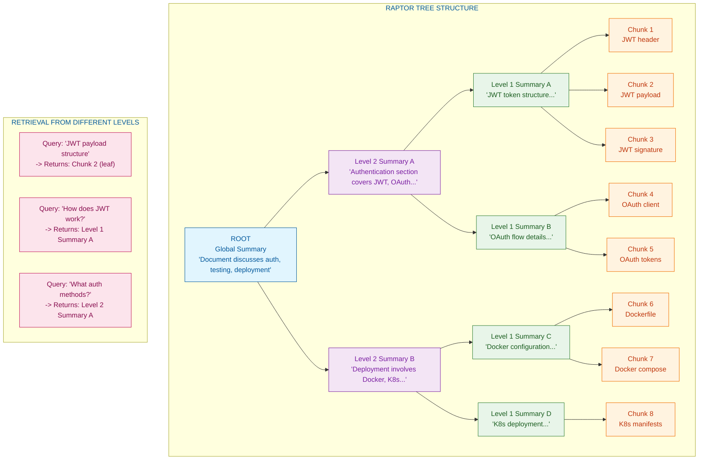

# RAPTOR: Recursive Abstractive Processing for Tree-Organized Retrieval

## Overview

RAPTOR builds a **hierarchical tree of summaries** through recursive clustering and abstractive summarization, enabling retrieval at multiple levels of abstraction. This approach addresses a fundamental limitation of traditional RAG systems: they can only retrieve specific chunks, missing the forest for the trees.

The key innovations of RAPTOR include:
- **Multi-level abstraction**: Summaries at different levels capture both details and themes
- **Soft clustering**: Documents can belong to multiple clusters, preserving cross-cutting themes
- **Recursive construction**: Tree grows bottom-up until reaching a single root summary
- **Level-appropriate retrieval**: Queries can match detailed chunks or high-level summaries

This architecture is particularly effective for:
- Questions requiring broad understanding ("What are the main themes?")
- Mixed-specificity queries that need both overview and detail
- Large document collections where global context matters
- Thematic analysis and summarization tasks

## Core Concepts

### Hierarchical Organization

Traditional RAG treats all chunks equally - a detailed implementation note has the same retrieval status as a strategic overview. RAPTOR recognizes that information exists at multiple levels of abstraction:

| Level | Content Type | Query Type | Example |
|-------|--------------|------------|---------|
| **Leaf (0)** | Original chunks | Specific details | "What's the JWT payload format?" |
| **Level 1** | Cluster summaries | Topic overview | "How does JWT work?" |
| **Level 2** | Theme summaries | Broad concepts | "What authentication methods exist?" |
| **Root** | Global summary | Document overview | "What is this documentation about?" |

### Gaussian Mixture Model Clustering

Unlike hard clustering (k-means), RAPTOR uses **Gaussian Mixture Models (GMM)** for soft clustering:
- Each chunk has a probability of belonging to each cluster
- A chunk can be assigned to multiple clusters if probability exceeds threshold
- This preserves information that spans topics (e.g., "JWT in OAuth" relates to both)
- The Bayesian Information Criterion (BIC) determines optimal cluster count

### Abstractive Summarization

At each level, clusters are summarized using an LLM:
- Summaries are **abstractive** (new sentences), not extractive (copy-paste)
- Key facts and relationships are preserved
- Redundancy is eliminated
- The summary becomes a new "document" for the next clustering round

## Tree Construction Process

```mermaid
flowchart TB
    subgraph Input["INPUT DOCUMENTS"]
        D1[/"Document 1"/]
        D2[/"Document 2"/]
        D3[/"Document N"/]
    end

    subgraph Chunking["LEVEL 0: CHUNKING"]
        CH1[Split documents into chunks]
        CH2[Chunk size: ~100 tokens]
        CH3[Overlap: 20 tokens]

        subgraph Chunks["Leaf Chunks"]
            C1["Chunk 1"]
            C2["Chunk 2"]
            C3["Chunk 3"]
            C4["Chunk 4"]
            C5["Chunk 5"]
            C6["Chunk 6"]
            C7["Chunk 7"]
            C8["Chunk 8"]
        end
    end

    subgraph Embedding["EMBEDDING GENERATION"]
        EM1[Generate embedding for each chunk]
        EM2["Model: text-embedding-ada-002<br/>or similar"]
        EM3[Store embeddings for clustering]
    end

    subgraph Level1["LEVEL 1: FIRST CLUSTERING"]
        CL1_1[Apply Gaussian Mixture Model]
        CL1_2[Soft clustering allows overlap]
        CL1_3[Determine optimal cluster count]

        subgraph Clusters1["Level 1 Clusters"]
            CL1_A["Cluster A<br/>(Chunks 1,2,3)"]
            CL1_B["Cluster B<br/>(Chunks 3,4,5)"]
            CL1_C["Cluster C<br/>(Chunks 6,7,8)"]
        end

        SUM1_1[Summarize Cluster A]
        SUM1_2[Summarize Cluster B]
        SUM1_3[Summarize Cluster C]

        subgraph Summaries1["Level 1 Summaries"]
            S1_A["Summary A"]
            S1_B["Summary B"]
            S1_C["Summary C"]
        end
    end

    subgraph Level2["LEVEL 2: SECOND CLUSTERING"]
        CL2_1[Embed Level 1 summaries]
        CL2_2[Cluster summaries]

        subgraph Clusters2["Level 2 Clusters"]
            CL2_A["Cluster AA<br/>(Summaries A,B)"]
            CL2_B["Cluster BB<br/>(Summary C)"]
        end

        SUM2_1[Summarize Cluster AA]
        SUM2_2[Summarize Cluster BB]

        subgraph Summaries2["Level 2 Summaries"]
            S2_A["Summary AA"]
            S2_B["Summary BB"]
        end
    end

    subgraph Level3["LEVEL 3: ROOT"]
        CL3_1[Cluster Level 2 summaries]
        SUM3_1[Generate root summary]

        ROOT["ROOT SUMMARY<br/>(Global document understanding)"]
    end

    D1 --> CH1
    D2 --> CH1
    D3 --> CH1
    CH1 --> CH2 --> CH3
    CH3 --> Chunks

    Chunks --> EM1 --> EM2 --> EM3

    EM3 --> CL1_1 --> CL1_2 --> CL1_3
    CL1_3 --> Clusters1

    CL1_A --> SUM1_1 --> S1_A
    CL1_B --> SUM1_2 --> S1_B
    CL1_C --> SUM1_3 --> S1_C

    Summaries1 --> CL2_1 --> CL2_2 --> Clusters2

    CL2_A --> SUM2_1 --> S2_A
    CL2_B --> SUM2_2 --> S2_B

    Summaries2 --> CL3_1 --> SUM3_1 --> ROOT

    classDef input fill:#e1f5fe,stroke:#01579b,color:#01579b
    classDef chunk fill:#f3e5f5,stroke:#7b1fa2,color:#7b1fa2
    classDef embed fill:#e8f5e9,stroke:#2e7d32,color:#1b5e20
    classDef cluster fill:#fff3e0,stroke:#ef6c00,color:#bf360c
    classDef summary fill:#fce4ec,stroke:#c2185b,color:#880e4f
    classDef root fill:#e0f7fa,stroke:#00838f,color:#00695c

    class D1,D2,D3 input
    class CH1,CH2,CH3,C1,C2,C3,C4,C5,C6,C7,C8 chunk
    class EM1,EM2,EM3 embed
    class CL1_1,CL1_2,CL1_3,CL1_A,CL1_B,CL1_C,CL2_1,CL2_2,CL2_A,CL2_B,CL3_1 cluster
    class SUM1_1,SUM1_2,SUM1_3,SUM2_1,SUM2_2,SUM3_1,S1_A,S1_B,S1_C,S2_A,S2_B summary
    class ROOT root
```



### Construction Parameters

| Parameter | Typical Value | Purpose |
|-----------|--------------|---------|
| Chunk size | 100 tokens | Base unit for clustering |
| Chunk overlap | 20 tokens | Preserve context at boundaries |
| GMM threshold | 0.1 | Min probability for cluster assignment |
| Max clusters | sqrt(N) | Upper bound for K selection |
| BIC penalty | 2 | Bayesian criterion for model selection |
| Summary length | Proportional | ~20% of input length |

## Detailed Clustering Algorithm

```mermaid
flowchart TB
    subgraph ClusteringAlgorithm["GAUSSIAN MIXTURE MODEL CLUSTERING"]
        direction TB

        subgraph Input["INPUT"]
            I1[Embeddings from current level]
            I2[Number of items N]
        end

        subgraph DetermineK["DETERMINE OPTIMAL K"]
            K1[Try K from 1 to sqrt(N)]
            K2[Fit GMM for each K]
            K3[Calculate BIC score]
            K4["BIC = -2 * log_likelihood + k * log(n)"]
            K5[Select K with lowest BIC]
        end

        subgraph FitGMM["FIT FINAL GMM"]
            G1[Initialize K Gaussian components]
            G2[EM Algorithm: E-step]
            G3["Compute responsibilities:<br/>P(cluster | point)"]
            G4[EM Algorithm: M-step]
            G5["Update means, covariances, weights"]
            G6{Converged?}
            G7[Continue iteration]
            G8[Return final model]
        end

        subgraph SoftAssignment["SOFT CLUSTER ASSIGNMENT"]
            SA1[For each embedding]
            SA2[Compute probability for each cluster]
            SA3{P(cluster) > threshold?}
            SA4[Assign to cluster]
            SA5[Skip this cluster]
            SA6[Item may belong to multiple clusters]
        end

        subgraph Output["OUTPUT"]
            O1[Cluster assignments]
            O2[Items grouped for summarization]
        end
    end

    I1 --> K1
    I2 --> K1
    K1 --> K2 --> K3 --> K4 --> K5

    K5 --> G1 --> G2 --> G3 --> G4 --> G5 --> G6
    G6 -->|No| G7 --> G2
    G6 -->|Yes| G8

    G8 --> SA1 --> SA2 --> SA3
    SA3 -->|Yes| SA4
    SA3 -->|No| SA5
    SA4 --> SA6
    SA5 --> SA6
    SA6 --> O1 --> O2

    classDef input fill:#e1f5fe,stroke:#01579b,color:#01579b
    classDef determineK fill:#f3e5f5,stroke:#7b1fa2,color:#7b1fa2
    classDef gmm fill:#e8f5e9,stroke:#2e7d32,color:#1b5e20
    classDef assign fill:#fff3e0,stroke:#ef6c00,color:#bf360c
    classDef output fill:#fce4ec,stroke:#c2185b,color:#880e4f

    class I1,I2 input
    class K1,K2,K3,K4,K5 determineK
    class G1,G2,G3,G4,G5,G6,G7,G8 gmm
    class SA1,SA2,SA3,SA4,SA5,SA6 assign
    class O1,O2 output
```

### Why GMM over K-Means

| Aspect | K-Means | GMM |
|--------|---------|-----|
| **Cluster shape** | Spherical only | Arbitrary elliptical |
| **Assignment** | Hard (0 or 1) | Soft (probability) |
| **Overlap handling** | None | Natural |
| **Boundary items** | Arbitrary assignment | Probabilistic |
| **Model selection** | Elbow method (heuristic) | BIC (principled) |

## Summarization Process

```mermaid
flowchart TB
    subgraph SummarizationPipeline["ABSTRACTIVE SUMMARIZATION"]
        direction TB

        subgraph Input["CLUSTER INPUT"]
            CI1[Collect all texts in cluster]
            CI2[Order by position/relevance]
            CI3[Concatenate with separators]
        end

        subgraph PromptConstruction["PROMPT CONSTRUCTION"]
            PC1["System: You are a summarization expert"]
            PC2["Task: Create a comprehensive summary"]
            PC3["Focus: Preserve key facts and relationships"]
            PC4["Style: Abstractive, not extractive"]
            PC5["Length: Proportional to input size"]
        end

        subgraph LLMSummarization["LLM SUMMARIZATION"]
            LS1[Send to GPT-3.5-turbo]
            LS2[Generate summary]
            LS3[Validate output length]
            LS4{Length appropriate?}
            LS5[Accept summary]
            LS6[Regenerate with length constraint]
        end

        subgraph QualityCheck["QUALITY VALIDATION"]
            QC1[Check information preservation]
            QC2[Verify no hallucinations]
            QC3[Ensure coherence]
            QC4{Passes checks?}
            QC5[Store summary]
            QC6[Flag for manual review]
        end

        subgraph TreeIntegration["TREE INTEGRATION"]
            TI1[Generate summary embedding]
            TI2[Create tree node]
            TI3[Link to child nodes]
            TI4[Update tree structure]
        end
    end

    CI1 --> CI2 --> CI3
    CI3 --> PC1 --> PC2 --> PC3 --> PC4 --> PC5
    PC5 --> LS1 --> LS2 --> LS3 --> LS4
    LS4 -->|Yes| LS5
    LS4 -->|No| LS6 --> LS1
    LS5 --> QC1 --> QC2 --> QC3 --> QC4
    QC4 -->|Yes| QC5
    QC4 -->|No| QC6
    QC5 --> TI1 --> TI2 --> TI3 --> TI4

    classDef input fill:#e1f5fe,stroke:#01579b,color:#01579b
    classDef prompt fill:#f3e5f5,stroke:#7b1fa2,color:#7b1fa2
    classDef llm fill:#e8f5e9,stroke:#2e7d32,color:#1b5e20
    classDef quality fill:#fff3e0,stroke:#ef6c00,color:#bf360c
    classDef tree fill:#fce4ec,stroke:#c2185b,color:#880e4f

    class CI1,CI2,CI3 input
    class PC1,PC2,PC3,PC4,PC5 prompt
    class LS1,LS2,LS3,LS4,LS5,LS6 llm
    class QC1,QC2,QC3,QC4,QC5,QC6 quality
    class TI1,TI2,TI3,TI4 tree
```



### Summarization Prompt Template

```
You are an expert at creating comprehensive summaries that preserve key information.

Given the following text segments, create a single coherent summary that:
1. Captures all key facts, concepts, and relationships
2. Uses abstractive summarization (your own words, not copy-paste)
3. Eliminates redundancy while preserving unique information
4. Maintains logical flow and coherence
5. Is approximately {target_length} words

Text segments:
---
{segment_1}
---
{segment_2}
---
...

Summary:
```

## Retrieval From Tree

```mermaid
flowchart TB
    subgraph Query["QUERY PROCESSING"]
        Q1[/"User Query"/]
        Q2[Generate query embedding]
    end

    subgraph TreeTraversal["TREE TRAVERSAL OPTIONS"]
        direction TB

        subgraph CollapsedRetrieval["OPTION 1: COLLAPSED RETRIEVAL"]
            CR1[Flatten all tree nodes]
            CR2[Include leaves + all summaries]
            CR3[Vector search across all]
            CR4[Return top-K from any level]
            CR5["Simple but effective"]
        end

        subgraph TreeRetrieval["OPTION 2: TREE TRAVERSAL"]
            TR1[Start at root]
            TR2[Compare query to root summary]
            TR3{Relevant?}
            TR4[Descend to children]
            TR5[Skip this subtree]
            TR6[Recursively traverse]
            TR7[Collect relevant leaves]
            TR8["More targeted but complex"]
        end
    end

    subgraph MultiLevelSelection["MULTI-LEVEL RESULT SELECTION"]
        ML1[Compute similarity scores]
        ML2[Normalize scores per level]
        ML3[Apply level-specific weights]
        ML4[Merge results across levels]
        ML5[Deduplicate overlapping content]
        ML6[Rank by final score]
    end

    subgraph Output["OUTPUT ASSEMBLY"]
        O1[Select top-K results]
        O2[May include mix of:<br/>- Leaf chunks (specific)<br/>- Level 1 summaries (moderate)<br/>- Level 2 summaries (broad)]
        O3[Format as retrieval context]
        O4[/"Retrieved Content"/]
    end

    Q1 --> Q2

    Q2 --> CR1
    Q2 --> TR1

    CR1 --> CR2 --> CR3 --> CR4 --> CR5
    TR1 --> TR2 --> TR3
    TR3 -->|Yes| TR4 --> TR6 --> TR7
    TR3 -->|No| TR5
    TR6 --> TR3
    TR7 --> TR8

    CR5 --> ML1
    TR8 --> ML1

    ML1 --> ML2 --> ML3 --> ML4 --> ML5 --> ML6
    ML6 --> O1 --> O2 --> O3 --> O4

    classDef query fill:#e1f5fe,stroke:#01579b,color:#01579b
    classDef collapsed fill:#f3e5f5,stroke:#7b1fa2,color:#7b1fa2
    classDef tree fill:#e8f5e9,stroke:#2e7d32,color:#1b5e20
    classDef multi fill:#fff3e0,stroke:#ef6c00,color:#bf360c
    classDef output fill:#fce4ec,stroke:#c2185b,color:#880e4f

    class Q1,Q2 query
    class CR1,CR2,CR3,CR4,CR5 collapsed
    class TR1,TR2,TR3,TR4,TR5,TR6,TR7,TR8 tree
    class ML1,ML2,ML3,ML4,ML5,ML6 multi
    class O1,O2,O3,O4 output
```

### Retrieval Strategy Comparison

| Strategy | Pros | Cons | Best For |
|----------|------|------|----------|
| **Collapsed** | Simple, catches all levels | May miss context | General queries |
| **Tree Traversal** | Respects hierarchy | Complex, may miss cross-cutting | Hierarchical content |
| **Hybrid** | Best of both | More computation | Production systems |

### Level Weighting Recommendations

For different query types, adjust level weights:

| Query Type | Leaf Weight | L1 Weight | L2 Weight | Root Weight |
|------------|-------------|-----------|-----------|-------------|
| **Specific detail** | 0.6 | 0.3 | 0.1 | 0.0 |
| **Topic overview** | 0.2 | 0.5 | 0.3 | 0.0 |
| **Broad question** | 0.1 | 0.3 | 0.4 | 0.2 |
| **Document summary** | 0.0 | 0.2 | 0.3 | 0.5 |

## Tree Structure Visualization



---

## How to Incorporate This into MycelicMemory

### Current State Analysis

MycelicMemory has foundational elements for hierarchical organization:
- `memories` table with `parent_memory_id` and `chunk_level` fields
- Vector storage via `sqlite-vec`
- Chunking support in `internal/memory/chunker.go`
- Categories table for organization

Missing components:
- GMM clustering for soft assignment
- Recursive summarization pipeline
- Tree node management
- Level-aware retrieval

### Recommended Implementation Steps

#### Step 1: Add RAPTOR Tree Schema

Extend the database to track tree structure:

```sql
-- RAPTOR tree nodes table
CREATE TABLE IF NOT EXISTS raptor_nodes (
    id TEXT PRIMARY KEY,
    level INTEGER NOT NULL DEFAULT 0,  -- 0 = leaf (original chunk)
    content TEXT NOT NULL,
    summary_type TEXT CHECK (summary_type IN ('leaf', 'cluster', 'root')),
    embedding BLOB,
    parent_node_id TEXT,
    cluster_id TEXT,  -- Which cluster this was derived from
    child_count INTEGER DEFAULT 0,
    token_count INTEGER,
    created_at DATETIME DEFAULT CURRENT_TIMESTAMP,
    FOREIGN KEY (parent_node_id) REFERENCES raptor_nodes(id)
);

CREATE INDEX IF NOT EXISTS idx_raptor_nodes_level ON raptor_nodes(level);
CREATE INDEX IF NOT EXISTS idx_raptor_nodes_parent ON raptor_nodes(parent_node_id);
CREATE INDEX IF NOT EXISTS idx_raptor_nodes_cluster ON raptor_nodes(cluster_id);

-- Link RAPTOR nodes to source memories
CREATE TABLE IF NOT EXISTS raptor_node_sources (
    node_id TEXT NOT NULL,
    memory_id TEXT NOT NULL,
    contribution_weight REAL DEFAULT 1.0,
    PRIMARY KEY (node_id, memory_id),
    FOREIGN KEY (node_id) REFERENCES raptor_nodes(id) ON DELETE CASCADE,
    FOREIGN KEY (memory_id) REFERENCES memories(id) ON DELETE CASCADE
);

-- Track tree building runs
CREATE TABLE IF NOT EXISTS raptor_trees (
    id TEXT PRIMARY KEY,
    domain TEXT,  -- Optional domain scope
    root_node_id TEXT,
    total_levels INTEGER,
    total_nodes INTEGER,
    leaf_count INTEGER,
    built_at DATETIME DEFAULT CURRENT_TIMESTAMP,
    config TEXT,  -- JSON config snapshot
    FOREIGN KEY (root_node_id) REFERENCES raptor_nodes(id)
);
```

#### Step 2: Implement GMM Clustering

Create a clustering service using soft assignment:

```go
// internal/raptor/clustering.go
package raptor

import (
    "math"
    "sort"

    "gonum.org/v1/gonum/mat"
    "gonum.org/v1/gonum/stat/distuv"
)

type GMMCluster struct {
    ID       string
    Mean     []float64
    Covar    *mat.SymDense
    Weight   float64
    Members  []string  // Node IDs
}

type ClusteringResult struct {
    Clusters    []*GMMCluster
    Assignments map[string][]ClusterAssignment  // Node -> clusters with probabilities
}

type ClusterAssignment struct {
    ClusterID   string
    Probability float64
}

type GMMClusterer struct {
    maxClusters      int
    threshold        float64  // Min probability for assignment
    maxIterations    int
    convergenceTol   float64
}

func NewGMMClusterer(maxClusters int, threshold float64) *GMMClusterer {
    return &GMMClusterer{
        maxClusters:    maxClusters,
        threshold:      threshold,
        maxIterations:  100,
        convergenceTol: 1e-4,
    }
}

func (g *GMMClusterer) Cluster(embeddings map[string][]float64) (*ClusteringResult, error) {
    n := len(embeddings)
    if n == 0 {
        return &ClusteringResult{}, nil
    }

    // Determine optimal K using BIC
    maxK := int(math.Min(float64(g.maxClusters), math.Sqrt(float64(n))))
    bestK := 1
    bestBIC := math.Inf(1)

    for k := 1; k <= maxK; k++ {
        bic := g.computeBIC(embeddings, k)
        if bic < bestBIC {
            bestBIC = bic
            bestK = k
        }
    }

    // Fit final GMM with optimal K
    clusters := g.fitGMM(embeddings, bestK)

    // Compute soft assignments
    assignments := make(map[string][]ClusterAssignment)
    for nodeID, embedding := range embeddings {
        probs := g.computeProbabilities(embedding, clusters)
        var nodeAssignments []ClusterAssignment

        for i, prob := range probs {
            if prob >= g.threshold {
                nodeAssignments = append(nodeAssignments, ClusterAssignment{
                    ClusterID:   clusters[i].ID,
                    Probability: prob,
                })
                clusters[i].Members = append(clusters[i].Members, nodeID)
            }
        }
        assignments[nodeID] = nodeAssignments
    }

    return &ClusteringResult{
        Clusters:    clusters,
        Assignments: assignments,
    }, nil
}

func (g *GMMClusterer) computeBIC(embeddings map[string][]float64, k int) float64 {
    // Simplified BIC computation
    n := float64(len(embeddings))
    dim := float64(len(embeddings[firstKey(embeddings)]))

    // Number of parameters: k * (dim + dim*(dim+1)/2 + 1) - 1
    numParams := float64(k) * (dim + dim*(dim+1)/2 + 1) - 1

    // Log-likelihood (approximated)
    logLikelihood := g.approximateLogLikelihood(embeddings, k)

    return -2*logLikelihood + numParams*math.Log(n)
}

func (g *GMMClusterer) computeProbabilities(embedding []float64, clusters []*GMMCluster) []float64 {
    probs := make([]float64, len(clusters))
    total := 0.0

    for i, cluster := range clusters {
        // Compute Gaussian probability
        prob := cluster.Weight * g.gaussianPDF(embedding, cluster.Mean, cluster.Covar)
        probs[i] = prob
        total += prob
    }

    // Normalize
    if total > 0 {
        for i := range probs {
            probs[i] /= total
        }
    }

    return probs
}
```

#### Step 3: Implement Tree Builder

Create the recursive tree construction pipeline:

```go
// internal/raptor/builder.go
package raptor

import (
    "context"
    "fmt"

    "github.com/google/uuid"
)

type TreeBuilder struct {
    db         *database.DB
    llm        LLMClient
    embedder   EmbeddingClient
    clusterer  *GMMClusterer
    chunkSize  int
    overlap    int
}

type BuildConfig struct {
    Domain       string
    ChunkSize    int
    Overlap      int
    MaxLevels    int
    MinClusterSize int
}

func (b *TreeBuilder) BuildTree(ctx context.Context, memoryIDs []string, config BuildConfig) (*RaptorTree, error) {
    tree := &RaptorTree{
        ID:     uuid.New().String(),
        Domain: config.Domain,
    }

    // Level 0: Create leaf nodes from memories
    leafNodes, err := b.createLeafNodes(ctx, memoryIDs)
    if err != nil {
        return nil, err
    }
    tree.LeafCount = len(leafNodes)

    // Recursive clustering until single root
    currentLevel := leafNodes
    level := 0

    for len(currentLevel) > 1 && level < config.MaxLevels {
        level++

        // Cluster current level
        embeddings := make(map[string][]float64)
        for _, node := range currentLevel {
            embeddings[node.ID] = node.Embedding
        }

        clusterResult, err := b.clusterer.Cluster(embeddings)
        if err != nil {
            return nil, err
        }

        // Summarize each cluster
        var nextLevel []*RaptorNode
        for _, cluster := range clusterResult.Clusters {
            if len(cluster.Members) < config.MinClusterSize {
                continue
            }

            // Gather texts from cluster members
            var texts []string
            for _, memberID := range cluster.Members {
                node := findNode(currentLevel, memberID)
                if node != nil {
                    texts = append(texts, node.Content)
                }
            }

            // Generate summary
            summary, err := b.summarizeCluster(ctx, texts, level)
            if err != nil {
                return nil, err
            }

            // Create summary node
            embedding, _ := b.embedder.Embed(summary)
            summaryNode := &RaptorNode{
                ID:          uuid.New().String(),
                Level:       level,
                Content:     summary,
                SummaryType: "cluster",
                Embedding:   embedding,
                ClusterID:   cluster.ID,
                ChildCount:  len(cluster.Members),
            }

            // Link children
            for _, memberID := range cluster.Members {
                b.db.SetNodeParent(memberID, summaryNode.ID)
            }

            nextLevel = append(nextLevel, summaryNode)
        }

        if len(nextLevel) == 0 {
            break
        }

        currentLevel = nextLevel
        tree.TotalNodes += len(nextLevel)
    }

    // Set root
    if len(currentLevel) == 1 {
        tree.RootNodeID = currentLevel[0].ID
        currentLevel[0].SummaryType = "root"
    } else if len(currentLevel) > 1 {
        // Create final root from remaining nodes
        root, err := b.createRootNode(ctx, currentLevel)
        if err != nil {
            return nil, err
        }
        tree.RootNodeID = root.ID
    }

    tree.TotalLevels = level + 1
    return tree, nil
}

func (b *TreeBuilder) summarizeCluster(ctx context.Context, texts []string, level int) (string, error) {
    combined := strings.Join(texts, "\n---\n")
    targetLength := len(combined) / 5  // ~20% compression

    prompt := fmt.Sprintf(`You are an expert at creating comprehensive summaries.

Given these text segments, create a single coherent summary that:
1. Captures all key facts, concepts, and relationships
2. Uses abstractive summarization (your own words)
3. Eliminates redundancy while preserving unique information
4. Is approximately %d words

Text segments:
%s

Summary:`, targetLength/5, combined)  // Rough word estimate

    return b.llm.Generate(ctx, prompt)
}
```

#### Step 4: Implement Level-Aware Retrieval

Create retrieval that uses the tree structure:

```go
// internal/raptor/retriever.go
package raptor

import (
    "context"
    "sort"
)

type RaptorRetriever struct {
    db        *database.DB
    embedder  EmbeddingClient
    weights   LevelWeights
}

type LevelWeights struct {
    Leaf   float64
    Level1 float64
    Level2 float64
    Root   float64
}

type RetrievalResult struct {
    NodeID    string
    Content   string
    Level     int
    Score     float64
    Sources   []string  // Original memory IDs
}

// CollapsedRetrieval searches all levels at once
func (r *RaptorRetriever) CollapsedRetrieval(ctx context.Context, query string, topK int) ([]RetrievalResult, error) {
    queryEmbed, err := r.embedder.Embed(query)
    if err != nil {
        return nil, err
    }

    // Search all RAPTOR nodes
    candidates, err := r.db.SearchRaptorNodes(queryEmbed, topK*3)
    if err != nil {
        return nil, err
    }

    // Apply level weights
    var results []RetrievalResult
    for _, cand := range candidates {
        weight := r.getLevelWeight(cand.Level)
        adjustedScore := cand.Score * weight

        results = append(results, RetrievalResult{
            NodeID:  cand.ID,
            Content: cand.Content,
            Level:   cand.Level,
            Score:   adjustedScore,
            Sources: cand.SourceMemoryIDs,
        })
    }

    // Sort by adjusted score
    sort.Slice(results, func(i, j int) bool {
        return results[i].Score > results[j].Score
    })

    // Deduplicate (prefer higher-level summaries when content overlaps)
    results = r.deduplicateResults(results)

    if len(results) > topK {
        results = results[:topK]
    }

    return results, nil
}

// TreeTraversal follows the tree structure
func (r *RaptorRetriever) TreeTraversal(ctx context.Context, query string, treeID string, threshold float64) ([]RetrievalResult, error) {
    queryEmbed, err := r.embedder.Embed(query)
    if err != nil {
        return nil, err
    }

    tree, err := r.db.GetRaptorTree(treeID)
    if err != nil {
        return nil, err
    }

    var results []RetrievalResult
    r.traverseNode(ctx, tree.RootNodeID, queryEmbed, threshold, &results)

    sort.Slice(results, func(i, j int) bool {
        return results[i].Score > results[j].Score
    })

    return results, nil
}

func (r *RaptorRetriever) traverseNode(ctx context.Context, nodeID string, queryEmbed []float64, threshold float64, results *[]RetrievalResult) {
    node, err := r.db.GetRaptorNode(nodeID)
    if err != nil || node == nil {
        return
    }

    // Compute similarity
    score := cosineSimilarity(queryEmbed, node.Embedding)

    if score >= threshold {
        *results = append(*results, RetrievalResult{
            NodeID:  node.ID,
            Content: node.Content,
            Level:   node.Level,
            Score:   score,
        })

        // Traverse children if this node is relevant
        children, _ := r.db.GetNodeChildren(nodeID)
        for _, child := range children {
            r.traverseNode(ctx, child.ID, queryEmbed, threshold, results)
        }
    }
}

func (r *RaptorRetriever) getLevelWeight(level int) float64 {
    switch level {
    case 0:
        return r.weights.Leaf
    case 1:
        return r.weights.Level1
    case 2:
        return r.weights.Level2
    default:
        return r.weights.Root
    }
}
```

#### Step 5: Add MCP Tool for RAPTOR Search

```go
// Add to mcp/tools.go
{
    Name:        "memory_search_hierarchical",
    Description: "Search memories using hierarchical tree (RAPTOR) for multi-level retrieval",
    InputSchema: map[string]interface{}{
        "type": "object",
        "properties": map[string]interface{}{
            "query": map[string]interface{}{
                "type":        "string",
                "description": "Search query",
            },
            "limit": map[string]interface{}{
                "type":    "integer",
                "default": 5,
            },
            "level_preference": map[string]interface{}{
                "type":        "string",
                "enum":        []string{"detail", "overview", "broad", "auto"},
                "default":     "auto",
                "description": "Preferred abstraction level",
            },
        },
        "required": []string{"query"},
    },
}
```

### Configuration Options

```yaml
# config.yaml addition
raptor:
  enabled: true

  # Tree building settings
  building:
    chunk_size: 100
    chunk_overlap: 20
    max_levels: 4
    min_cluster_size: 2
    rebuild_interval: "24h"

  # GMM clustering settings
  clustering:
    max_clusters: 10
    assignment_threshold: 0.1
    convergence_tolerance: 1e-4

  # Summarization settings
  summarization:
    llm_model: "qwen2.5:3b"
    compression_ratio: 0.2
    max_summary_tokens: 500

  # Retrieval settings
  retrieval:
    default_strategy: "collapsed"
    level_weights:
      leaf: 0.4
      level1: 0.3
      level2: 0.2
      root: 0.1
    tree_threshold: 0.3
```

### Benefits of This Integration

1. **Multi-Level Understanding**: Answer both specific and broad questions from the same knowledge base
2. **Automatic Organization**: Tree structure emerges from content, no manual tagging needed
3. **Efficient Retrieval**: Higher-level summaries capture themes without retrieving all details
4. **Reduced Context Size**: Return summaries instead of multiple chunks when appropriate
5. **Domain Clustering**: Natural grouping of related content

### Migration Path

For existing MycelicMemory installations:

1. Run schema migration to add RAPTOR tables
2. Configure tree building parameters
3. Run initial tree build for existing memories (batch job)
4. Enable hierarchical retrieval as additional search path
5. Monitor retrieval quality at different levels
6. Schedule periodic tree rebuilds as content grows
7. Tune level weights based on query patterns
