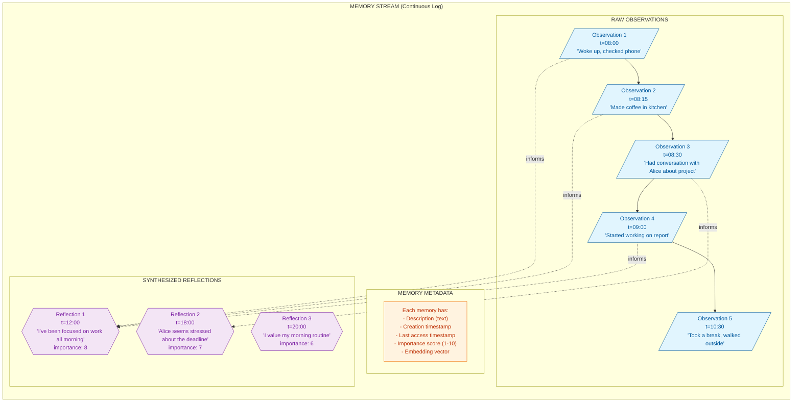
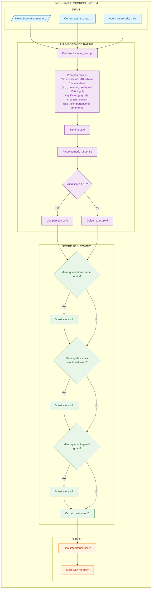
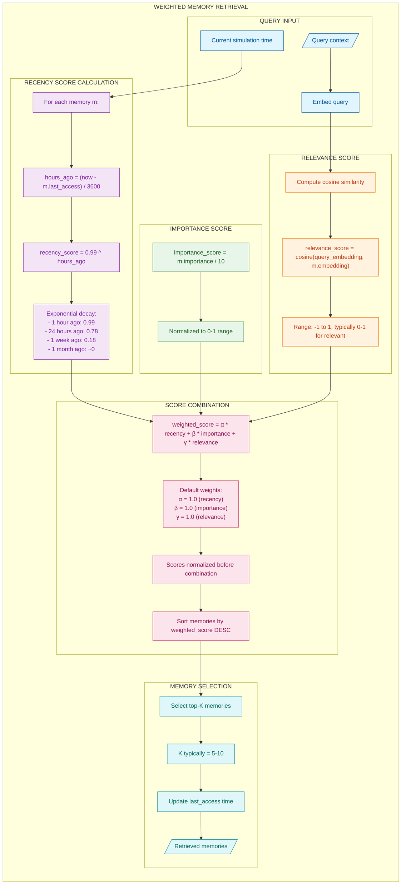
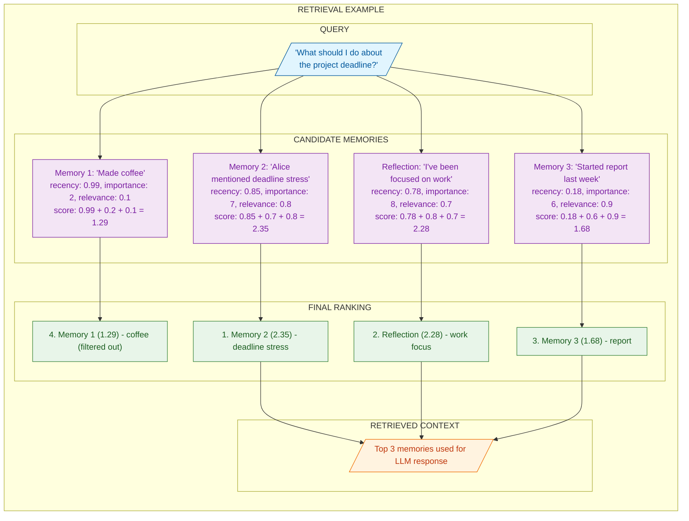

# Generative Agents: Memory Stream and Reflection Architecture

## Overview

The Generative Agents paper (Park et al., 2023) introduced a groundbreaking architecture for believable AI agents that can remember, reflect, and plan. The core innovation is the **memory stream** - a continuously growing log of experiences that agents can query to inform their behavior. This document details the memory stream architecture, importance scoring mechanisms, weighted memory retrieval, and reflection generation pipeline.

### Key Innovations

| Component | Purpose | Mechanism |
|-----------|---------|-----------|
| Memory Stream | Continuous experience log | Append-only storage with embeddings |
| Importance Scoring | Prioritize significant memories | LLM-based scoring (1-10 scale) |
| Weighted Retrieval | Balance recency, importance, relevance | Multi-factor scoring formula |
| Reflections | Higher-order insights | Periodic synthesis from observations |

### Core Principles

1. **Continuous Recording**: Every observation becomes a timestamped memory
2. **Exponential Decay**: Recent memories are naturally prioritized
3. **Importance Weighting**: Significant events persist longer
4. **Reflective Abstraction**: Patterns emerge through periodic synthesis

---

## Memory Stream Architecture

The memory stream is a continuous log that stores both raw observations and synthesized reflections. Each entry contains metadata including timestamps, importance scores, and embedding vectors.



### Memory Stream Components

**Observations** are the raw building blocks of the memory stream. They capture:
- Direct perceptions from the environment
- Actions taken by the agent
- Interactions with other agents
- Environmental changes

**Reflections** are higher-order memories that emerge from observing patterns across multiple observations. They provide:
- Abstract insights about behavior patterns
- Understanding of relationships and dynamics
- Self-awareness of preferences and habits
- Strategic planning capabilities

**Metadata** enriches each memory entry with:
- **Description**: Natural language content of the memory
- **Creation timestamp**: When the memory was first recorded
- **Last access timestamp**: When the memory was last retrieved (for recency calculations)
- **Importance score**: LLM-assigned value from 1-10
- **Embedding vector**: For semantic similarity search

---

## Importance Scoring Pipeline

Every memory receives an importance score that influences its persistence and retrieval priority. The scoring combines LLM judgment with rule-based adjustments.



### Importance Score Interpretation

| Score Range | Classification | Examples |
|-------------|---------------|----------|
| 1-3 | Mundane/Routine | Brushing teeth, checking time, walking |
| 4-6 | Moderately Important | Conversations, work tasks, meals |
| 7-8 | Significant | Decisions, conflicts, achievements |
| 9-10 | Critical/Life-changing | Major events, revelations, transformations |

### Scoring Prompt Template

```
On a scale of 1-10, where 1 is purely mundane (e.g., brushing teeth,
checking the time) and 10 is extremely poignant or life-changing
(e.g., a breakup, getting accepted to college), rate the likely
significance of the following memory:

Memory: {memory_content}

Answer with just the number.
```

---

## Weighted Memory Retrieval (WMR)

The retrieval system balances three factors to select the most relevant memories for a given context:

1. **Recency**: How recently was the memory accessed?
2. **Importance**: How significant is the memory?
3. **Relevance**: How semantically related is the memory to the query?



### Recency Decay Formula

The exponential decay formula ensures recent memories are naturally prioritized:

```
recency_score = decay_factor ^ hours_since_access
              = 0.99 ^ hours_ago
```

**Decay Examples:**
| Time Since Access | Recency Score |
|-------------------|---------------|
| 1 hour | 0.99 |
| 24 hours | 0.78 |
| 1 week | 0.18 |
| 1 month | ~0.00 |

### Weighted Score Formula

```
final_score = α × recency_score + β × importance_score + γ × relevance_score
```

Where:
- `α`, `β`, `γ` are configurable weights (default: 1.0 each)
- All component scores are normalized to [0, 1]
- Final scores are sorted descending for selection

---

## Reflection Generation Pipeline

Reflections are higher-order memories synthesized from observations. They emerge when the cumulative importance of recent memories exceeds a threshold.

```mermaid
flowchart TB
    subgraph ReflectionPipeline["REFLECTION GENERATION PIPELINE"]
        direction TB

        subgraph Trigger["REFLECTION TRIGGER"]
            T1["Monitor cumulative importance"]
            T2["Sum importance of recent memories"]
            T3{Sum > threshold?}
            T4["Threshold typically = 150"]
            T5["Trigger reflection"]
            T6["Continue observing"]
        end

        subgraph MemoryRetrieval["RETRIEVE RECENT MEMORIES"]
            MR1["Get memories since last reflection"]
            MR2["Apply WMR to select most relevant"]
            MR3["Typically retrieve 100 most recent"]
            MR4["Sort by importance DESC"]
        end

        subgraph QuestionGeneration["GENERATE REFLECTION QUESTIONS"]
            QG1["Prompt LLM with memories"]
            QG2["'Given these recent memories,<br/>what 3 high-level questions<br/>can be answered?'"]
            QG3["Parse question list"]
            QG4["Example questions:<br/>- What are my priorities today?<br/>- How do I feel about X?<br/>- What did I learn from Y?"]
        end

        subgraph InsightExtraction["EXTRACT INSIGHTS"]
            IE1["For each question:"]
            IE2["Retrieve relevant memories via WMR"]
            IE3["Prompt LLM for insight"]
            IE4["'Based on these memories,<br/>what is the answer to: {question}'"]
            IE5["Generate insight statement"]
            IE6["Score insight importance"]
        end

        subgraph ReflectionStorage["STORE REFLECTIONS"]
            RS1["Create reflection memory"]
            RS2["Set type = 'reflection'"]
            RS3["Link to source memories"]
            RS4["Assign high importance (typically 8-10)"]
            RS5["Generate embedding"]
            RS6["Add to memory stream"]
        end

        subgraph ReflectionChaining["REFLECTION CHAINING"]
            RC1["Reflections can trigger more reflections"]
            RC2["Higher-order insights emerge"]
            RC3["Creates abstraction hierarchy"]
            RC4["Limits: max 3 levels deep"]
        end
    end

    T1 --> T2 --> T3
    T3 -->|Yes| T5
    T3 -->|No| T6
    T4 -.-> T3
    T6 --> T1

    T5 --> MR1 --> MR2 --> MR3 --> MR4

    MR4 --> QG1 --> QG2 --> QG3 --> QG4

    QG4 --> IE1 --> IE2 --> IE3 --> IE4 --> IE5 --> IE6

    IE6 --> RS1 --> RS2 --> RS3 --> RS4 --> RS5 --> RS6

    RS6 --> RC1 --> RC2 --> RC3 --> RC4
    RC4 -.->|may trigger| T1

    classDef trigger fill:#e1f5fe,stroke:#01579b,color:#01579b
    classDef retrieve fill:#f3e5f5,stroke:#7b1fa2,color:#7b1fa2
    classDef question fill:#e8f5e9,stroke:#2e7d32,color:#1b5e20
    classDef insight fill:#fff3e0,stroke:#ef6c00,color:#bf360c
    classDef storage fill:#fce4ec,stroke:#c2185b,color:#880e4f
    classDef chain fill:#e0f7fa,stroke:#00838f,color:#00695c

    class T1,T2,T3,T4,T5,T6 trigger
    class MR1,MR2,MR3,MR4 retrieve
    class QG1,QG2,QG3,QG4 question
    class IE1,IE2,IE3,IE4,IE5,IE6 insight
    class RS1,RS2,RS3,RS4,RS5,RS6 storage
    class RC1,RC2,RC3,RC4 chain
```



### Reflection Question Prompt

```
You are analyzing a person's recent memories to generate high-level questions
that can be answered by examining these memories.

Recent memories:
{memory_list}

Given only the information above, what are 3 most salient high-level questions
we can answer about the subject? Focus on patterns, relationships, and insights.
```

### Insight Extraction Prompt

```
Statements relevant to answering the question "{question}":
{relevant_memories}

What insight does this information provide about "{question}"?
Provide a single statement insight in 1-2 sentences.
```

---

## Complete Agent Memory Cycle

The full agent loop integrates perception, storage, reflection, planning, and action into a continuous cycle.

```mermaid
flowchart TB
    subgraph AgentCycle["COMPLETE AGENT MEMORY CYCLE"]
        direction TB

        subgraph Perception["PERCEPTION"]
            P1[/"Environment state"/]
            P2["Parse observable elements"]
            P3["Generate observation descriptions"]
            P4["Create memory objects"]
        end

        subgraph Storage["MEMORY STORAGE"]
            S1["Score importance via LLM"]
            S2["Generate embedding"]
            S3["Add timestamp metadata"]
            S4["Append to memory stream"]
            S5["Update importance accumulator"]
        end

        subgraph ReflectionCheck["REFLECTION CHECK"]
            RC1{Importance sum > threshold?}
            RC2["Run reflection pipeline"]
            RC3["Generate higher-order insights"]
            RC4["Store reflections"]
            RC5["Reset importance accumulator"]
        end

        subgraph Planning["PLANNING"]
            PL1[/"Current situation/query"/]
            PL2["Retrieve relevant memories via WMR"]
            PL3["Include both observations and reflections"]
            PL4["Construct context for LLM"]
        end

        subgraph Action["ACTION GENERATION"]
            A1["LLM generates action plan"]
            A2["Consider retrieved memories"]
            A3["Factor in agent personality"]
            A4["Output: next action to take"]
        end

        subgraph Execution["EXECUTION"]
            E1["Execute action in environment"]
            E2["Observe results"]
            E3["Loop back to perception"]
        end
    end

    P1 --> P2 --> P3 --> P4
    P4 --> S1 --> S2 --> S3 --> S4 --> S5

    S5 --> RC1
    RC1 -->|Yes| RC2 --> RC3 --> RC4 --> RC5
    RC1 -->|No| PL1
    RC5 --> PL1

    PL1 --> PL2 --> PL3 --> PL4
    PL4 --> A1 --> A2 --> A3 --> A4
    A4 --> E1 --> E2 --> E3 --> P1

    classDef perception fill:#e1f5fe,stroke:#01579b,color:#01579b
    classDef storage fill:#f3e5f5,stroke:#7b1fa2,color:#7b1fa2
    classDef reflection fill:#e8f5e9,stroke:#2e7d32,color:#1b5e20
    classDef planning fill:#fff3e0,stroke:#ef6c00,color:#bf360c
    classDef action fill:#fce4ec,stroke:#c2185b,color:#880e4f
    classDef execution fill:#e0f7fa,stroke:#00838f,color:#00695c

    class P1,P2,P3,P4 perception
    class S1,S2,S3,S4,S5 storage
    class RC1,RC2,RC3,RC4,RC5 reflection
    class PL1,PL2,PL3,PL4 planning
    class A1,A2,A3,A4 action
    class E1,E2,E3 execution
```



---

## Memory Retrieval Example

A concrete example showing how the weighted retrieval formula selects memories for a project-related query.



---

## How to Incorporate This into MycelicMemory

### Current State Analysis

MycelicMemory already has foundational elements that align with Generative Agents:

| Feature | Current State | Gap |
|---------|--------------|-----|
| Memory storage | SQLite with `memories` table | Missing `last_accessed_at` for recency |
| Importance scoring | `importance` field (1-10) | Missing LLM-based scoring on store |
| Embeddings | nomic-embed-text via Ollama | Ready for relevance scoring |
| Relationships | `memory_relationships` table | Can link reflections to sources |
| Memory types | No distinction | Need `memory_type` field |

### Recommended Implementation Steps

#### Step 1: Schema Updates

Add fields to support recency tracking and memory types:

```sql
-- Add to memories table
ALTER TABLE memories ADD COLUMN last_accessed_at DATETIME DEFAULT CURRENT_TIMESTAMP;
ALTER TABLE memories ADD COLUMN memory_type TEXT DEFAULT 'observation'
    CHECK (memory_type IN ('observation', 'reflection', 'plan'));
ALTER TABLE memories ADD COLUMN access_count INTEGER DEFAULT 0;

-- Index for recency-based queries
CREATE INDEX IF NOT EXISTS idx_memories_last_accessed ON memories(last_accessed_at);
CREATE INDEX IF NOT EXISTS idx_memories_type ON memories(memory_type);

-- Table for tracking reflection triggers
CREATE TABLE IF NOT EXISTS reflection_state (
    id TEXT PRIMARY KEY,
    session_id TEXT NOT NULL,
    cumulative_importance REAL DEFAULT 0,
    last_reflection_at DATETIME,
    observation_count INTEGER DEFAULT 0,
    FOREIGN KEY (session_id) REFERENCES agent_sessions(session_id)
);
```

#### Step 2: Importance Scorer Service

```go
// internal/services/importance_scorer.go
package services

import (
    "context"
    "fmt"
    "strconv"
    "strings"
)

// ImportanceScorer assigns importance scores to memories using LLM
type ImportanceScorer struct {
    ollamaClient *OllamaClient
    model        string
}

// NewImportanceScorer creates a new importance scorer
func NewImportanceScorer(client *OllamaClient, model string) *ImportanceScorer {
    return &ImportanceScorer{
        ollamaClient: client,
        model:        model,
    }
}

// ScoreImportance returns an importance score (1-10) for the given content
func (s *ImportanceScorer) ScoreImportance(ctx context.Context, content string, agentContext string) (int, error) {
    prompt := fmt.Sprintf(`On a scale of 1-10, where 1 is purely mundane (e.g., checking the time,
making coffee) and 10 is extremely significant (e.g., major decision,
critical learning, important preference), rate the importance of remembering:

Content: %s
Context: %s

Respond with just the number (1-10).`, content, agentContext)

    response, err := s.ollamaClient.Generate(ctx, s.model, prompt)
    if err != nil {
        return 5, err // Default to middle importance on error
    }

    // Parse the numeric response
    score, err := strconv.Atoi(strings.TrimSpace(response))
    if err != nil || score < 1 || score > 10 {
        return 5, nil // Default to middle importance
    }

    // Apply heuristic boosts
    score = s.applyBoosts(content, score)

    return score, nil
}

// applyBoosts adds rule-based adjustments to the score
func (s *ImportanceScorer) applyBoosts(content string, score int) int {
    contentLower := strings.ToLower(content)

    // Named entity boost
    if containsProperNoun(content) {
        score++
    }

    // Preference/opinion boost
    preferenceIndicators := []string{"prefer", "like", "hate", "always", "never", "want"}
    for _, indicator := range preferenceIndicators {
        if strings.Contains(contentLower, indicator) {
            score++
            break
        }
    }

    // Goal/task boost
    goalIndicators := []string{"goal", "objective", "must", "need to", "should", "priority"}
    for _, indicator := range goalIndicators {
        if strings.Contains(contentLower, indicator) {
            score += 2
            break
        }
    }

    // Cap at 10
    if score > 10 {
        score = 10
    }

    return score
}
```

#### Step 3: Weighted Retriever

```go
// internal/services/weighted_retriever.go
package services

import (
    "context"
    "math"
    "sort"
    "time"
)

// WeightedRetrieverConfig holds retrieval weight configuration
type WeightedRetrieverConfig struct {
    RecencyWeight    float64 `yaml:"recency_weight"`
    ImportanceWeight float64 `yaml:"importance_weight"`
    RelevanceWeight  float64 `yaml:"relevance_weight"`
    DecayFactor      float64 `yaml:"decay_factor"` // Default: 0.99
    TopK             int     `yaml:"top_k"`        // Default: 10
}

// DefaultWeightedRetrieverConfig returns default configuration
func DefaultWeightedRetrieverConfig() WeightedRetrieverConfig {
    return WeightedRetrieverConfig{
        RecencyWeight:    1.0,
        ImportanceWeight: 1.0,
        RelevanceWeight:  1.0,
        DecayFactor:      0.99,
        TopK:             10,
    }
}

// WeightedRetriever implements Generative Agents style retrieval
type WeightedRetriever struct {
    repo   MemoryRepository
    embed  EmbeddingService
    config WeightedRetrieverConfig
}

// ScoredMemory combines a memory with its weighted score
type ScoredMemory struct {
    Memory         Memory
    RecencyScore   float64
    ImportanceScore float64
    RelevanceScore  float64
    FinalScore      float64
}

// Retrieve performs weighted memory retrieval
func (r *WeightedRetriever) Retrieve(ctx context.Context, query string, sessionID string) ([]ScoredMemory, error) {
    // Generate query embedding
    queryEmbed, err := r.embed.Embed(ctx, query)
    if err != nil {
        return nil, err
    }

    // Get candidate memories (top 100 by similarity)
    candidates, err := r.repo.SearchByVector(ctx, queryEmbed, 100, sessionID)
    if err != nil {
        return nil, err
    }

    now := time.Now()
    scored := make([]ScoredMemory, 0, len(candidates))

    for _, mem := range candidates {
        sm := r.scoreMemory(mem, queryEmbed, now)
        scored = append(scored, sm)
    }

    // Sort by final score descending
    sort.Slice(scored, func(i, j int) bool {
        return scored[i].FinalScore > scored[j].FinalScore
    })

    // Return top-K
    if len(scored) > r.config.TopK {
        scored = scored[:r.config.TopK]
    }

    // Update access timestamps for retrieved memories
    for _, sm := range scored {
        r.repo.UpdateLastAccessed(ctx, sm.Memory.ID, now)
    }

    return scored, nil
}

// scoreMemory calculates the weighted score for a single memory
func (r *WeightedRetriever) scoreMemory(mem Memory, queryEmbed []float32, now time.Time) ScoredMemory {
    // Recency score: exponential decay based on hours since last access
    lastAccess := mem.LastAccessedAt
    if lastAccess.IsZero() {
        lastAccess = mem.CreatedAt
    }
    hoursSinceAccess := now.Sub(lastAccess).Hours()
    recencyScore := math.Pow(r.config.DecayFactor, hoursSinceAccess)

    // Importance score: normalized to 0-1
    importanceScore := float64(mem.Importance) / 10.0

    // Relevance score: cosine similarity (already computed during vector search)
    relevanceScore := mem.Similarity // Assumed to be set by SearchByVector

    // Weighted combination
    finalScore := (r.config.RecencyWeight * recencyScore) +
                  (r.config.ImportanceWeight * importanceScore) +
                  (r.config.RelevanceWeight * relevanceScore)

    return ScoredMemory{
        Memory:          mem,
        RecencyScore:    recencyScore,
        ImportanceScore: importanceScore,
        RelevanceScore:  relevanceScore,
        FinalScore:      finalScore,
    }
}
```

#### Step 4: Reflection Generator

```go
// internal/services/reflection_generator.go
package services

import (
    "context"
    "fmt"
    "strings"
    "time"
)

// ReflectionConfig configures reflection generation
type ReflectionConfig struct {
    ImportanceThreshold float64 `yaml:"importance_threshold"` // Default: 150
    MaxReflectionDepth  int     `yaml:"max_reflection_depth"` // Default: 3
    QuestionsPerCycle   int     `yaml:"questions_per_cycle"`  // Default: 3
    MinMemoriesForReflection int `yaml:"min_memories"`        // Default: 10
}

// ReflectionGenerator creates higher-order insights from observations
type ReflectionGenerator struct {
    repo      MemoryRepository
    retriever *WeightedRetriever
    llm       *OllamaClient
    scorer    *ImportanceScorer
    config    ReflectionConfig
}

// ReflectionState tracks cumulative importance for a session
type ReflectionState struct {
    SessionID            string
    CumulativeImportance float64
    LastReflectionAt     time.Time
    ObservationCount     int
}

// CheckAndGenerateReflections checks if reflection is needed and generates them
func (g *ReflectionGenerator) CheckAndGenerateReflections(ctx context.Context, state *ReflectionState) ([]Memory, error) {
    if state.CumulativeImportance < g.config.ImportanceThreshold {
        return nil, nil // Not enough accumulated importance
    }

    if state.ObservationCount < g.config.MinMemoriesForReflection {
        return nil, nil // Not enough observations
    }

    // Retrieve recent memories for reflection
    memories, err := g.repo.GetMemoriesSince(ctx, state.SessionID, state.LastReflectionAt, 100)
    if err != nil {
        return nil, err
    }

    // Generate reflection questions
    questions, err := g.generateQuestions(ctx, memories)
    if err != nil {
        return nil, err
    }

    // Generate insights for each question
    reflections := make([]Memory, 0, len(questions))
    for _, question := range questions {
        reflection, err := g.generateInsight(ctx, question, state.SessionID)
        if err != nil {
            continue // Skip failed reflections
        }
        reflections = append(reflections, reflection)
    }

    // Store reflections and reset state
    for _, ref := range reflections {
        if err := g.repo.Store(ctx, &ref); err != nil {
            return nil, err
        }
    }

    // Reset accumulator
    state.CumulativeImportance = 0
    state.LastReflectionAt = time.Now()

    return reflections, nil
}

// generateQuestions uses LLM to create reflection questions
func (g *ReflectionGenerator) generateQuestions(ctx context.Context, memories []Memory) ([]string, error) {
    // Format memories for prompt
    var memoryList strings.Builder
    for i, mem := range memories {
        if i >= 50 { // Limit context size
            break
        }
        fmt.Fprintf(&memoryList, "- %s (importance: %d)\n", mem.Content, mem.Importance)
    }

    prompt := fmt.Sprintf(`Given these recent observations and memories:
%s

What are %d high-level questions that these memories can help answer?
Focus on patterns, relationships, insights, and learnings.
Return each question on a new line, numbered 1-3.`,
        memoryList.String(), g.config.QuestionsPerCycle)

    response, err := g.llm.Generate(ctx, "qwen2.5:3b", prompt)
    if err != nil {
        return nil, err
    }

    // Parse questions from response
    lines := strings.Split(response, "\n")
    questions := make([]string, 0, g.config.QuestionsPerCycle)
    for _, line := range lines {
        line = strings.TrimSpace(line)
        if len(line) > 3 && (line[0] >= '1' && line[0] <= '9') {
            // Remove number prefix
            question := strings.TrimLeft(line[1:], ".): ")
            questions = append(questions, question)
        }
    }

    return questions, nil
}

// generateInsight creates a reflection memory from a question
func (g *ReflectionGenerator) generateInsight(ctx context.Context, question string, sessionID string) (Memory, error) {
    // Retrieve memories relevant to this question
    relevant, err := g.retriever.Retrieve(ctx, question, sessionID)
    if err != nil {
        return Memory{}, err
    }

    // Format relevant memories
    var context strings.Builder
    for _, sm := range relevant {
        fmt.Fprintf(&context, "- %s\n", sm.Memory.Content)
    }

    prompt := fmt.Sprintf(`Based on these relevant memories:
%s

What insight or conclusion can we draw about: "%s"
Provide a single statement (1-2 sentences) that captures the key insight.`,
        context.String(), question)

    insight, err := g.llm.Generate(ctx, "qwen2.5:3b", prompt)
    if err != nil {
        return Memory{}, err
    }

    // Score the reflection's importance
    importance, _ := g.scorer.ScoreImportance(ctx, insight, "reflection on: "+question)
    if importance < 7 {
        importance = 7 // Reflections are inherently important
    }

    // Create reflection memory
    reflection := Memory{
        ID:         generateUUID(),
        Content:    strings.TrimSpace(insight),
        Source:     "reflection",
        Importance: importance,
        SessionID:  sessionID,
        MemoryType: "reflection",
        CreatedAt:  time.Now(),
        Tags:       []string{"reflection", "insight"},
    }

    return reflection, nil
}
```

### Configuration Options

```yaml
# config/memory.yaml
generative_agents:
  enabled: true

  importance_scoring:
    enabled: true
    default_score: 5
    boost_named_entities: 1
    boost_preferences: 1
    boost_goals: 2
    max_score: 10

  weighted_retrieval:
    recency_weight: 1.0
    importance_weight: 1.0
    relevance_weight: 1.0
    decay_factor: 0.99  # Per hour
    top_k: 10

  reflection:
    enabled: true
    importance_threshold: 150
    max_depth: 3
    questions_per_cycle: 3
    min_memories_for_reflection: 10

  memory_types:
    - observation
    - reflection
    - plan
```

### Benefits of Integration

1. **Smarter Retrieval**: Balance recency, importance, and relevance for more contextually appropriate memories
2. **Memory Persistence**: Important memories naturally persist while mundane ones fade
3. **Higher-Order Insights**: Reflections surface patterns and relationships across observations
4. **Agent Continuity**: Memory stream provides long-term context for believable agent behavior
5. **Reduced Noise**: Importance filtering prevents trivial information from cluttering context

### Migration Path

1. **Phase 1**: Add `last_accessed_at` and `memory_type` columns to existing schema
2. **Phase 2**: Implement importance scoring on new memory stores
3. **Phase 3**: Switch retrieval from pure vector search to weighted retrieval
4. **Phase 4**: Enable reflection generation for long-running sessions
5. **Phase 5**: Add reflection chaining for deeper insights

### MCP Tool Integration

```go
// Add to MCP server tools
func (s *MCPServer) registerGenerativeAgentTools() {
    // memory_retrieve now uses weighted retrieval
    s.registerTool("memory_retrieve", func(params map[string]any) (any, error) {
        query := params["query"].(string)
        sessionID := params["session_id"].(string)

        scored, err := s.weightedRetriever.Retrieve(s.ctx, query, sessionID)
        if err != nil {
            return nil, err
        }

        // Format response with scores for transparency
        results := make([]map[string]any, len(scored))
        for i, sm := range scored {
            results[i] = map[string]any{
                "id":              sm.Memory.ID,
                "content":         sm.Memory.Content,
                "recency_score":   sm.RecencyScore,
                "importance_score": sm.ImportanceScore,
                "relevance_score": sm.RelevanceScore,
                "final_score":     sm.FinalScore,
            }
        }
        return results, nil
    })

    // New tool for triggering reflection
    s.registerTool("memory_reflect", func(params map[string]any) (any, error) {
        sessionID := params["session_id"].(string)
        state, _ := s.getReflectionState(sessionID)

        reflections, err := s.reflectionGenerator.CheckAndGenerateReflections(s.ctx, state)
        if err != nil {
            return nil, err
        }

        return map[string]any{
            "reflections_generated": len(reflections),
            "reflections": reflections,
        }, nil
    })
}
```

---

## Summary

The Generative Agents memory stream architecture provides a proven framework for building AI systems with believable, long-term memory. By implementing importance scoring, weighted retrieval, and reflection generation, MycelicMemory can:

- Store experiences with appropriate priority
- Retrieve contextually relevant memories balancing recency, importance, and relevance
- Generate higher-order insights through periodic reflection
- Support long-running agent sessions with coherent memory

The implementation leverages MycelicMemory's existing SQLite infrastructure while adding the temporal and importance dimensions needed for human-like memory behavior.
