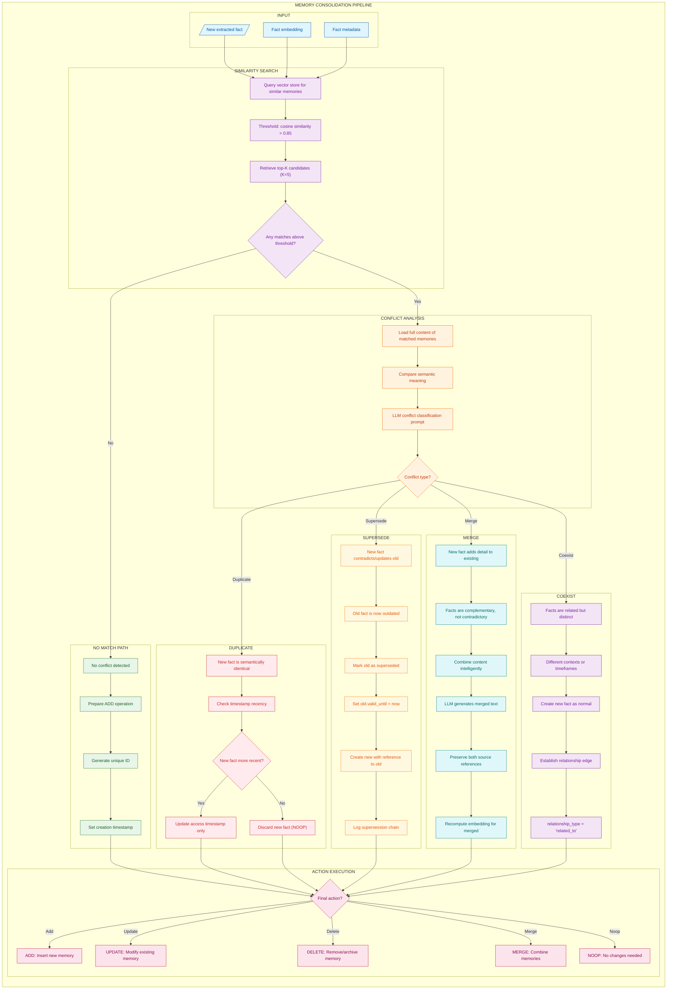
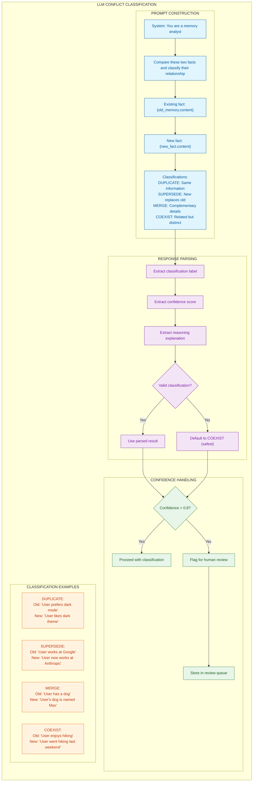
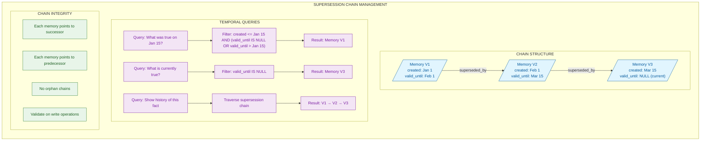
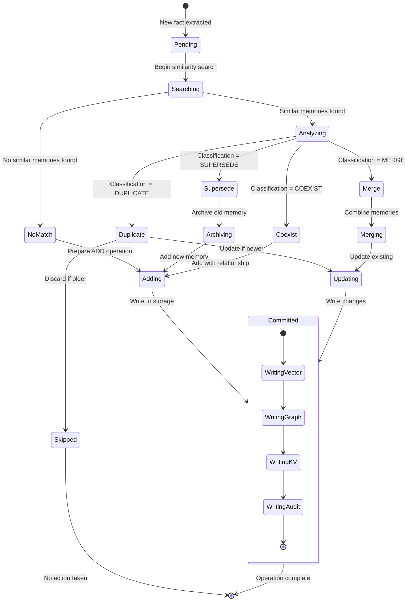

# Memory Consolidation Pipeline (ADD/UPDATE/DELETE/MERGE)

## Overview

Memory consolidation is the process of integrating new information with existing memories. When a new fact is extracted, the system must determine how it relates to existing knowledge: Is it entirely new? Does it duplicate existing information? Does it contradict or supersede something already stored? Should it be merged with related memories?

This document details the complete consolidation pipeline, including conflict detection, resolution strategies, and the atomic operations (ADD, UPDATE, DELETE, MERGE) that maintain memory integrity.

### Why Consolidation Matters

| Challenge | Without Consolidation | With Consolidation |
|-----------|----------------------|-------------------|
| Duplicate information | Storage bloat, retrieval noise | Deduplication, clean storage |
| Contradictory facts | Conflicting context, confused responses | Latest truth preserved |
| Related information | Scattered fragments | Merged, coherent memories |
| Temporal changes | Outdated facts persist | Supersession chains |

### Core Operations

1. **ADD**: Insert a completely new memory
2. **UPDATE**: Modify an existing memory's metadata or content
3. **DELETE**: Remove or archive a memory
4. **MERGE**: Combine multiple related memories into one
5. **NOOP**: No operation needed (duplicate detected)

---

## Consolidation Decision Flow

The main pipeline processes each new fact through similarity search, conflict analysis, and action determination.



### Similarity Threshold Selection

The similarity threshold determines when two memories are "close enough" to require conflict analysis:

| Threshold | Behavior | Use Case |
|-----------|----------|----------|
| > 0.95 | Very strict, near-identical matches only | High-precision deduplication |
| > 0.85 | Balanced, catches related content | Default for most scenarios |
| > 0.75 | Loose, broad relationship detection | Exploration and linking |

---

## LLM Conflict Classification

When similar memories are found, an LLM determines the relationship type between the new fact and existing memories.



### Classification Prompt Template

```
You are a memory analyst. Compare these two facts and determine their relationship.

EXISTING FACT (stored previously):
{old_memory.content}
Stored at: {old_memory.created_at}

NEW FACT (just extracted):
{new_fact.content}
Extracted at: {timestamp}

Classify the relationship between these facts:

1. DUPLICATE - The new fact says essentially the same thing as the existing fact (same information, different wording)
2. SUPERSEDE - The new fact updates or contradicts the existing fact (the old fact is now outdated)
3. MERGE - The new fact adds complementary details to the existing fact (they should be combined)
4. COEXIST - The facts are related but distinct (both should be kept separately)

Respond in JSON format:
{
  "classification": "DUPLICATE|SUPERSEDE|MERGE|COEXIST",
  "confidence": 0.0-1.0,
  "reasoning": "Brief explanation"
}
```

---

## Merge Operation Detail

When facts are complementary, the merge operation intelligently combines them while preserving provenance.

```mermaid
flowchart TB
    subgraph MergeOperation["MERGE OPERATION DETAIL"]
        direction TB

        subgraph Input["MERGE INPUTS"]
            MI1["Existing memory M1"]
            MI2["New fact F1"]
            MI3["Classification: MERGE"]
        end

        subgraph ContentMerge["CONTENT MERGING"]
            CM1["LLM prompt: Combine these facts"]
            CM2["'Combine into single coherent statement:<br/>Fact 1: {M1.content}<br/>Fact 2: {F1.content}'"]
            CM3["Generate merged content"]
            CM4["Validate merged preserves both facts"]
        end

        subgraph MetadataMerge["METADATA MERGING"]
            MM1["importance = max(M1.importance, F1.importance)"]
            MM2["created_at = min(M1.created_at, F1.created_at)"]
            MM3["updated_at = now()"]
            MM4["access_count = M1.access_count + 1"]
            MM5["sources = M1.sources + F1.sources"]
        end

        subgraph TagMerge["TAG MERGING"]
            TM1["Union of M1.tags and F1.tags"]
            TM2["Deduplicate tags"]
            TM3["Normalize tag formats"]
            TM4["Preserve tag weights if available"]
        end

        subgraph EntityMerge["ENTITY MERGING"]
            EM1["Collect entities from both"]
            EM2["Deduplicate by entity ID"]
            EM3["Update entity relationships"]
            EM4["Recompute entity graph edges"]
        end

        subgraph EmbeddingRecompute["EMBEDDING UPDATE"]
            ER1["Generate new embedding for merged content"]
            ER2["Update vector store"]
            ER3["Remove old embedding"]
            ER4["Index new embedding"]
        end

        subgraph AuditTrail["AUDIT TRAIL"]
            AT1["Log merge operation"]
            AT2["Store before state: M1"]
            AT3["Store after state: merged"]
            AT4["Record merge timestamp"]
            AT5["Link to source memories"]
        end

        subgraph Output["MERGED MEMORY"]
            O1["New unified memory object"]
            O2["M1.id preserved (update in place)"]
            O3["F1 marked as merged into M1"]
        end
    end

    MI1 --> CM1
    MI2 --> CM1
    MI3 --> CM1

    CM1 --> CM2 --> CM3 --> CM4

    CM4 --> MM1 --> MM2 --> MM3 --> MM4 --> MM5

    MM5 --> TM1 --> TM2 --> TM3 --> TM4

    TM4 --> EM1 --> EM2 --> EM3 --> EM4

    EM4 --> ER1 --> ER2 --> ER3 --> ER4

    ER4 --> AT1 --> AT2 --> AT3 --> AT4 --> AT5

    AT5 --> O1 --> O2 --> O3

    classDef input fill:#e1f5fe,stroke:#01579b,color:#01579b
    classDef content fill:#f3e5f5,stroke:#7b1fa2,color:#7b1fa2
    classDef metadata fill:#e8f5e9,stroke:#2e7d32,color:#1b5e20
    classDef tag fill:#fff3e0,stroke:#ef6c00,color:#bf360c
    classDef entity fill:#fce4ec,stroke:#c2185b,color:#880e4f
    classDef embed fill:#e0f7fa,stroke:#00838f,color:#00695c
    classDef audit fill:#fff8e1,stroke:#f57f17,color:#e65100
    classDef output fill:#f1f8e9,stroke:#558b2f,color:#33691e

    class MI1,MI2,MI3 input
    class CM1,CM2,CM3,CM4 content
    class MM1,MM2,MM3,MM4,MM5 metadata
    class TM1,TM2,TM3,TM4 tag
    class EM1,EM2,EM3,EM4 entity
    class ER1,ER2,ER3,ER4 embed
    class AT1,AT2,AT3,AT4,AT5 audit
    class O1,O2,O3 output
```



### Merge Prompt Template

```
Combine these two related facts into a single, coherent statement that preserves all information:

Fact 1: {existing_memory.content}
Fact 2: {new_fact.content}

Requirements:
- Include all specific details from both facts
- Do not add information not present in either fact
- Write as a single statement or short paragraph
- Maintain factual accuracy

Combined statement:
```

---

## Supersession Chain Management

When facts change over time, supersession chains maintain the history of truth for temporal queries.



### Temporal Query Examples

| Query Type | SQL Pattern | Use Case |
|------------|-------------|----------|
| Current truth | `WHERE valid_until IS NULL` | Normal retrieval |
| Point-in-time | `WHERE created_at <= ? AND (valid_until IS NULL OR valid_until > ?)` | Historical queries |
| Full history | `WHERE supersession_chain_id = ?` | Audit trails |

---

## Consolidation State Machine

The state machine shows all valid transitions during the consolidation process.



### State Descriptions

| State | Description | Next States |
|-------|-------------|-------------|
| Pending | New fact awaiting processing | Searching |
| Searching | Querying for similar memories | NoMatch, Analyzing |
| Analyzing | LLM classifying relationship | Duplicate, Supersede, Merge, Coexist |
| Adding | Preparing new memory insert | Committed |
| Updating | Modifying existing memory | Committed |
| Merging | Combining memories | Updating |
| Archiving | Marking old memory as superseded | Adding |
| Committed | Write operations complete | Terminal |
| Skipped | No action needed (duplicate) | Terminal |

---

## How to Incorporate This into MycelicMemory

### Current State Analysis

MycelicMemory's existing schema provides a foundation for consolidation:

| Feature | Current State | Gap |
|---------|--------------|-----|
| Memory storage | `memories` table with content, embedding | No `valid_until` for supersession |
| Relationships | `memory_relationships` with 7 types | Missing 'supersedes' and 'merged_into' types |
| Vector search | sqlite-vec for similarity | Ready for conflict detection |
| Audit trail | Basic `created_at`, `updated_at` | Need consolidation_log table |

### Recommended Implementation Steps

#### Step 1: Schema Updates

Add fields and tables for consolidation tracking:

```sql
-- Add supersession fields to memories
ALTER TABLE memories ADD COLUMN valid_until DATETIME;
ALTER TABLE memories ADD COLUMN superseded_by TEXT REFERENCES memories(id);
ALTER TABLE memories ADD COLUMN supersession_chain_id TEXT;
ALTER TABLE memories ADD COLUMN merge_source_ids TEXT; -- JSON array

-- Index for temporal queries
CREATE INDEX IF NOT EXISTS idx_memories_valid_until ON memories(valid_until);
CREATE INDEX IF NOT EXISTS idx_memories_supersession_chain ON memories(supersession_chain_id);

-- Consolidation operation log
CREATE TABLE IF NOT EXISTS consolidation_log (
    id TEXT PRIMARY KEY,
    operation_type TEXT NOT NULL CHECK (
        operation_type IN ('ADD', 'UPDATE', 'DELETE', 'MERGE', 'SUPERSEDE', 'NOOP')
    ),
    source_memory_ids TEXT NOT NULL, -- JSON array
    target_memory_id TEXT,
    classification TEXT,
    confidence REAL,
    reasoning TEXT,
    before_state TEXT, -- JSON snapshot
    after_state TEXT,  -- JSON snapshot
    created_at DATETIME NOT NULL DEFAULT CURRENT_TIMESTAMP,
    session_id TEXT,
    FOREIGN KEY (target_memory_id) REFERENCES memories(id)
);

CREATE INDEX IF NOT EXISTS idx_consolidation_log_operation ON consolidation_log(operation_type);
CREATE INDEX IF NOT EXISTS idx_consolidation_log_target ON consolidation_log(target_memory_id);

-- Add new relationship types
-- The existing CHECK constraint needs to be updated
-- In SQLite, this requires recreating the table or using a trigger
CREATE TRIGGER IF NOT EXISTS validate_extended_relationship_type
BEFORE INSERT ON memory_relationships
BEGIN
    SELECT CASE
        WHEN NEW.relationship_type NOT IN (
            'references', 'contradicts', 'expands', 'similar',
            'sequential', 'causes', 'enables', 'supersedes', 'merged_into'
        )
        THEN RAISE(ABORT, 'Invalid relationship type')
    END;
END;
```

#### Step 2: Consolidation Service

```go
// internal/services/consolidation.go
package services

import (
    "context"
    "encoding/json"
    "fmt"
    "time"
)

// ConsolidationType represents the outcome of conflict analysis
type ConsolidationType string

const (
    ConsolidationAdd       ConsolidationType = "ADD"
    ConsolidationUpdate    ConsolidationType = "UPDATE"
    ConsolidationMerge     ConsolidationType = "MERGE"
    ConsolidationSupersede ConsolidationType = "SUPERSEDE"
    ConsolidationNoop      ConsolidationType = "NOOP"
)

// ConflictClassification holds LLM classification results
type ConflictClassification struct {
    Type       string  `json:"classification"`
    Confidence float64 `json:"confidence"`
    Reasoning  string  `json:"reasoning"`
}

// ConsolidationResult holds the outcome of a consolidation operation
type ConsolidationResult struct {
    Operation      ConsolidationType
    TargetMemoryID string
    Classification *ConflictClassification
    MergedContent  string
    Error          error
}

// ConsolidationConfig holds consolidation settings
type ConsolidationConfig struct {
    SimilarityThreshold float64 `yaml:"similarity_threshold"` // Default: 0.85
    ConfidenceThreshold float64 `yaml:"confidence_threshold"` // Default: 0.8
    MaxCandidates       int     `yaml:"max_candidates"`       // Default: 5
    EnableMerge         bool    `yaml:"enable_merge"`         // Default: true
    EnableSupersede     bool    `yaml:"enable_supersede"`     // Default: true
}

// Consolidator handles memory consolidation operations
type Consolidator struct {
    repo      MemoryRepository
    vectorDB  VectorStore
    llm       *OllamaClient
    embedder  EmbeddingService
    config    ConsolidationConfig
}

// NewConsolidator creates a new consolidator
func NewConsolidator(repo MemoryRepository, vectorDB VectorStore, llm *OllamaClient, embedder EmbeddingService, config ConsolidationConfig) *Consolidator {
    return &Consolidator{
        repo:     repo,
        vectorDB: vectorDB,
        llm:      llm,
        embedder: embedder,
        config:   config,
    }
}

// Consolidate processes a new fact and determines the appropriate action
func (c *Consolidator) Consolidate(ctx context.Context, newFact *Memory) (*ConsolidationResult, error) {
    // Step 1: Generate embedding if not present
    if len(newFact.Embedding) == 0 {
        embedding, err := c.embedder.Embed(ctx, newFact.Content)
        if err != nil {
            return nil, fmt.Errorf("failed to generate embedding: %w", err)
        }
        newFact.Embedding = embedding
    }

    // Step 2: Search for similar memories
    candidates, err := c.vectorDB.SearchSimilar(ctx, newFact.Embedding, c.config.MaxCandidates, c.config.SimilarityThreshold)
    if err != nil {
        return nil, fmt.Errorf("similarity search failed: %w", err)
    }

    // Step 3: No matches - simple ADD
    if len(candidates) == 0 {
        return c.handleAdd(ctx, newFact)
    }

    // Step 4: Analyze conflicts with each candidate
    for _, candidate := range candidates {
        classification, err := c.classifyConflict(ctx, candidate, newFact)
        if err != nil {
            continue // Try next candidate
        }

        // Step 5: Execute based on classification
        switch classification.Type {
        case "DUPLICATE":
            return c.handleDuplicate(ctx, candidate, newFact, classification)
        case "SUPERSEDE":
            if c.config.EnableSupersede {
                return c.handleSupersede(ctx, candidate, newFact, classification)
            }
        case "MERGE":
            if c.config.EnableMerge {
                return c.handleMerge(ctx, candidate, newFact, classification)
            }
        case "COEXIST":
            return c.handleCoexist(ctx, candidate, newFact, classification)
        }
    }

    // Default: ADD as new memory
    return c.handleAdd(ctx, newFact)
}

// classifyConflict uses LLM to determine relationship between memories
func (c *Consolidator) classifyConflict(ctx context.Context, existing *Memory, newFact *Memory) (*ConflictClassification, error) {
    prompt := fmt.Sprintf(`You are a memory analyst. Compare these two facts and determine their relationship.

EXISTING FACT (stored previously):
%s
Stored at: %s

NEW FACT (just extracted):
%s

Classify the relationship:
1. DUPLICATE - Same information, different wording
2. SUPERSEDE - New fact updates/contradicts existing (old is outdated)
3. MERGE - New fact adds complementary details (should be combined)
4. COEXIST - Related but distinct (both should be kept)

Respond in JSON:
{"classification": "DUPLICATE|SUPERSEDE|MERGE|COEXIST", "confidence": 0.0-1.0, "reasoning": "explanation"}`,
        existing.Content, existing.CreatedAt.Format(time.RFC3339), newFact.Content)

    response, err := c.llm.Generate(ctx, "qwen2.5:3b", prompt)
    if err != nil {
        return nil, err
    }

    var classification ConflictClassification
    if err := json.Unmarshal([]byte(response), &classification); err != nil {
        // Default to COEXIST if parsing fails
        return &ConflictClassification{
            Type:       "COEXIST",
            Confidence: 0.5,
            Reasoning:  "Failed to parse LLM response",
        }, nil
    }

    return &classification, nil
}

// handleAdd inserts a new memory
func (c *Consolidator) handleAdd(ctx context.Context, memory *Memory) (*ConsolidationResult, error) {
    memory.ID = generateUUID()
    memory.CreatedAt = time.Now()
    memory.UpdatedAt = time.Now()

    if err := c.repo.Store(ctx, memory); err != nil {
        return nil, err
    }

    c.logOperation(ctx, ConsolidationAdd, []string{}, memory.ID, nil)

    return &ConsolidationResult{
        Operation:      ConsolidationAdd,
        TargetMemoryID: memory.ID,
    }, nil
}

// handleDuplicate handles duplicate detection
func (c *Consolidator) handleDuplicate(ctx context.Context, existing, newFact *Memory, classification *ConflictClassification) (*ConsolidationResult, error) {
    // If new fact is more recent, update access time
    if newFact.CreatedAt.After(existing.CreatedAt) {
        existing.UpdatedAt = time.Now()
        if err := c.repo.Update(ctx, existing); err != nil {
            return nil, err
        }
    }

    c.logOperation(ctx, ConsolidationNoop, []string{newFact.ID}, existing.ID, classification)

    return &ConsolidationResult{
        Operation:      ConsolidationNoop,
        TargetMemoryID: existing.ID,
        Classification: classification,
    }, nil
}

// handleSupersede marks old memory as superseded
func (c *Consolidator) handleSupersede(ctx context.Context, existing, newFact *Memory, classification *ConflictClassification) (*ConsolidationResult, error) {
    now := time.Now()

    // Mark existing as superseded
    existing.ValidUntil = &now
    existing.SupersededBy = newFact.ID
    if err := c.repo.Update(ctx, existing); err != nil {
        return nil, err
    }

    // Create new memory with chain reference
    newFact.ID = generateUUID()
    newFact.CreatedAt = now
    newFact.UpdatedAt = now
    newFact.SupersessionChainID = existing.SupersessionChainID
    if newFact.SupersessionChainID == "" {
        newFact.SupersessionChainID = existing.ID // Start new chain
    }

    if err := c.repo.Store(ctx, newFact); err != nil {
        return nil, err
    }

    // Create supersession relationship
    c.repo.CreateRelationship(ctx, &MemoryRelationship{
        ID:               generateUUID(),
        SourceMemoryID:   newFact.ID,
        TargetMemoryID:   existing.ID,
        RelationshipType: "supersedes",
        Strength:         1.0,
        CreatedAt:        now,
    })

    c.logOperation(ctx, ConsolidationSupersede, []string{existing.ID}, newFact.ID, classification)

    return &ConsolidationResult{
        Operation:      ConsolidationSupersede,
        TargetMemoryID: newFact.ID,
        Classification: classification,
    }, nil
}

// handleMerge combines two memories
func (c *Consolidator) handleMerge(ctx context.Context, existing, newFact *Memory, classification *ConflictClassification) (*ConsolidationResult, error) {
    // Generate merged content via LLM
    mergedContent, err := c.generateMergedContent(ctx, existing, newFact)
    if err != nil {
        return nil, err
    }

    // Update existing memory with merged content
    now := time.Now()
    existing.Content = mergedContent
    existing.UpdatedAt = now

    // Merge importance (take max)
    if newFact.Importance > existing.Importance {
        existing.Importance = newFact.Importance
    }

    // Merge tags
    existing.Tags = mergeTags(existing.Tags, newFact.Tags)

    // Track merge sources
    existing.MergeSourceIDs = append(existing.MergeSourceIDs, newFact.ID)

    // Recompute embedding for merged content
    embedding, err := c.embedder.Embed(ctx, mergedContent)
    if err != nil {
        return nil, err
    }
    existing.Embedding = embedding

    if err := c.repo.Update(ctx, existing); err != nil {
        return nil, err
    }

    // Create merged_into relationship
    c.repo.CreateRelationship(ctx, &MemoryRelationship{
        ID:               generateUUID(),
        SourceMemoryID:   newFact.ID,
        TargetMemoryID:   existing.ID,
        RelationshipType: "merged_into",
        Strength:         1.0,
        CreatedAt:        now,
    })

    c.logOperation(ctx, ConsolidationMerge, []string{newFact.ID}, existing.ID, classification)

    return &ConsolidationResult{
        Operation:      ConsolidationMerge,
        TargetMemoryID: existing.ID,
        Classification: classification,
        MergedContent:  mergedContent,
    }, nil
}

// handleCoexist adds new memory with relationship to existing
func (c *Consolidator) handleCoexist(ctx context.Context, existing, newFact *Memory, classification *ConflictClassification) (*ConsolidationResult, error) {
    // Add new memory
    result, err := c.handleAdd(ctx, newFact)
    if err != nil {
        return nil, err
    }

    // Create relationship edge
    c.repo.CreateRelationship(ctx, &MemoryRelationship{
        ID:               generateUUID(),
        SourceMemoryID:   newFact.ID,
        TargetMemoryID:   existing.ID,
        RelationshipType: "similar",
        Strength:         0.8,
        CreatedAt:        time.Now(),
    })

    result.Classification = classification
    return result, nil
}

// generateMergedContent uses LLM to combine two facts
func (c *Consolidator) generateMergedContent(ctx context.Context, existing, newFact *Memory) (string, error) {
    prompt := fmt.Sprintf(`Combine these two related facts into a single, coherent statement:

Fact 1: %s
Fact 2: %s

Requirements:
- Include all specific details from both facts
- Do not add information not present in either
- Write as a single statement or short paragraph
- Maintain factual accuracy

Combined statement:`, existing.Content, newFact.Content)

    return c.llm.Generate(ctx, "qwen2.5:3b", prompt)
}

// logOperation records consolidation activity
func (c *Consolidator) logOperation(ctx context.Context, operation ConsolidationType, sourceIDs []string, targetID string, classification *ConflictClassification) {
    log := &ConsolidationLog{
        ID:              generateUUID(),
        OperationType:   string(operation),
        SourceMemoryIDs: sourceIDs,
        TargetMemoryID:  targetID,
        CreatedAt:       time.Now(),
    }
    if classification != nil {
        log.Classification = classification.Type
        log.Confidence = classification.Confidence
        log.Reasoning = classification.Reasoning
    }
    c.repo.StoreConsolidationLog(ctx, log)
}
```

#### Step 3: Temporal Query Support

```go
// internal/repository/temporal_queries.go
package repository

import (
    "context"
    "time"
)

// GetMemoryAtTime returns memory state at a specific point in time
func (r *MemoryRepository) GetMemoryAtTime(ctx context.Context, chainID string, timestamp time.Time) (*Memory, error) {
    query := `
        SELECT * FROM memories
        WHERE supersession_chain_id = ?
        AND created_at <= ?
        AND (valid_until IS NULL OR valid_until > ?)
        ORDER BY created_at DESC
        LIMIT 1
    `
    return r.queryOne(ctx, query, chainID, timestamp, timestamp)
}

// GetCurrentMemory returns the latest valid memory in a chain
func (r *MemoryRepository) GetCurrentMemory(ctx context.Context, chainID string) (*Memory, error) {
    query := `
        SELECT * FROM memories
        WHERE supersession_chain_id = ?
        AND valid_until IS NULL
        ORDER BY created_at DESC
        LIMIT 1
    `
    return r.queryOne(ctx, query, chainID)
}

// GetSupersessionHistory returns all versions of a memory
func (r *MemoryRepository) GetSupersessionHistory(ctx context.Context, chainID string) ([]*Memory, error) {
    query := `
        SELECT * FROM memories
        WHERE supersession_chain_id = ?
        ORDER BY created_at ASC
    `
    return r.queryMany(ctx, query, chainID)
}

// ExcludeSuperseded filters out superseded memories from retrieval
func (r *MemoryRepository) SearchCurrentMemories(ctx context.Context, embedding []float32, limit int) ([]*Memory, error) {
    // Vector search with valid_until filter
    query := `
        SELECT m.* FROM memories m
        JOIN vector_metadata vm ON m.id = vm.memory_id
        WHERE m.valid_until IS NULL
        ORDER BY vec_distance_cosine(m.embedding, ?) ASC
        LIMIT ?
    `
    return r.queryMany(ctx, query, embedding, limit)
}
```

### Configuration Options

```yaml
# config/consolidation.yaml
consolidation:
  enabled: true

  similarity:
    threshold: 0.85          # Cosine similarity for conflict detection
    max_candidates: 5        # Max memories to analyze per consolidation

  classification:
    confidence_threshold: 0.8  # Min confidence for auto-action
    fallback_action: "COEXIST" # Action when confidence too low
    require_human_review: false

  operations:
    enable_merge: true
    enable_supersede: true
    enable_delete: false     # Disable permanent deletion
    archive_superseded: true # Keep superseded memories

  merge:
    preserve_sources: true   # Track merge source IDs
    recompute_embedding: true
    inherit_max_importance: true

  supersession:
    maintain_chains: true    # Track version history
    index_valid_until: true  # Enable temporal queries

  audit:
    log_all_operations: true
    store_before_state: true
    store_after_state: true
    retention_days: 90       # How long to keep logs
```

### Benefits of Integration

1. **Deduplication**: Prevent storage bloat from repeated similar facts
2. **Temporal Accuracy**: Track how facts change over time with supersession chains
3. **Information Richness**: Merge complementary details into comprehensive memories
4. **Query Precision**: Retrieve only current, valid information by default
5. **Audit Trail**: Full history of all consolidation operations
6. **Conflict Resolution**: LLM-powered intelligent decision making

### Migration Path

1. **Phase 1**: Add schema updates (valid_until, supersession fields)
2. **Phase 2**: Implement consolidation service with NOOP and ADD operations
3. **Phase 3**: Enable MERGE operations with audit logging
4. **Phase 4**: Enable SUPERSEDE with temporal query support
5. **Phase 5**: Add human review queue for low-confidence classifications

### MCP Tool Integration

```go
// Consolidation-aware store operation
func (s *MCPServer) registerConsolidationTools() {
    s.registerTool("memory_store", func(params map[string]any) (any, error) {
        content := params["content"].(string)
        sessionID := params["session_id"].(string)

        memory := &Memory{
            Content:   content,
            SessionID: sessionID,
            Source:    "mcp",
        }

        // Run through consolidation pipeline
        result, err := s.consolidator.Consolidate(s.ctx, memory)
        if err != nil {
            return nil, err
        }

        return map[string]any{
            "operation":  string(result.Operation),
            "memory_id":  result.TargetMemoryID,
            "merged":     result.MergedContent != "",
            "superseded": result.Operation == ConsolidationSupersede,
        }, nil
    })

    // Tool for querying memory history
    s.registerTool("memory_history", func(params map[string]any) (any, error) {
        memoryID := params["memory_id"].(string)

        history, err := s.repo.GetSupersessionHistory(s.ctx, memoryID)
        if err != nil {
            return nil, err
        }

        return map[string]any{
            "versions": history,
            "current":  history[len(history)-1],
        }, nil
    })
}
```

---

## Summary

The Memory Consolidation Pipeline ensures MycelicMemory maintains a clean, accurate, and efficient knowledge base by intelligently handling new information:

- **Duplicate Detection**: Prevents redundant storage
- **Supersession Chains**: Tracks temporal evolution of facts
- **Intelligent Merging**: Combines complementary information
- **Relationship Preservation**: Maintains links between related memories
- **Full Audit Trail**: Logs all operations for debugging and review

The implementation builds on MycelicMemory's existing SQLite infrastructure while adding the conflict detection and resolution capabilities needed for robust long-term memory management.
