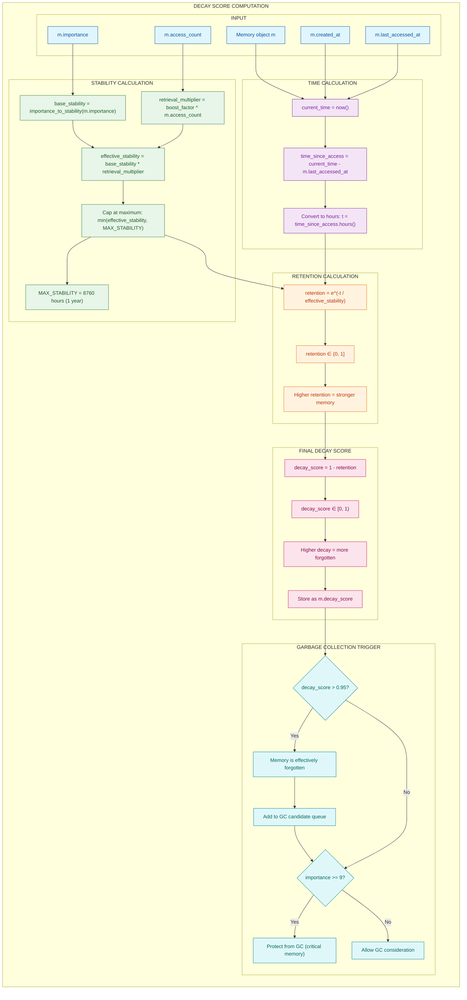
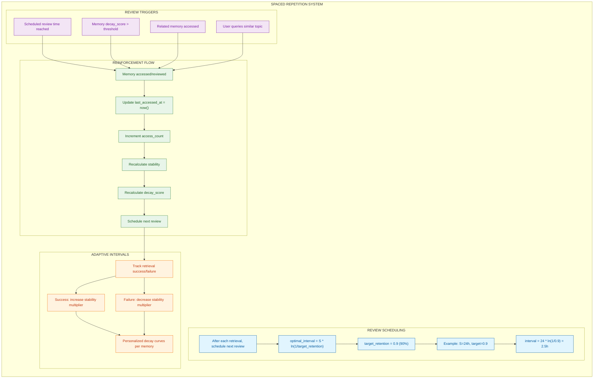
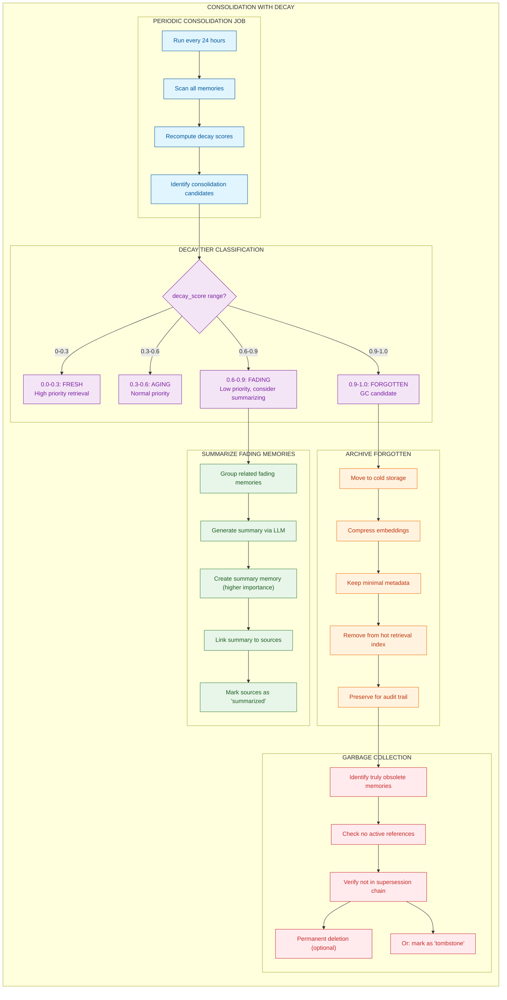
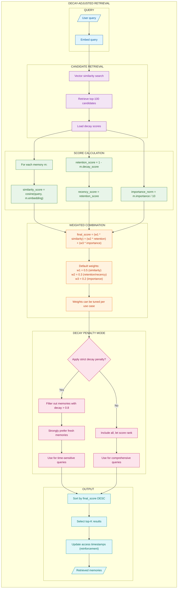
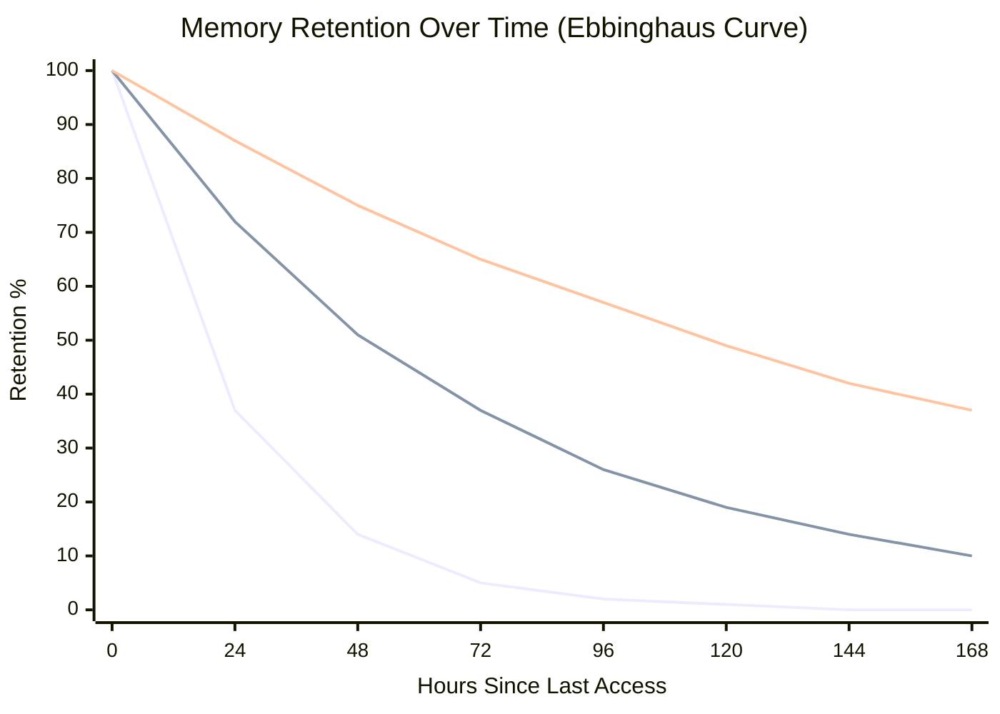
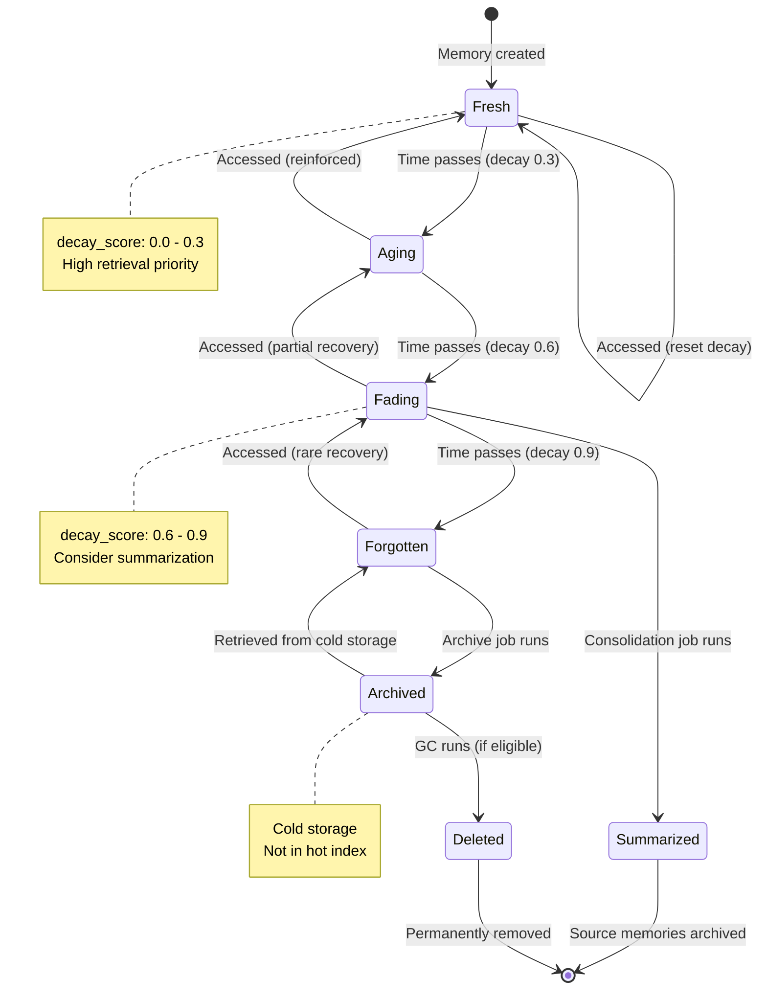

# Ebbinghaus Forgetting Curve Implementation

## Overview

The Ebbinghaus forgetting curve, discovered by Hermann Ebbinghaus in 1885, describes how memory retention decreases exponentially over time without reinforcement. This natural decay mechanism can be leveraged in AI memory systems to:

1. **Prioritize fresh memories** in retrieval
2. **Identify stale content** for garbage collection
3. **Implement spaced repetition** for important information
4. **Balance storage costs** with memory value

This document details how to implement forgetting curve mathematics, decay-aware retrieval, and memory lifecycle management.

### Key Concepts

| Term | Definition | Formula |
|------|------------|---------|
| Retention (R) | Probability of remembering | R(t) = e^(-t/S) |
| Stability (S) | Memory strength in hours | Base varies by importance |
| Decay Score | How "forgotten" a memory is | 1 - R |
| Reinforcement | Access that increases stability | S_new = S * boost_factor |

---

## Forgetting Curve Mathematics

The core formula models exponential decay of retention over time, modulated by memory stability.

```mermaid
flowchart TB
    subgraph ForgettingCurve["EBBINGHAUS FORGETTING CURVE"]
        direction TB

        subgraph Formula["CORE FORMULA"]
            F1["R(t) = e^(-t/S)"]
            F2["Where:<br/>R = Retention (0-1)<br/>t = Time elapsed since learning<br/>S = Stability (memory strength)"]
            F3["Higher S = slower decay"]
            F4["Each retrieval increases S"]
        end

        subgraph StabilityFactors["STABILITY FACTORS"]
            SF1["Base stability = f(importance)"]
            SF2["importance 1-3: S = 24 hours"]
            SF3["importance 4-6: S = 72 hours"]
            SF4["importance 7-8: S = 168 hours (1 week)"]
            SF5["importance 9-10: S = 720 hours (1 month)"]
        end

        subgraph RetrievalBoost["RETRIEVAL BOOST"]
            RB1["Each successful retrieval:"]
            RB2["S_new = S_old * boost_factor"]
            RB3["boost_factor = 1.5 (typical)"]
            RB4["Example: S=24h → 36h → 54h → 81h"]
            RB5["Memories strengthen with use"]
        end

        subgraph DecayCurve["DECAY VISUALIZATION"]
            DC1["t=0: R=1.0 (100% retention)"]
            DC2["t=S: R=0.37 (37% retention)"]
            DC3["t=2S: R=0.14 (14% retention)"]
            DC4["t=3S: R=0.05 (5% retention)"]
            DC5["t=5S: R≈0 (effectively forgotten)"]
        end
    end

    F1 --> F2 --> F3 --> F4
    SF1 --> SF2 --> SF3 --> SF4 --> SF5
    RB1 --> RB2 --> RB3 --> RB4 --> RB5

    classDef formula fill:#e1f5fe,stroke:#01579b,color:#01579b
    classDef stability fill:#f3e5f5,stroke:#7b1fa2,color:#7b1fa2
    classDef boost fill:#e8f5e9,stroke:#2e7d32,color:#1b5e20
    classDef decay fill:#fff3e0,stroke:#ef6c00,color:#bf360c

    class F1,F2,F3,F4 formula
    class SF1,SF2,SF3,SF4,SF5 stability
    class RB1,RB2,RB3,RB4,RB5 boost
    class DC1,DC2,DC3,DC4,DC5 decay
```



### Mathematical Details

**Core Retention Formula:**
```
R(t) = e^(-t/S)

Where:
- R(t) = retention probability at time t (0 to 1)
- t = time elapsed since last access (in hours)
- S = stability constant (in hours)
- e = Euler's number (~2.718)
```

**Stability by Importance:**
| Importance | Base Stability | Half-Life | Description |
|------------|---------------|-----------|-------------|
| 1-3 | 24 hours | ~16.6 hours | Mundane facts |
| 4-6 | 72 hours | ~50 hours | Useful information |
| 7-8 | 168 hours | ~116 hours | Important knowledge |
| 9-10 | 720 hours | ~499 hours | Critical/permanent |

**Reinforcement Formula:**
```
S_after = S_before * boost_factor^successful_retrievals
```

---

## Decay Score Computation Pipeline

This pipeline calculates how "forgotten" each memory is, enabling decay-aware retrieval and garbage collection decisions.



### Decay Score Interpretation

| Decay Score | Status | Retrieval Priority | Action |
|-------------|--------|-------------------|--------|
| 0.0 - 0.3 | Fresh | High | Include in context |
| 0.3 - 0.6 | Aging | Normal | Standard retrieval |
| 0.6 - 0.9 | Fading | Low | Consider summarization |
| 0.9 - 1.0 | Forgotten | Minimal | GC candidate |

---

## Spaced Repetition Integration

Spaced repetition optimizes memory reinforcement by scheduling reviews at optimal intervals.



### Optimal Review Interval Formula

```
interval = S * ln(1 / target_retention)

For target_retention = 0.9 (90%):
interval ≈ S * 0.105

Examples:
- S = 24h  → review in 2.5 hours
- S = 72h  → review in 7.6 hours
- S = 168h → review in 17.7 hours
```

---

## Memory Consolidation with Decay

Periodic consolidation jobs use decay scores to manage the memory lifecycle.



### Memory Lifecycle States

| State | Decay Range | Storage | Retrieval | Action |
|-------|-------------|---------|-----------|--------|
| Fresh | 0.0 - 0.3 | Hot | High priority | None |
| Aging | 0.3 - 0.6 | Hot | Normal | None |
| Fading | 0.6 - 0.9 | Hot | Low priority | Summarize |
| Forgotten | 0.9+ | Cold | Excluded | Archive/GC |

---

## Decay-Adjusted Retrieval Scoring

Integrate decay scores into the retrieval ranking to naturally prioritize fresh memories.



---

## Decay Curve Visualization

Visual representation of how different importance levels affect retention over time.



### Retention Values by Time and Importance

| Hours | Importance 3 (S=24h) | Importance 6 (S=72h) | Importance 9 (S=168h) |
|-------|---------------------|---------------------|----------------------|
| 0 | 100% | 100% | 100% |
| 24 | 37% | 72% | 87% |
| 48 | 14% | 51% | 75% |
| 72 | 5% | 37% | 65% |
| 168 | ~0% | 10% | 37% |

---

## Decay Score State Transitions

State machine showing how memories transition through decay states.



---

## How to Incorporate This into MycelicMemory

### Current State Analysis

MycelicMemory needs additional fields and services to implement forgetting curves:

| Feature | Current State | Gap |
|---------|--------------|-----|
| Access tracking | `updated_at` field | Need `last_accessed_at`, `access_count` |
| Importance | `importance` field (1-10) | Ready for stability mapping |
| Decay calculation | Not implemented | Need decay computation service |
| GC mechanism | None | Need periodic cleanup job |

### Recommended Implementation Steps

#### Step 1: Schema Updates

Add fields for decay tracking:

```sql
-- Add decay-related fields to memories
ALTER TABLE memories ADD COLUMN last_accessed_at DATETIME DEFAULT CURRENT_TIMESTAMP;
ALTER TABLE memories ADD COLUMN access_count INTEGER DEFAULT 0;
ALTER TABLE memories ADD COLUMN decay_score REAL DEFAULT 0.0;
ALTER TABLE memories ADD COLUMN stability_hours REAL;
ALTER TABLE memories ADD COLUMN next_review_at DATETIME;
ALTER TABLE memories ADD COLUMN is_archived BOOLEAN DEFAULT 0;

-- Index for decay-based queries
CREATE INDEX IF NOT EXISTS idx_memories_decay_score ON memories(decay_score);
CREATE INDEX IF NOT EXISTS idx_memories_last_accessed ON memories(last_accessed_at);
CREATE INDEX IF NOT EXISTS idx_memories_next_review ON memories(next_review_at);
CREATE INDEX IF NOT EXISTS idx_memories_archived ON memories(is_archived);

-- Archived memories table (cold storage)
CREATE TABLE IF NOT EXISTS archived_memories (
    id TEXT PRIMARY KEY,
    original_id TEXT NOT NULL,
    content TEXT NOT NULL,
    metadata TEXT, -- JSON: importance, tags, source, etc.
    archived_at DATETIME NOT NULL DEFAULT CURRENT_TIMESTAMP,
    reason TEXT, -- 'decay', 'superseded', 'merged', 'manual'
    FOREIGN KEY (original_id) REFERENCES memories(id) ON DELETE SET NULL
);

CREATE INDEX IF NOT EXISTS idx_archived_original ON archived_memories(original_id);
```

#### Step 2: Decay Calculator Service

```go
// internal/services/decay_calculator.go
package services

import (
    "context"
    "math"
    "time"
)

// DecayConfig holds decay calculation parameters
type DecayConfig struct {
    // Base stability by importance tier
    StabilityTiers map[int]float64 `yaml:"stability_tiers"` // importance -> hours
    BoostFactor    float64         `yaml:"boost_factor"`    // Default: 1.5
    MaxStability   float64         `yaml:"max_stability"`   // Default: 8760 (1 year)

    // Garbage collection thresholds
    FadingThreshold    float64 `yaml:"fading_threshold"`    // Default: 0.6
    ForgottenThreshold float64 `yaml:"forgotten_threshold"` // Default: 0.9
    GCThreshold        float64 `yaml:"gc_threshold"`        // Default: 0.95

    // Protected importance level
    ProtectedImportance int `yaml:"protected_importance"` // Default: 9
}

// DefaultDecayConfig returns sensible defaults
func DefaultDecayConfig() DecayConfig {
    return DecayConfig{
        StabilityTiers: map[int]float64{
            1: 24, 2: 24, 3: 24,      // Low importance: 1 day
            4: 72, 5: 72, 6: 72,      // Medium: 3 days
            7: 168, 8: 168,           // High: 1 week
            9: 720, 10: 720,          // Critical: 1 month
        },
        BoostFactor:         1.5,
        MaxStability:        8760, // 1 year
        FadingThreshold:     0.6,
        ForgottenThreshold:  0.9,
        GCThreshold:         0.95,
        ProtectedImportance: 9,
    }
}

// DecayCalculator computes memory decay scores
type DecayCalculator struct {
    config DecayConfig
}

// NewDecayCalculator creates a new decay calculator
func NewDecayCalculator(config DecayConfig) *DecayCalculator {
    return &DecayCalculator{config: config}
}

// CalculateDecay computes the decay score for a memory
func (c *DecayCalculator) CalculateDecay(memory *Memory, now time.Time) DecayResult {
    // Calculate time since last access
    lastAccess := memory.LastAccessedAt
    if lastAccess.IsZero() {
        lastAccess = memory.CreatedAt
    }
    hoursSinceAccess := now.Sub(lastAccess).Hours()

    // Calculate effective stability
    baseStability := c.getBaseStability(memory.Importance)
    boostMultiplier := math.Pow(c.config.BoostFactor, float64(memory.AccessCount))
    effectiveStability := math.Min(baseStability*boostMultiplier, c.config.MaxStability)

    // Calculate retention using Ebbinghaus formula
    retention := math.Exp(-hoursSinceAccess / effectiveStability)
    decayScore := 1 - retention

    // Determine tier
    tier := c.classifyTier(decayScore)

    return DecayResult{
        MemoryID:           memory.ID,
        DecayScore:         decayScore,
        Retention:          retention,
        EffectiveStability: effectiveStability,
        HoursSinceAccess:   hoursSinceAccess,
        Tier:               tier,
        IsProtected:        memory.Importance >= c.config.ProtectedImportance,
    }
}

// getBaseStability returns base stability hours for importance level
func (c *DecayCalculator) getBaseStability(importance int) float64 {
    if stability, ok := c.config.StabilityTiers[importance]; ok {
        return stability
    }
    return 72 // Default to medium
}

// classifyTier determines the decay tier
func (c *DecayCalculator) classifyTier(decayScore float64) DecayTier {
    switch {
    case decayScore < 0.3:
        return TierFresh
    case decayScore < c.config.FadingThreshold:
        return TierAging
    case decayScore < c.config.ForgottenThreshold:
        return TierFading
    default:
        return TierForgotten
    }
}

// CalculateNextReview computes optimal next review time
func (c *DecayCalculator) CalculateNextReview(memory *Memory, targetRetention float64) time.Time {
    baseStability := c.getBaseStability(memory.Importance)
    boostMultiplier := math.Pow(c.config.BoostFactor, float64(memory.AccessCount))
    effectiveStability := math.Min(baseStability*boostMultiplier, c.config.MaxStability)

    // interval = S * ln(1/target_retention)
    intervalHours := effectiveStability * math.Log(1/targetRetention)

    return time.Now().Add(time.Duration(intervalHours) * time.Hour)
}

// DecayTier represents memory freshness state
type DecayTier string

const (
    TierFresh     DecayTier = "fresh"
    TierAging     DecayTier = "aging"
    TierFading    DecayTier = "fading"
    TierForgotten DecayTier = "forgotten"
)

// DecayResult holds decay calculation output
type DecayResult struct {
    MemoryID           string
    DecayScore         float64
    Retention          float64
    EffectiveStability float64
    HoursSinceAccess   float64
    Tier               DecayTier
    IsProtected        bool
}
```

#### Step 3: Decay-Aware Retriever

```go
// internal/services/decay_retriever.go
package services

import (
    "context"
    "sort"
    "time"
)

// DecayRetrieverConfig holds retrieval configuration
type DecayRetrieverConfig struct {
    SimilarityWeight float64 `yaml:"similarity_weight"` // Default: 0.5
    RetentionWeight  float64 `yaml:"retention_weight"`  // Default: 0.3
    ImportanceWeight float64 `yaml:"importance_weight"` // Default: 0.2

    StrictDecayMode  bool    `yaml:"strict_decay_mode"`   // Filter high-decay memories
    MaxDecayAllowed  float64 `yaml:"max_decay_allowed"`   // Default: 0.8

    TopK             int     `yaml:"top_k"`               // Default: 10
    CandidateLimit   int     `yaml:"candidate_limit"`     // Default: 100
}

// DecayRetriever implements decay-aware memory retrieval
type DecayRetriever struct {
    repo       MemoryRepository
    embedder   EmbeddingService
    calculator *DecayCalculator
    config     DecayRetrieverConfig
}

// NewDecayRetriever creates a new decay-aware retriever
func NewDecayRetriever(
    repo MemoryRepository,
    embedder EmbeddingService,
    calculator *DecayCalculator,
    config DecayRetrieverConfig,
) *DecayRetriever {
    return &DecayRetriever{
        repo:       repo,
        embedder:   embedder,
        calculator: calculator,
        config:     config,
    }
}

// Retrieve performs decay-aware memory retrieval
func (r *DecayRetriever) Retrieve(ctx context.Context, query string, sessionID string) ([]ScoredMemory, error) {
    // Generate query embedding
    queryEmbed, err := r.embedder.Embed(ctx, query)
    if err != nil {
        return nil, err
    }

    // Get candidate memories (excluding archived)
    candidates, err := r.repo.SearchByVector(ctx, queryEmbed, r.config.CandidateLimit, sessionID)
    if err != nil {
        return nil, err
    }

    now := time.Now()
    scored := make([]ScoredMemory, 0, len(candidates))

    for _, mem := range candidates {
        // Calculate decay
        decay := r.calculator.CalculateDecay(&mem, now)

        // Apply strict decay filter if enabled
        if r.config.StrictDecayMode && decay.DecayScore > r.config.MaxDecayAllowed {
            continue
        }

        // Calculate weighted score
        similarityScore := mem.Similarity
        retentionScore := decay.Retention
        importanceScore := float64(mem.Importance) / 10.0

        finalScore := (r.config.SimilarityWeight * similarityScore) +
                      (r.config.RetentionWeight * retentionScore) +
                      (r.config.ImportanceWeight * importanceScore)

        scored = append(scored, ScoredMemory{
            Memory:          mem,
            SimilarityScore: similarityScore,
            RetentionScore:  retentionScore,
            ImportanceScore: importanceScore,
            DecayScore:      decay.DecayScore,
            FinalScore:      finalScore,
            DecayTier:       decay.Tier,
        })
    }

    // Sort by final score descending
    sort.Slice(scored, func(i, j int) bool {
        return scored[i].FinalScore > scored[j].FinalScore
    })

    // Return top-K
    if len(scored) > r.config.TopK {
        scored = scored[:r.config.TopK]
    }

    // Update access timestamps (reinforcement)
    for _, sm := range scored {
        r.reinforceMemory(ctx, sm.Memory.ID, now)
    }

    return scored, nil
}

// reinforceMemory updates access tracking for retrieved memory
func (r *DecayRetriever) reinforceMemory(ctx context.Context, memoryID string, accessTime time.Time) {
    r.repo.UpdateAccess(ctx, memoryID, accessTime)
}

// ScoredMemory extends Memory with scoring details
type ScoredMemory struct {
    Memory          Memory
    SimilarityScore float64
    RetentionScore  float64
    ImportanceScore float64
    DecayScore      float64
    FinalScore      float64
    DecayTier       DecayTier
}
```

#### Step 4: Memory Lifecycle Manager

```go
// internal/services/lifecycle_manager.go
package services

import (
    "context"
    "fmt"
    "strings"
    "time"
)

// LifecycleConfig holds lifecycle management settings
type LifecycleConfig struct {
    ScanIntervalHours    int     `yaml:"scan_interval_hours"`    // Default: 24
    SummarizeBatchSize   int     `yaml:"summarize_batch_size"`   // Default: 10
    ArchiveAfterDays     int     `yaml:"archive_after_days"`     // Default: 30
    DeleteAfterDays      int     `yaml:"delete_after_days"`      // Default: 90
    MinMemoriesForSummary int    `yaml:"min_memories_for_summary"` // Default: 3
}

// LifecycleManager handles memory aging and cleanup
type LifecycleManager struct {
    repo       MemoryRepository
    calculator *DecayCalculator
    llm        *OllamaClient
    config     LifecycleConfig
}

// LifecycleResult holds the outcome of a lifecycle run
type LifecycleResult struct {
    MemoriesScanned     int
    MemoriesSummarized  int
    MemoriesArchived    int
    MemoriesDeleted     int
    SummariesCreated    int
    Errors              []error
}

// RunLifecycleScan performs periodic memory maintenance
func (m *LifecycleManager) RunLifecycleScan(ctx context.Context) (*LifecycleResult, error) {
    result := &LifecycleResult{}
    now := time.Now()

    // Get all non-archived memories
    memories, err := m.repo.GetAllActive(ctx)
    if err != nil {
        return nil, err
    }
    result.MemoriesScanned = len(memories)

    // Classify by decay tier
    tiers := make(map[DecayTier][]*Memory)
    for _, mem := range memories {
        decay := m.calculator.CalculateDecay(mem, now)

        // Update stored decay score
        mem.DecayScore = decay.DecayScore
        m.repo.UpdateDecayScore(ctx, mem.ID, decay.DecayScore)

        tiers[decay.Tier] = append(tiers[decay.Tier], mem)
    }

    // Process fading memories - consider summarization
    if fading := tiers[TierFading]; len(fading) >= m.config.MinMemoriesForSummary {
        summaries, errs := m.summarizeFadingMemories(ctx, fading)
        result.SummariesCreated = summaries
        result.MemoriesSummarized = len(fading)
        result.Errors = append(result.Errors, errs...)
    }

    // Process forgotten memories - archive
    if forgotten := tiers[TierForgotten]; len(forgotten) > 0 {
        archived, errs := m.archiveMemories(ctx, forgotten)
        result.MemoriesArchived = archived
        result.Errors = append(result.Errors, errs...)
    }

    return result, nil
}

// summarizeFadingMemories groups and summarizes related fading memories
func (m *LifecycleManager) summarizeFadingMemories(ctx context.Context, memories []*Memory) (int, []error) {
    var errors []error
    summariesCreated := 0

    // Group by domain/session for related summaries
    groups := m.groupRelatedMemories(memories)

    for _, group := range groups {
        if len(group) < m.config.MinMemoriesForSummary {
            continue
        }

        // Generate summary via LLM
        summary, err := m.generateSummary(ctx, group)
        if err != nil {
            errors = append(errors, err)
            continue
        }

        // Create summary memory with higher importance
        summaryMem := &Memory{
            ID:         generateUUID(),
            Content:    summary,
            Source:     "summary",
            Importance: 8, // Summaries are important
            Tags:       []string{"summary", "consolidated"},
            CreatedAt:  time.Now(),
        }

        if err := m.repo.Store(ctx, summaryMem); err != nil {
            errors = append(errors, err)
            continue
        }

        // Link summary to source memories
        for _, mem := range group {
            m.repo.CreateRelationship(ctx, &MemoryRelationship{
                ID:               generateUUID(),
                SourceMemoryID:   summaryMem.ID,
                TargetMemoryID:   mem.ID,
                RelationshipType: "summarizes",
                Strength:         1.0,
                CreatedAt:        time.Now(),
            })

            // Mark source as summarized
            mem.Tags = append(mem.Tags, "summarized")
            m.repo.Update(ctx, mem)
        }

        summariesCreated++
    }

    return summariesCreated, errors
}

// generateSummary uses LLM to create a summary of related memories
func (m *LifecycleManager) generateSummary(ctx context.Context, memories []*Memory) (string, error) {
    var content strings.Builder
    for _, mem := range memories {
        fmt.Fprintf(&content, "- %s\n", mem.Content)
    }

    prompt := fmt.Sprintf(`Summarize these related facts into a single, comprehensive statement:

%s

Requirements:
- Preserve key information from all facts
- Combine related details coherently
- Write 2-3 sentences maximum
- Do not add speculation

Summary:`, content.String())

    return m.llm.Generate(ctx, "qwen2.5:3b", prompt)
}

// archiveMemories moves forgotten memories to cold storage
func (m *LifecycleManager) archiveMemories(ctx context.Context, memories []*Memory) (int, []error) {
    var errors []error
    archived := 0

    for _, mem := range memories {
        // Skip protected memories
        if mem.Importance >= m.config.ProtectedImportance {
            continue
        }

        // Skip if in active supersession chain
        if m.isInActiveChain(ctx, mem) {
            continue
        }

        // Archive
        if err := m.repo.ArchiveMemory(ctx, mem, "decay"); err != nil {
            errors = append(errors, err)
            continue
        }

        archived++
    }

    return archived, errors
}

// groupRelatedMemories clusters memories by domain and tags
func (m *LifecycleManager) groupRelatedMemories(memories []*Memory) [][]*Memory {
    groups := make(map[string][]*Memory)

    for _, mem := range memories {
        key := mem.Domain
        if key == "" {
            key = "default"
        }
        groups[key] = append(groups[key], mem)
    }

    result := make([][]*Memory, 0, len(groups))
    for _, group := range groups {
        result = append(result, group)
    }
    return result
}

// isInActiveChain checks if memory is part of an active supersession chain
func (m *LifecycleManager) isInActiveChain(ctx context.Context, mem *Memory) bool {
    if mem.SupersessionChainID == "" {
        return false
    }

    // Check if there's a more recent memory in the chain
    latest, err := m.repo.GetLatestInChain(ctx, mem.SupersessionChainID)
    if err != nil {
        return false
    }

    return latest.ID != mem.ID
}
```

### Configuration Options

```yaml
# config/decay.yaml
forgetting_curve:
  enabled: true

  stability:
    tiers:
      1: 24   # hours
      2: 24
      3: 24
      4: 72
      5: 72
      6: 72
      7: 168
      8: 168
      9: 720
      10: 720
    boost_factor: 1.5
    max_stability: 8760  # 1 year

  thresholds:
    fading: 0.6
    forgotten: 0.9
    gc_eligible: 0.95

  retrieval:
    similarity_weight: 0.5
    retention_weight: 0.3
    importance_weight: 0.2
    strict_decay_mode: false
    max_decay_allowed: 0.8

  lifecycle:
    scan_interval_hours: 24
    summarize_batch_size: 10
    archive_after_days: 30
    delete_after_days: 90
    min_memories_for_summary: 3
    protected_importance: 9

  spaced_repetition:
    enabled: true
    target_retention: 0.9
```

### Benefits of Integration

1. **Natural Prioritization**: Fresh memories naturally rank higher in retrieval
2. **Storage Efficiency**: Forgotten memories archived or deleted automatically
3. **Quality Context**: Retrieved context contains relevant, well-retained information
4. **Memory Strengthening**: Frequently accessed memories become more stable
5. **Intelligent Summarization**: Fading memories consolidated into lasting summaries
6. **Configurable Decay**: Different domains can have different decay profiles

### Migration Path

1. **Phase 1**: Add `last_accessed_at`, `access_count`, `decay_score` columns
2. **Phase 2**: Implement decay calculator and integrate into retrieval
3. **Phase 3**: Add periodic decay score refresh job
4. **Phase 4**: Implement lifecycle manager with summarization
5. **Phase 5**: Enable archival and garbage collection

### MCP Tool Integration

```go
// Decay-aware MCP tools
func (s *MCPServer) registerDecayTools() {
    // Standard retrieval now uses decay scoring
    s.registerTool("memory_search", func(params map[string]any) (any, error) {
        query := params["query"].(string)

        results, err := s.decayRetriever.Retrieve(s.ctx, query, s.sessionID)
        if err != nil {
            return nil, err
        }

        // Include decay information in response
        memories := make([]map[string]any, len(results))
        for i, sm := range results {
            memories[i] = map[string]any{
                "id":          sm.Memory.ID,
                "content":     sm.Memory.Content,
                "decay_score": sm.DecayScore,
                "decay_tier":  sm.DecayTier,
                "final_score": sm.FinalScore,
            }
        }
        return memories, nil
    })

    // Tool to check memory freshness
    s.registerTool("memory_freshness", func(params map[string]any) (any, error) {
        memoryID := params["memory_id"].(string)

        mem, err := s.repo.GetByID(s.ctx, memoryID)
        if err != nil {
            return nil, err
        }

        decay := s.decayCalculator.CalculateDecay(mem, time.Now())

        return map[string]any{
            "memory_id":  memoryID,
            "decay_score": decay.DecayScore,
            "retention":   decay.Retention,
            "tier":        decay.Tier,
            "is_protected": decay.IsProtected,
            "hours_since_access": decay.HoursSinceAccess,
        }, nil
    })
}
```

---

## Summary

The Ebbinghaus Forgetting Curve implementation brings natural memory dynamics to MycelicMemory:

- **Exponential Decay**: Memories naturally fade based on importance and reinforcement
- **Stability Boosting**: Frequently accessed memories become more durable
- **Decay-Aware Retrieval**: Fresh, relevant memories prioritized in context
- **Lifecycle Management**: Automatic summarization, archival, and cleanup
- **Spaced Repetition**: Optimal review scheduling for important memories

The implementation leverages MycelicMemory's existing SQLite infrastructure while adding the temporal decay mechanics that make memory feel more human-like and manageable at scale.
