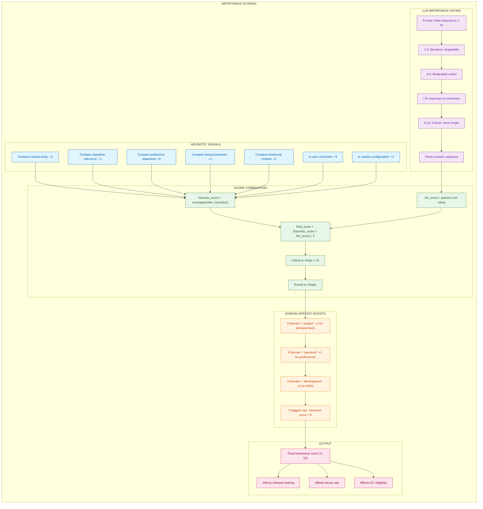
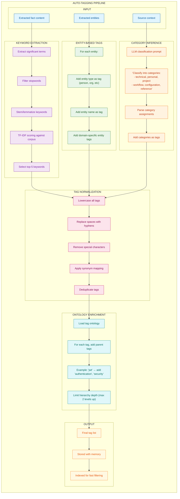
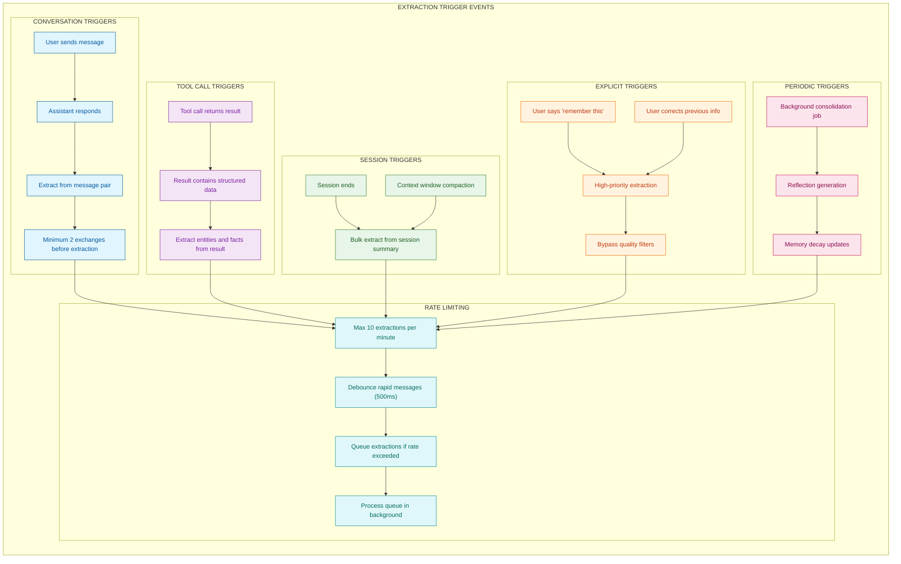
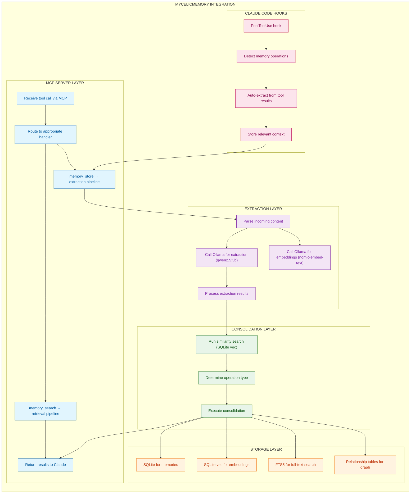

# Auto-Extraction Pipeline for MycelicMemory

## Overview

The Auto-Extraction Pipeline automatically identifies and extracts memorable information from conversations, tool outputs, and documents. This eliminates the need for users to explicitly store memories, creating a seamless experience where important information is captured naturally during interactions.

This document synthesizes patterns from Mem0, Zep, and Generative Agents research to create a comprehensive extraction system tailored to MycelicMemory's architecture.

### Key Features

| Feature | Purpose | Benefit |
|---------|---------|---------|
| Multi-Source Extraction | Handle conversations, tools, documents | Comprehensive capture |
| Quality Filtering | Filter trivial information | Clean, relevant storage |
| Entity Recognition | Extract people, places, concepts | Rich knowledge graph |
| Importance Scoring | Prioritize significant facts | Efficient retrieval |
| Auto-Tagging | Automatic categorization | Better organization |

### Design Principles

1. **Non-Intrusive**: Extraction happens in the background without interrupting conversation flow
2. **Quality Over Quantity**: Only meaningful, persistent information is stored
3. **Context-Aware**: Uses conversation history to understand what matters
4. **Configurable**: Adjustable sensitivity for different use cases

---

## Complete Auto-Extraction Flow

The main pipeline processes inputs from various sources through classification, context assembly, LLM extraction, quality filtering, and storage.

```mermaid
flowchart TB
    subgraph AutoExtraction["AUTO-EXTRACTION PIPELINE"]
        direction TB

        subgraph Input["INPUT SOURCES"]
            I1[/"Conversation message"/]
            I2[/"Tool call result"/]
            I3[/"Document content"/]
            I4[/"User correction"/]
            I5[/"System event"/]
        end

        subgraph SourceClassification["SOURCE CLASSIFICATION"]
            SC1{Input type?}
            SC2["Conversation Handler"]
            SC3["Tool Result Handler"]
            SC4["Document Handler"]
            SC5["Correction Handler"]
            SC6["Event Handler"]
        end

        subgraph ContextWindow["CONTEXT ASSEMBLY"]
            CW1["Load recent conversation (last 10 msgs)"]
            CW2["Load rolling summary if available"]
            CW3["Load relevant existing memories (top 5)"]
            CW4["Assemble extraction context"]
        end

        subgraph ExtractionPrompt["LLM EXTRACTION"]
            EP1["System: You are a memory extraction expert"]
            EP2["Extract facts that should be remembered"]
            EP3["Focus on: preferences, facts, events, relationships"]
            EP4["Ignore: small talk, transient info, redundant data"]
            EP5["Return JSON array of extracted facts"]
        end

        subgraph FactParsing["FACT PARSING"]
            FP1["Parse JSON response"]
            FP2["Validate fact structure"]
            FP3["Extract: content, entities, importance"]
            FP4["Generate embedding for each fact"]
            FP5["Assign metadata (source, timestamp, tags)"]
        end

        subgraph QualityFilter["QUALITY FILTERING"]
            QF1{Fact passes quality checks?}
            QF2["Check minimum content length (>10 chars)"]
            QF3["Check contains actionable/persistent info"]
            QF4["Check not duplicate of recent extract"]
            QF5["Accept fact for storage"]
            QF6["Discard low-quality fact"]
        end

        subgraph StoragePipeline["STORAGE PIPELINE"]
            SP1["Run consolidation pipeline"]
            SP2["Determine ADD/UPDATE/MERGE/NOOP"]
            SP3["Execute storage operation"]
            SP4["Update vector index"]
            SP5["Update knowledge graph"]
            SP6["Log to audit trail"]
        end

        subgraph FeedbackLoop["FEEDBACK & LEARNING"]
            FL1["Track extraction accuracy"]
            FL2["Monitor retrieval success rate"]
            FL3["Adjust extraction prompts"]
            FL4["Tune quality thresholds"]
        end
    end

    I1 --> SC1
    I2 --> SC1
    I3 --> SC1
    I4 --> SC1
    I5 --> SC1

    SC1 -->|Conversation| SC2
    SC1 -->|Tool| SC3
    SC1 -->|Document| SC4
    SC1 -->|Correction| SC5
    SC1 -->|Event| SC6

    SC2 --> CW1
    SC3 --> CW1
    SC4 --> CW1
    SC5 --> CW1
    SC6 --> CW1

    CW1 --> CW2 --> CW3 --> CW4

    CW4 --> EP1 --> EP2 --> EP3 --> EP4 --> EP5

    EP5 --> FP1 --> FP2 --> FP3 --> FP4 --> FP5

    FP5 --> QF1
    QF1 --> QF2 --> QF3 --> QF4
    QF4 -->|Pass| QF5 --> SP1
    QF4 -->|Fail| QF6

    SP1 --> SP2 --> SP3 --> SP4 --> SP5 --> SP6

    SP6 --> FL1 --> FL2 --> FL3 --> FL4

    classDef input fill:#e1f5fe,stroke:#01579b,color:#01579b
    classDef classify fill:#f3e5f5,stroke:#7b1fa2,color:#7b1fa2
    classDef context fill:#e8f5e9,stroke:#2e7d32,color:#1b5e20
    classDef extract fill:#fff3e0,stroke:#ef6c00,color:#bf360c
    classDef parse fill:#fce4ec,stroke:#c2185b,color:#880e4f
    classDef quality fill:#e0f7fa,stroke:#00838f,color:#00695c
    classDef storage fill:#fff8e1,stroke:#f57f17,color:#e65100
    classDef feedback fill:#f1f8e9,stroke:#558b2f,color:#33691e

    class I1,I2,I3,I4,I5 input
    class SC1,SC2,SC3,SC4,SC5,SC6 classify
    class CW1,CW2,CW3,CW4 context
    class EP1,EP2,EP3,EP4,EP5 extract
    class FP1,FP2,FP3,FP4,FP5 parse
    class QF1,QF2,QF3,QF4,QF5,QF6 quality
    class SP1,SP2,SP3,SP4,SP5,SP6 storage
    class FL1,FL2,FL3,FL4 feedback
```



### Extraction Prompt Template

```
You are a memory extraction expert. Analyze the following content and extract facts worth remembering long-term.

CONTEXT:
Recent conversation:
{conversation_history}

Existing relevant memories:
{relevant_memories}

NEW CONTENT TO ANALYZE:
{new_content}

EXTRACTION RULES:
1. Extract facts that are:
   - User preferences (likes, dislikes, habits)
   - Biographical facts (name, role, location, relationships)
   - Project information (goals, decisions, technical choices)
   - Learned knowledge (SOPs, workflows, patterns)
   - Important events (meetings, deadlines, milestones)

2. DO NOT extract:
   - Small talk or greetings
   - Transient information (current weather, time)
   - Information already in existing memories
   - Vague or incomplete statements
   - Speculative or uncertain information

3. For each fact, provide:
   - content: The fact in clear, standalone form
   - importance: 1-10 rating
   - entities: List of named entities mentioned
   - tags: Relevant categorization tags

Respond in JSON format:
{
  "facts": [
    {
      "content": "...",
      "importance": 7,
      "entities": ["Alice", "ProjectX"],
      "tags": ["project", "decision"]
    }
  ]
}
```

---

## Entity Extraction Detail

Named Entity Recognition (NER) identifies people, organizations, concepts, and other structured elements to build a rich knowledge graph.

```mermaid
flowchart TB
    subgraph EntityExtraction["ENTITY EXTRACTION (OpenIE Style)"]
        direction TB

        subgraph Input["INPUT"]
            I1[/"Raw text content"/]
            I2["Extraction context"]
        end

        subgraph NERExtraction["NAMED ENTITY RECOGNITION"]
            NER1["LLM prompt for entity extraction"]
            NER2["'Extract all named entities:<br/>- People (names, roles)<br/>- Organizations (companies, teams)<br/>- Locations (cities, offices)<br/>- Concepts (technologies, methods)<br/>- Events (meetings, deadlines)<br/>- Values (preferences, opinions)'"]
            NER3["Parse entity list with types"]
        end

        subgraph EntityNormalization["ENTITY NORMALIZATION"]
            EN1["For each extracted entity:"]
            EN2["Normalize casing (title case for names)"]
            EN3["Resolve aliases/abbreviations"]
            EN4["Map to existing entities if similar"]
            EN5["Generate entity embedding"]
        end

        subgraph EntityDedup["ENTITY DEDUPLICATION"]
            ED1["Search for similar existing entities"]
            ED2["cosine(new_embedding, existing_embedding) > 0.9"]
            ED3{Match found?}
            ED4["Merge with existing entity"]
            ED5["Create new entity node"]
        end

        subgraph RelationshipInference["RELATIONSHIP INFERENCE"]
            RI1["LLM prompt for relationships"]
            RI2["'Given entities [A, B, C...] in context:<br/>{text}<br/>What relationships exist?'"]
            RI3["Extract subject-predicate-object triplets"]
            RI4["Score relationship confidence"]
            RI5{Confidence > 0.7?}
            RI6["Create relationship edge"]
            RI7["Discard uncertain relationship"]
        end

        subgraph Output["OUTPUT"]
            O1["List of entity nodes"]
            O2["List of relationship edges"]
            O3["Entity embeddings"]
        end
    end

    I1 --> NER1
    I2 --> NER1
    NER1 --> NER2 --> NER3

    NER3 --> EN1 --> EN2 --> EN3 --> EN4 --> EN5

    EN5 --> ED1 --> ED2 --> ED3
    ED3 -->|Yes| ED4
    ED3 -->|No| ED5

    ED4 --> RI1
    ED5 --> RI1

    RI1 --> RI2 --> RI3 --> RI4 --> RI5
    RI5 -->|Yes| RI6
    RI5 -->|No| RI7

    RI6 --> O1
    RI6 --> O2
    ED5 --> O3

    classDef input fill:#e1f5fe,stroke:#01579b,color:#01579b
    classDef ner fill:#f3e5f5,stroke:#7b1fa2,color:#7b1fa2
    classDef normalize fill:#e8f5e9,stroke:#2e7d32,color:#1b5e20
    classDef dedup fill:#fff3e0,stroke:#ef6c00,color:#bf360c
    classDef relation fill:#fce4ec,stroke:#c2185b,color:#880e4f
    classDef output fill:#e0f7fa,stroke:#00838f,color:#00695c

    class I1,I2 input
    class NER1,NER2,NER3 ner
    class EN1,EN2,EN3,EN4,EN5 normalize
    class ED1,ED2,ED3,ED4,ED5 dedup
    class RI1,RI2,RI3,RI4,RI5,RI6,RI7 relation
    class O1,O2,O3 output
```



### Entity Types and Examples

| Type | Examples | Extraction Pattern |
|------|----------|-------------------|
| Person | "Alice", "Dr. Smith" | Names, titles, roles |
| Organization | "Anthropic", "Engineering Team" | Company names, team names |
| Location | "San Francisco", "Office A" | Cities, buildings, regions |
| Concept | "JWT", "microservices" | Technologies, methodologies |
| Event | "Q3 Review", "Sprint 5" | Meetings, milestones |
| Value | "prefers dark mode" | Preferences, opinions |

---

## Importance Scoring Pipeline

Importance scoring determines how valuable a fact is for long-term retention, combining heuristic signals with LLM assessment.



### Importance Score Guidelines

| Score | Classification | Retention | Examples |
|-------|---------------|-----------|----------|
| 1-3 | Mundane | Short-term | "Made coffee", "Checked email" |
| 4-6 | Useful | Medium-term | "Had meeting with Alice", "Read report" |
| 7-8 | Important | Long-term | "User prefers dark mode", "Project deadline March 1" |
| 9-10 | Critical | Permanent | "SOP: Always run tests", "User allergic to peanuts" |

---

## Auto-Tagging Pipeline

Automatic tag assignment using keyword extraction, entity-based tags, and LLM categorization.



---

## Extraction Trigger Events

Different events trigger extraction with varying priorities and behaviors.



### Trigger Priority

| Trigger Type | Priority | Bypass Filters | Example |
|--------------|----------|----------------|---------|
| Explicit ("remember this") | Highest | Yes | "Please remember I'm vegetarian" |
| User Correction | High | Partially | "Actually, it's spelled 'Michaela'" |
| Session End | Medium | No | Context compaction before session close |
| Conversation | Normal | No | Regular message exchanges |
| Tool Result | Normal | No | File search returns relevant data |
| Periodic | Low | No | Background consolidation job |

---

## Integration with MycelicMemory Architecture

How the extraction pipeline integrates with existing MycelicMemory components.



---

## How to Incorporate This into MycelicMemory

### Current State Analysis

MycelicMemory has the foundational infrastructure for auto-extraction:

| Component | Current State | Gap |
|-----------|--------------|-----|
| MCP Server | Receives tool calls | Need extraction middleware |
| Ollama Integration | LLM/embedding calls | Ready for extraction prompts |
| SQLite Storage | memories, relationships | Need entities table |
| Vector Search | sqlite-vec | Ready for similarity checks |
| FTS5 | Full-text search | Ready for keyword matching |

### Recommended Implementation Steps

#### Step 1: Schema Updates

Add tables for entities and extraction tracking:

```sql
-- Entities table for knowledge graph
CREATE TABLE IF NOT EXISTS entities (
    id TEXT PRIMARY KEY,
    name TEXT NOT NULL,
    canonical_name TEXT NOT NULL,
    entity_type TEXT NOT NULL CHECK (
        entity_type IN ('person', 'organization', 'location', 'concept', 'event', 'value')
    ),
    embedding BLOB,
    first_seen_at DATETIME NOT NULL DEFAULT CURRENT_TIMESTAMP,
    last_seen_at DATETIME NOT NULL DEFAULT CURRENT_TIMESTAMP,
    mention_count INTEGER DEFAULT 1,
    metadata TEXT -- JSON for additional attributes
);

CREATE INDEX IF NOT EXISTS idx_entities_type ON entities(entity_type);
CREATE INDEX IF NOT EXISTS idx_entities_canonical ON entities(canonical_name);

-- Memory-entity junction table
CREATE TABLE IF NOT EXISTS memory_entities (
    memory_id TEXT NOT NULL,
    entity_id TEXT NOT NULL,
    mention_context TEXT, -- snippet showing how entity was mentioned
    created_at DATETIME NOT NULL DEFAULT CURRENT_TIMESTAMP,
    PRIMARY KEY (memory_id, entity_id),
    FOREIGN KEY (memory_id) REFERENCES memories(id) ON DELETE CASCADE,
    FOREIGN KEY (entity_id) REFERENCES entities(id) ON DELETE CASCADE
);

-- Entity relationships (knowledge graph edges)
CREATE TABLE IF NOT EXISTS entity_relationships (
    id TEXT PRIMARY KEY,
    source_entity_id TEXT NOT NULL,
    target_entity_id TEXT NOT NULL,
    relationship_type TEXT NOT NULL, -- "works_at", "knows", "created_by", etc.
    strength REAL DEFAULT 1.0,
    context TEXT, -- supporting evidence
    created_at DATETIME NOT NULL DEFAULT CURRENT_TIMESTAMP,
    FOREIGN KEY (source_entity_id) REFERENCES entities(id) ON DELETE CASCADE,
    FOREIGN KEY (target_entity_id) REFERENCES entities(id) ON DELETE CASCADE
);

CREATE INDEX IF NOT EXISTS idx_entity_rel_source ON entity_relationships(source_entity_id);
CREATE INDEX IF NOT EXISTS idx_entity_rel_target ON entity_relationships(target_entity_id);

-- Extraction log for debugging and analytics
CREATE TABLE IF NOT EXISTS extraction_log (
    id TEXT PRIMARY KEY,
    trigger_type TEXT NOT NULL, -- 'conversation', 'tool', 'explicit', etc.
    source_content TEXT,
    facts_extracted INTEGER DEFAULT 0,
    entities_extracted INTEGER DEFAULT 0,
    facts_accepted INTEGER DEFAULT 0,
    processing_time_ms INTEGER,
    created_at DATETIME NOT NULL DEFAULT CURRENT_TIMESTAMP,
    session_id TEXT
);

CREATE INDEX IF NOT EXISTS idx_extraction_log_trigger ON extraction_log(trigger_type);
```

#### Step 2: Extraction Service

```go
// internal/services/extractor.go
package services

import (
    "context"
    "encoding/json"
    "fmt"
    "strings"
    "time"
)

// ExtractionConfig holds extraction settings
type ExtractionConfig struct {
    MinContentLength     int     `yaml:"min_content_length"`      // Default: 10
    MaxFactsPerExtract   int     `yaml:"max_facts_per_extract"`   // Default: 5
    DuplicateThreshold   float64 `yaml:"duplicate_threshold"`     // Default: 0.9
    MinImportance        int     `yaml:"min_importance"`          // Default: 4
    EnableEntityExtract  bool    `yaml:"enable_entity_extraction"` // Default: true
    RateLimitPerMinute   int     `yaml:"rate_limit_per_minute"`   // Default: 10
}

// ExtractedFact represents a fact extracted from content
type ExtractedFact struct {
    Content    string   `json:"content"`
    Importance int      `json:"importance"`
    Entities   []string `json:"entities"`
    Tags       []string `json:"tags"`
}

// ExtractionResult holds the outcome of an extraction
type ExtractionResult struct {
    Facts            []ExtractedFact
    Entities         []*Entity
    FactsAccepted    int
    FactsRejected    int
    ProcessingTimeMs int64
}

// Extractor handles automatic memory extraction
type Extractor struct {
    llm          *OllamaClient
    embedder     EmbeddingService
    repo         MemoryRepository
    entityRepo   EntityRepository
    consolidator *Consolidator
    scorer       *ImportanceScorer
    tagger       *AutoTagger
    config       ExtractionConfig
}

// NewExtractor creates a new extractor
func NewExtractor(
    llm *OllamaClient,
    embedder EmbeddingService,
    repo MemoryRepository,
    entityRepo EntityRepository,
    consolidator *Consolidator,
    config ExtractionConfig,
) *Extractor {
    return &Extractor{
        llm:          llm,
        embedder:     embedder,
        repo:         repo,
        entityRepo:   entityRepo,
        consolidator: consolidator,
        scorer:       NewImportanceScorer(llm, "qwen2.5:3b"),
        tagger:       NewAutoTagger(llm),
        config:       config,
    }
}

// Extract processes content and extracts memorable facts
func (e *Extractor) Extract(ctx context.Context, content string, trigger TriggerType, sessionID string) (*ExtractionResult, error) {
    startTime := time.Now()
    result := &ExtractionResult{}

    // Build context for extraction
    context := e.buildExtractionContext(ctx, content, sessionID)

    // Call LLM for extraction
    facts, err := e.callExtractionLLM(ctx, context)
    if err != nil {
        return nil, fmt.Errorf("extraction LLM call failed: %w", err)
    }

    // Process each extracted fact
    for _, fact := range facts {
        // Quality filtering
        if !e.passesQualityCheck(fact) {
            result.FactsRejected++
            continue
        }

        // Score importance (combine LLM score with heuristics)
        finalImportance := e.scorer.CombineScores(fact.Importance, fact.Content)
        if finalImportance < e.config.MinImportance {
            result.FactsRejected++
            continue
        }
        fact.Importance = finalImportance

        // Auto-tag
        tags, _ := e.tagger.GenerateTags(ctx, fact.Content, fact.Entities)
        fact.Tags = mergeTags(fact.Tags, tags)

        // Generate embedding
        embedding, err := e.embedder.Embed(ctx, fact.Content)
        if err != nil {
            continue
        }

        // Check for duplicates
        if e.isDuplicate(ctx, embedding, sessionID) {
            result.FactsRejected++
            continue
        }

        // Create memory and run through consolidation
        memory := &Memory{
            Content:    fact.Content,
            Importance: fact.Importance,
            Tags:       fact.Tags,
            SessionID:  sessionID,
            Source:     string(trigger),
            Embedding:  embedding,
        }

        _, err = e.consolidator.Consolidate(ctx, memory)
        if err != nil {
            continue
        }

        result.Facts = append(result.Facts, fact)
        result.FactsAccepted++

        // Extract and link entities
        if e.config.EnableEntityExtract {
            entities := e.extractEntities(ctx, fact.Content, fact.Entities)
            for _, entity := range entities {
                e.entityRepo.LinkToMemory(ctx, entity.ID, memory.ID, fact.Content)
            }
            result.Entities = append(result.Entities, entities...)
        }
    }

    result.ProcessingTimeMs = time.Since(startTime).Milliseconds()

    // Log extraction
    e.logExtraction(ctx, trigger, content, result, sessionID)

    return result, nil
}

// buildExtractionContext assembles context for the extraction prompt
func (e *Extractor) buildExtractionContext(ctx context.Context, content string, sessionID string) string {
    var contextBuilder strings.Builder

    // Get recent conversation (last 10 messages would be passed separately)
    contextBuilder.WriteString("CONTENT TO ANALYZE:\n")
    contextBuilder.WriteString(content)
    contextBuilder.WriteString("\n\n")

    // Get relevant existing memories
    relevantMemories, _ := e.repo.SearchByText(ctx, content, 5, sessionID)
    if len(relevantMemories) > 0 {
        contextBuilder.WriteString("EXISTING RELEVANT MEMORIES:\n")
        for _, mem := range relevantMemories {
            contextBuilder.WriteString(fmt.Sprintf("- %s\n", mem.Content))
        }
    }

    return contextBuilder.String()
}

// callExtractionLLM calls the LLM to extract facts
func (e *Extractor) callExtractionLLM(ctx context.Context, extractionContext string) ([]ExtractedFact, error) {
    prompt := fmt.Sprintf(`You are a memory extraction expert. Extract facts worth remembering long-term.

%s

EXTRACTION RULES:
1. Extract: preferences, biographical facts, project info, learned knowledge, important events
2. Ignore: small talk, transient info, duplicates, vague statements
3. Return JSON: {"facts": [{"content": "...", "importance": 1-10, "entities": [], "tags": []}]}

Extract facts:`, extractionContext)

    response, err := e.llm.Generate(ctx, "qwen2.5:3b", prompt)
    if err != nil {
        return nil, err
    }

    // Parse JSON response
    var result struct {
        Facts []ExtractedFact `json:"facts"`
    }

    if err := json.Unmarshal([]byte(response), &result); err != nil {
        // Try to extract JSON from response if it's wrapped in other text
        return e.parsePartialJSON(response)
    }

    return result.Facts, nil
}

// passesQualityCheck validates a fact meets quality standards
func (e *Extractor) passesQualityCheck(fact ExtractedFact) bool {
    // Minimum length
    if len(fact.Content) < e.config.MinContentLength {
        return false
    }

    // Not just whitespace
    if len(strings.TrimSpace(fact.Content)) == 0 {
        return false
    }

    // Contains actionable/persistent info (basic heuristics)
    lowered := strings.ToLower(fact.Content)
    transientIndicators := []string{"right now", "currently", "at the moment", "just now"}
    for _, indicator := range transientIndicators {
        if strings.Contains(lowered, indicator) {
            return false
        }
    }

    return true
}

// isDuplicate checks if a similar fact already exists
func (e *Extractor) isDuplicate(ctx context.Context, embedding []float32, sessionID string) bool {
    similar, err := e.repo.SearchByVector(ctx, embedding, 1, sessionID)
    if err != nil || len(similar) == 0 {
        return false
    }

    return similar[0].Similarity > e.config.DuplicateThreshold
}

// extractEntities identifies and stores entities from content
func (e *Extractor) extractEntities(ctx context.Context, content string, hints []string) []*Entity {
    var entities []*Entity

    // Use hints from LLM extraction
    for _, hint := range hints {
        entity, err := e.entityRepo.FindOrCreate(ctx, hint, content)
        if err != nil {
            continue
        }
        entities = append(entities, entity)
    }

    return entities
}

// TriggerType identifies what triggered the extraction
type TriggerType string

const (
    TriggerConversation TriggerType = "conversation"
    TriggerTool         TriggerType = "tool"
    TriggerExplicit     TriggerType = "explicit"
    TriggerSession      TriggerType = "session"
    TriggerPeriodic     TriggerType = "periodic"
)
```

#### Step 3: Auto-Tagger Service

```go
// internal/services/auto_tagger.go
package services

import (
    "context"
    "encoding/json"
    "fmt"
    "strings"
)

// AutoTagger generates tags for memories
type AutoTagger struct {
    llm      *OllamaClient
    ontology *TagOntology
}

// NewAutoTagger creates a new auto tagger
func NewAutoTagger(llm *OllamaClient) *AutoTagger {
    return &AutoTagger{
        llm:      llm,
        ontology: LoadDefaultOntology(),
    }
}

// GenerateTags produces tags for the given content
func (t *AutoTagger) GenerateTags(ctx context.Context, content string, entities []string) ([]string, error) {
    tags := make([]string, 0)

    // Entity-based tags
    for _, entity := range entities {
        normalized := t.normalizeTag(entity)
        tags = append(tags, normalized)
    }

    // LLM-based category inference
    categories, err := t.inferCategories(ctx, content)
    if err == nil {
        tags = append(tags, categories...)
    }

    // Keyword extraction (simple TF-IDF-like)
    keywords := t.extractKeywords(content)
    tags = append(tags, keywords...)

    // Normalize all tags
    normalized := make([]string, 0, len(tags))
    for _, tag := range tags {
        norm := t.normalizeTag(tag)
        if norm != "" {
            normalized = append(normalized, norm)
        }
    }

    // Deduplicate
    seen := make(map[string]bool)
    unique := make([]string, 0)
    for _, tag := range normalized {
        if !seen[tag] {
            seen[tag] = true
            unique = append(unique, tag)
        }
    }

    // Ontology enrichment - add parent tags
    enriched := t.enrichWithOntology(unique)

    return enriched, nil
}

// inferCategories uses LLM to classify content
func (t *AutoTagger) inferCategories(ctx context.Context, content string) ([]string, error) {
    prompt := fmt.Sprintf(`Classify this content into categories. Choose from: technical, personal, project, workflow, reference, sop.

Content: %s

Return JSON: {"categories": ["category1", "category2"]}`, content)

    response, err := t.llm.Generate(ctx, "qwen2.5:3b", prompt)
    if err != nil {
        return nil, err
    }

    var result struct {
        Categories []string `json:"categories"`
    }
    if err := json.Unmarshal([]byte(response), &result); err != nil {
        return nil, err
    }

    return result.Categories, nil
}

// extractKeywords extracts significant terms from content
func (t *AutoTagger) extractKeywords(content string) []string {
    // Simple keyword extraction based on word frequency and stopwords
    words := strings.Fields(strings.ToLower(content))
    stopwords := map[string]bool{
        "the": true, "a": true, "an": true, "is": true, "are": true,
        "was": true, "were": true, "be": true, "been": true, "being": true,
        "have": true, "has": true, "had": true, "do": true, "does": true,
        "did": true, "will": true, "would": true, "could": true, "should": true,
        "may": true, "might": true, "must": true, "to": true, "of": true,
        "in": true, "for": true, "on": true, "with": true, "at": true,
        "by": true, "from": true, "as": true, "into": true, "through": true,
        "and": true, "or": true, "but": true, "if": true, "then": true,
        "that": true, "this": true, "it": true, "its": true, "i": true,
        "you": true, "we": true, "they": true, "he": true, "she": true,
    }

    wordCount := make(map[string]int)
    for _, word := range words {
        // Remove punctuation
        word = strings.Trim(word, ".,!?;:'\"()[]{}--")
        if len(word) > 3 && !stopwords[word] {
            wordCount[word]++
        }
    }

    // Return top keywords (frequency > 1 or long words)
    keywords := make([]string, 0)
    for word, count := range wordCount {
        if count > 1 || len(word) > 7 {
            keywords = append(keywords, word)
        }
    }

    // Limit to top 5
    if len(keywords) > 5 {
        keywords = keywords[:5]
    }

    return keywords
}

// normalizeTag standardizes tag format
func (t *AutoTagger) normalizeTag(tag string) string {
    // Lowercase
    tag = strings.ToLower(tag)
    // Replace spaces with hyphens
    tag = strings.ReplaceAll(tag, " ", "-")
    // Remove special characters (keep alphanumeric and hyphens)
    var builder strings.Builder
    for _, r := range tag {
        if (r >= 'a' && r <= 'z') || (r >= '0' && r <= '9') || r == '-' {
            builder.WriteRune(r)
        }
    }
    // Remove leading/trailing hyphens
    return strings.Trim(builder.String(), "-")
}

// enrichWithOntology adds parent tags from the ontology
func (t *AutoTagger) enrichWithOntology(tags []string) []string {
    enriched := make([]string, 0, len(tags)*2)
    seen := make(map[string]bool)

    for _, tag := range tags {
        if !seen[tag] {
            seen[tag] = true
            enriched = append(enriched, tag)
        }

        // Add parent tags (max 2 levels up)
        parents := t.ontology.GetParents(tag, 2)
        for _, parent := range parents {
            if !seen[parent] {
                seen[parent] = true
                enriched = append(enriched, parent)
            }
        }
    }

    return enriched
}
```

#### Step 4: MCP Integration

```go
// internal/mcp/extraction_middleware.go
package mcp

import (
    "context"
    "strings"
)

// ExtractionMiddleware handles automatic extraction for MCP calls
type ExtractionMiddleware struct {
    extractor *Extractor
    config    ExtractionMiddlewareConfig
}

// ExtractionMiddlewareConfig holds middleware settings
type ExtractionMiddlewareConfig struct {
    EnableConversationExtract bool     `yaml:"enable_conversation_extract"`
    EnableToolResultExtract   bool     `yaml:"enable_tool_result_extract"`
    ExplicitTriggerPhrases    []string `yaml:"explicit_trigger_phrases"`
    IgnoredTools              []string `yaml:"ignored_tools"`
}

// ProcessMessage handles message-based extraction
func (m *ExtractionMiddleware) ProcessMessage(ctx context.Context, message string, sessionID string) error {
    if !m.config.EnableConversationExtract {
        return nil
    }

    // Check for explicit trigger phrases
    trigger := TriggerConversation
    for _, phrase := range m.config.ExplicitTriggerPhrases {
        if strings.Contains(strings.ToLower(message), phrase) {
            trigger = TriggerExplicit
            break
        }
    }

    // Extract in background (non-blocking)
    go func() {
        m.extractor.Extract(context.Background(), message, trigger, sessionID)
    }()

    return nil
}

// ProcessToolResult handles tool result extraction
func (m *ExtractionMiddleware) ProcessToolResult(ctx context.Context, toolName string, result string, sessionID string) error {
    if !m.config.EnableToolResultExtract {
        return nil
    }

    // Skip ignored tools
    for _, ignored := range m.config.IgnoredTools {
        if toolName == ignored {
            return nil
        }
    }

    // Extract in background
    go func() {
        m.extractor.Extract(context.Background(), result, TriggerTool, sessionID)
    }()

    return nil
}

// Integrate with MCP server
func (s *MCPServer) setupExtractionMiddleware() {
    s.extractionMiddleware = &ExtractionMiddleware{
        extractor: s.extractor,
        config: ExtractionMiddlewareConfig{
            EnableConversationExtract: true,
            EnableToolResultExtract:   true,
            ExplicitTriggerPhrases:    []string{"remember this", "don't forget", "note that"},
            IgnoredTools:              []string{"memory_search", "memory_list"},
        },
    }

    // Register as post-processing hook
    s.registerPostProcessor(func(ctx context.Context, request, response interface{}) {
        // Extract from conversation
        if msg, ok := request.(string); ok {
            s.extractionMiddleware.ProcessMessage(ctx, msg, s.sessionID)
        }
    })
}
```

### Configuration Options

```yaml
# config/extraction.yaml
auto_extraction:
  enabled: true

  triggers:
    conversation: true
    tool_results: true
    session_end: true
    periodic: false

  quality:
    min_content_length: 10
    min_importance: 4
    duplicate_threshold: 0.9
    max_facts_per_extract: 5

  entities:
    enabled: true
    merge_threshold: 0.9
    track_relationships: true

  tagging:
    enabled: true
    use_ontology: true
    max_tags_per_memory: 10
    ontology_depth: 2

  rate_limiting:
    max_per_minute: 10
    debounce_ms: 500
    queue_size: 100

  explicit_triggers:
    - "remember this"
    - "don't forget"
    - "note that"
    - "save this"

  ignored_patterns:
    - "^(hi|hello|hey|thanks|thank you)$"
    - "^(ok|okay|sure|yes|no)$"
```

### Benefits of Integration

1. **Seamless Capture**: Important information saved without explicit user action
2. **Quality Filtering**: Only meaningful facts stored, reducing noise
3. **Rich Knowledge Graph**: Entities and relationships extracted automatically
4. **Context-Aware**: Uses conversation history for better extraction
5. **Configurable**: Adjustable sensitivity and triggers for different use cases
6. **Non-Blocking**: Extraction runs in background without slowing responses

### Migration Path

1. **Phase 1**: Add entities and extraction_log tables to schema
2. **Phase 2**: Implement basic fact extraction from conversations
3. **Phase 3**: Add entity extraction and linking
4. **Phase 4**: Integrate auto-tagging with ontology
5. **Phase 5**: Enable tool result extraction
6. **Phase 6**: Add explicit trigger phrase detection

---

## Summary

The Auto-Extraction Pipeline transforms MycelicMemory from a passive storage system into an active knowledge capture platform:

- **Multi-Source Extraction**: Handles conversations, tool outputs, and explicit requests
- **Intelligent Filtering**: Quality checks ensure only valuable information is stored
- **Entity Recognition**: Builds a rich knowledge graph from extracted content
- **Automatic Tagging**: Categorizes memories without user intervention
- **Background Processing**: Non-blocking extraction keeps conversations smooth

The implementation builds on MycelicMemory's existing Ollama integration and SQLite infrastructure while adding the intelligent extraction layer needed for truly automated memory management.
