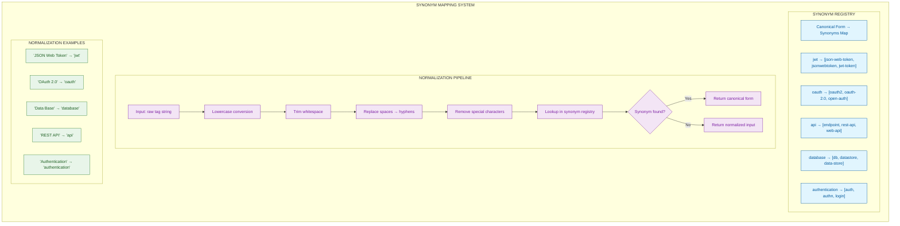
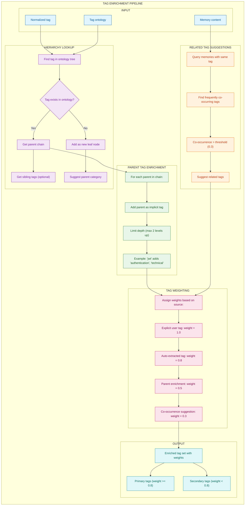
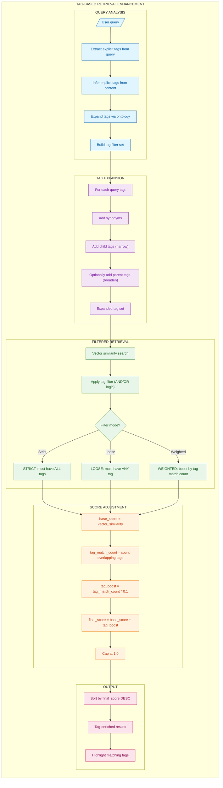
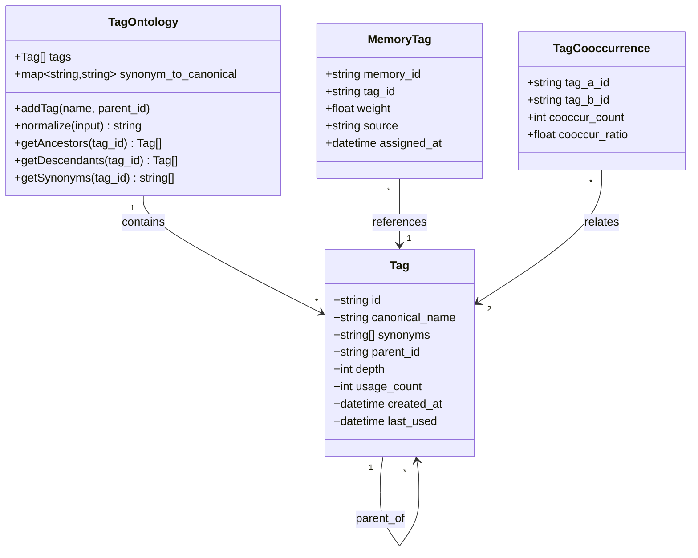
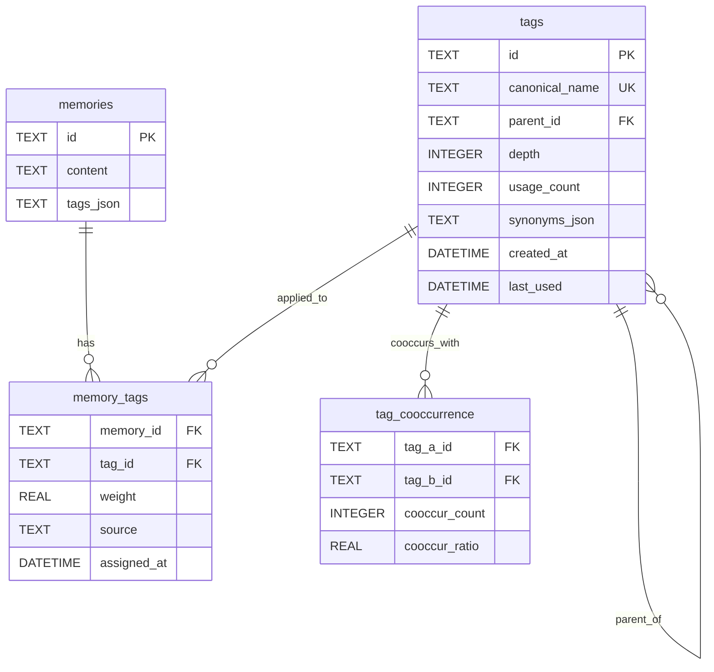

# Tag Ontology and Normalization System

## Overview

A hierarchical tag ontology system that enables consistent tagging, synonym resolution, and intelligent tag-based retrieval.

## Tag Ontology Structure

```mermaid
flowchart TB
    subgraph TagOntology["TAG ONTOLOGY HIERARCHY"]
        direction TB

        subgraph RootCategories["ROOT CATEGORIES"]
            RC1["TECHNICAL"]
            RC2["PERSONAL"]
            RC3["PROJECT"]
            RC4["WORKFLOW"]
            RC5["REFERENCE"]
        end

        subgraph TechnicalTree["TECHNICAL SUBTREE"]
            T1["authentication"]
            T1_1["jwt"]
            T1_2["oauth"]
            T1_3["session"]
            T1_4["cookie"]

            T2["database"]
            T2_1["sql"]
            T2_2["nosql"]
            T2_3["sqlite"]
            T2_4["postgresql"]

            T3["api"]
            T3_1["rest"]
            T3_2["graphql"]
            T3_3["mcp"]

            T4["architecture"]
            T4_1["microservices"]
            T4_2["monolith"]
            T4_3["serverless"]

            RC1 --> T1 --> T1_1
            T1 --> T1_2
            T1 --> T1_3
            T1 --> T1_4
            RC1 --> T2 --> T2_1
            T2 --> T2_2
            T2 --> T2_3
            T2 --> T2_4
            RC1 --> T3 --> T3_1
            T3 --> T3_2
            T3 --> T3_3
            RC1 --> T4 --> T4_1
            T4 --> T4_2
            T4 --> T4_3
        end

        subgraph PersonalTree["PERSONAL SUBTREE"]
            P1["preferences"]
            P1_1["ui-preference"]
            P1_2["workflow-preference"]
            P1_3["communication-style"]

            P2["facts"]
            P2_1["location"]
            P2_2["role"]
            P2_3["organization"]

            RC2 --> P1 --> P1_1
            P1 --> P1_2
            P1 --> P1_3
            RC2 --> P2 --> P2_1
            P2 --> P2_2
            P2 --> P2_3
        end

        subgraph WorkflowTree["WORKFLOW SUBTREE"]
            W1["sop"]
            W1_1["development-sop"]
            W1_2["testing-sop"]
            W1_3["deployment-sop"]

            W2["process"]
            W2_1["git-workflow"]
            W2_2["code-review"]
            W2_3["ci-cd"]

            RC4 --> W1 --> W1_1
            W1 --> W1_2
            W1 --> W1_3
            RC4 --> W2 --> W2_1
            W2 --> W2_2
            W2 --> W2_3
        end
    end

    classDef root fill:#e1f5fe,stroke:#01579b,color:#01579b
    classDef level1 fill:#f3e5f5,stroke:#7b1fa2,color:#7b1fa2
    classDef level2 fill:#e8f5e9,stroke:#2e7d32,color:#1b5e20
    classDef level3 fill:#fff3e0,stroke:#ef6c00,color:#bf360c

    class RC1,RC2,RC3,RC4,RC5 root
    class T1,T2,T3,T4,P1,P2,W1,W2 level1
    class T1_1,T1_2,T1_3,T1_4,T2_1,T2_2,T2_3,T2_4,T3_1,T3_2,T3_3,T4_1,T4_2,T4_3,P1_1,P1_2,P1_3,P2_1,P2_2,P2_3,W1_1,W1_2,W1_3,W2_1,W2_2,W2_3 level2
```

## Synonym Mapping System

## Tag Enrichment Pipeline

## Tag-Based Retrieval Enhancement

## Ontology Evolution and Learning

```mermaid
flowchart TB
    subgraph OntologyEvolution["ONTOLOGY EVOLUTION"]
        direction TB

        subgraph NewTagDetection["NEW TAG DETECTION"]
            NT1["Monitor incoming tags"]
            NT2{Tag exists in ontology?}
            NT3["Use existing placement"]
            NT4["Queue for classification"]
        end

        subgraph AutoClassification["AUTO-CLASSIFICATION"]
            AC1["Collect unclassified tags"]
            AC2["LLM prompt: Suggest parent category"]
            AC3["'Given tag: {tag}<br/>Existing categories: {ontology}<br/>Which category fits best?'"]
            AC4["Parse suggested parent"]
            AC5{Confidence > 0.8?}
            AC6["Auto-add to ontology"]
            AC7["Queue for human review"]
        end

        subgraph UsageAnalysis["USAGE ANALYSIS"]
            UA1["Periodic analysis job"]
            UA2["Count tag usage frequencies"]
            UA3["Identify underused tags"]
            UA4["Identify missing parent categories"]
            UA5["Suggest ontology improvements"]
        end

        subgraph SynonymDiscovery["SYNONYM DISCOVERY"]
            SD1["Analyze tags that always co-occur"]
            SD2["co-occurrence > 0.9 = potential synonym"]
            SD3["LLM verification: Are these synonyms?"]
            SD4{Confirmed synonym?}
            SD5["Add to synonym registry"]
            SD6["Keep as distinct tags"]
        end

        subgraph OntologyMaintenance["MAINTENANCE"]
            OM1["Prune unused tags (0 memories)"]
            OM2["Merge near-identical branches"]
            OM3["Rebalance deep hierarchies"]
            OM4["Export ontology as JSON/YAML"]
        end
    end

    NT1 --> NT2
    NT2 -->|Yes| NT3
    NT2 -->|No| NT4

    NT4 --> AC1 --> AC2 --> AC3 --> AC4 --> AC5
    AC5 -->|Yes| AC6
    AC5 -->|No| AC7

    AC6 --> UA1
    UA1 --> UA2 --> UA3 --> UA4 --> UA5

    UA5 --> SD1 --> SD2 --> SD3 --> SD4
    SD4 -->|Yes| SD5
    SD4 -->|No| SD6

    SD5 --> OM1 --> OM2 --> OM3 --> OM4

    classDef detect fill:#e1f5fe,stroke:#01579b,color:#01579b
    classDef classify fill:#f3e5f5,stroke:#7b1fa2,color:#7b1fa2
    classDef usage fill:#e8f5e9,stroke:#2e7d32,color:#1b5e20
    classDef synonym fill:#fff3e0,stroke:#ef6c00,color:#bf360c
    classDef maintain fill:#fce4ec,stroke:#c2185b,color:#880e4f

    class NT1,NT2,NT3,NT4 detect
    class AC1,AC2,AC3,AC4,AC5,AC6,AC7 classify
    class UA1,UA2,UA3,UA4,UA5 usage
    class SD1,SD2,SD3,SD4,SD5,SD6 synonym
    class OM1,OM2,OM3,OM4 maintain
```

## Tag Data Model

## Tag Storage Schema (SQLite)

## Tag Query Examples

```mermaid
flowchart LR
    subgraph QueryExamples["TAG QUERY EXAMPLES"]
        direction TB

        subgraph Example1["QUERY 1: Strict Tag Filter"]
            Q1[/"Find memories tagged 'jwt' AND 'authentication'"/]
            SQL1["SELECT * FROM memories m<br/>JOIN memory_tags mt1 ON m.id = mt1.memory_id<br/>JOIN memory_tags mt2 ON m.id = mt2.memory_id<br/>WHERE mt1.tag_id = 'jwt'<br/>AND mt2.tag_id = 'authentication'"]
        end

        subgraph Example2["QUERY 2: Hierarchical Search"]
            Q2[/"Find memories in 'technical' category (any depth)"/]
            SQL2["WITH RECURSIVE subtree AS (<br/>  SELECT id FROM tags WHERE id = 'technical'<br/>  UNION ALL<br/>  SELECT t.id FROM tags t<br/>  JOIN subtree s ON t.parent_id = s.id<br/>)<br/>SELECT * FROM memories m<br/>JOIN memory_tags mt ON m.id = mt.memory_id<br/>WHERE mt.tag_id IN (SELECT id FROM subtree)"]
        end

        subgraph Example3["QUERY 3: Synonym-Aware Search"]
            Q3[/"Find memories tagged 'json-web-token' (synonym of 'jwt')"/]
            STEP1["1. Normalize 'json-web-token' → 'jwt'"]
            STEP2["2. Query for canonical tag 'jwt'"]
            SQL3["SELECT * FROM memories m<br/>JOIN memory_tags mt ON m.id = mt.memory_id<br/>WHERE mt.tag_id = 'jwt'"]
        end

        subgraph Example4["QUERY 4: Tag Suggestions"]
            Q4[/"Suggest tags for new memory about OAuth2"/]
            STEP4_1["1. Extract keywords: 'oauth', 'oauth2'"]
            STEP4_2["2. Normalize: 'oauth'"]
            STEP4_3["3. Lookup hierarchy: 'oauth' → 'authentication' → 'technical'"]
            STEP4_4["4. Find co-occurring tags: 'security', 'api'"]
            RESULT4["Suggested: oauth, authentication, technical, security, api"]
        end
    end

    Q1 --> SQL1
    Q2 --> SQL2
    Q3 --> STEP1 --> STEP2 --> SQL3
    Q4 --> STEP4_1 --> STEP4_2 --> STEP4_3 --> STEP4_4 --> RESULT4

    classDef query fill:#e1f5fe,stroke:#01579b,color:#01579b
    classDef sql fill:#f3e5f5,stroke:#7b1fa2,color:#7b1fa2
    classDef step fill:#e8f5e9,stroke:#2e7d32,color:#1b5e20
    classDef result fill:#fff3e0,stroke:#ef6c00,color:#bf360c

    class Q1,Q2,Q3,Q4 query
    class SQL1,SQL2,SQL3 sql
    class STEP1,STEP2,STEP4_1,STEP4_2,STEP4_3,STEP4_4 step
    class RESULT4 result
```

